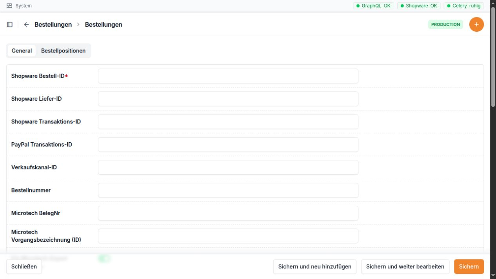

Bestellungen
============

Wofür ist dieser Bereich da?
~~~~~~~~~~~~~~~~~~~~~~~~~~~~

Im Bereich **Bestellungen** sehen Sie Bestellungen aus Shopware. Sie
können offene Bestellungen neu einlesen, den aktuellen Stand von
Bestellung, Zahlung und Lieferung prüfen, eine Bestellung nach Microtech
übertragen und bei Bedarf einen Zoll-Export erstellen.

Wichtig: Eine neue Bestellung wird nicht allein durch das Einlesen
automatisch nach Microtech übertragen. Dafür gibt es die eigene Aktion
**In Microtech anlegen**.

Die Bestellmaske beginnt mit den Kennungen aus Shopware und Microtech. Viele
dieser Werte werden beim Einlesen automatisch gefüllt.

Navigation
~~~~~~~~~~

Öffnen Sie in der linken Navigation **Bestellungen**. Dort stehen drei
Einträge:

-  **Bestellungen**: alle eingelesenen Bestellungen
-  **PayPal**: nur Bestellungen mit einer PayPal-Transaktionsnummer
-  **Bestellpositionen**: die einzelnen Artikelzeilen aller Bestellungen

Direkte Adressen:

-  Bestellungen: ``/admin/orders/order/``
-  PayPal: ``/admin/orders/paypalorder/``
-  Bestellpositionen: ``/admin/orders/orderdetail/``
-  Einzelne Bestellung: ``/admin/orders/order/<ID>/change/``
-  Regelvorschau einer Bestellung:
   ``/admin/orders/order/<ID>/rule-tester/``
-  Adressabgleich einer Bestellung:
   ``/admin/orders/order/<ID>/address-reconciliation/``

``<ID>`` ist die interne Nummer des Datensatzes. Sie ist nicht mit der
Shopware-Bestellnummer gleichzusetzen.

Die Bestellliste
~~~~~~~~~~~~~~~~

In der Liste werden 20 Bestellungen pro Seite angezeigt. Neue
Bestellungen stehen normalerweise oben.

+----------------+----------------------------------------------------+
| Spalte         | Einfache Erklärung                                 |
+================+====================================================+
| Bestellnummer  | Die für Mitarbeitende lesbare Bestellnummer aus    |
|                | Shopware.                                          |
+----------------+----------------------------------------------------+
| Kunde          | Zeigt die AdrNr und den Namen. Ein Zusatz          |
|                | kennzeichnet **Inland**, **Ausland · EU**,         |
|                | **Ausland** oder **Unbekannt**.                    |
+----------------+----------------------------------------------------+
| Land           | Zeigt Flagge und Ländercode der bevorzugten        |
|                | Rechnungsanschrift, sonst der Lieferanschrift.     |
+----------------+----------------------------------------------------+
| Verknüpfung    | Zwei Hinweise zeigen, ob die Standardadressen      |
|                | fachlich zugeordnet und zwischen Shopware und      |
|                | Microtech eindeutig verknüpft sind. Grün bedeutet  |
|                | in Ordnung. Gelb bedeutet, dass etwas geprüft      |
|                | werden sollte.                                     |
+----------------+----------------------------------------------------+
| Bestelldatum   | Datum und Uhrzeit der Bestellung.                  |
+----------------+----------------------------------------------------+
| Bestellstatus  | Der aktuelle Status aus Shopware.                  |
+----------------+----------------------------------------------------+
| Microtech-Sync | Stand der letzten Übertragung nach Microtech. Ohne |
|                | bisherigen Lauf steht hier ein Strich.             |
+----------------+----------------------------------------------------+

Die Suche findet Bestellungen über Bestellnummer, Shopware-Bestell-ID,
Microtech-Belegnummer, Microtech-Vorgangsbezeichnung,
PayPal-ID, PayPal-Transaktionsnummer sowie über AdrNr, Kundenname, Kunden-E-Mail,
Vorname oder Nachname in einer Kundenadresse.

Die Filter am rechten Rand grenzen die Liste ein nach:

-  Bestellstatus
-  Zahlstatus
-  Versandstatus
-  Freigabe für den Microtech-Export
-  Bestelldatum
-  Anlagedatum in der GC-Bridge

Aufgeklappte Bestellzeile
^^^^^^^^^^^^^^^^^^^^^^^^^

Beim Aufklappen einer Bestellung erscheint eine kompakte Übersicht:

-  **Status**: Bestellung, Zahlung und Lieferung. Über die Auswahl kann
   ein erlaubter nächster Shopware-Status gesetzt werden.
-  **Übergänge aktualisieren**: lädt die derzeit erlaubten Statuswechsel
   neu aus Shopware.
-  **Microtech-Sync**: zeigt den laufenden oder letzten Zustand sowie
   die Microtech-Belegnummer. Bei einem laufenden Vorgang aktualisiert
   sich die Anzeige selbst.
-  **Zahlungsreferenz**: zeigt AdrNr und PayPal-Transaktionsnummer.
-  **Rechnungsanschrift** und **Lieferanschrift**: zeigen die zur
   Bestellung gespeicherten Anschriften.

Ein Statuswechsel wirkt direkt in Shopware. Fehlt die passende
Shopware-ID, ist die Auswahl nicht verfügbar. Bleibt ein Statusfeld leer
oder zeigt keine Möglichkeit an, zuerst **Übergänge aktualisieren**
wählen.

Aktionen in der Bestellliste
~~~~~~~~~~~~~~~~~~~~~~~~~~~~

+----------------------+----------------------+----------------------+
| Aktion               | Wirkung              | Wichtiger Hinweis    |
+======================+======================+======================+
| Offene Bestellungen  | Liest offene         | Die Rückmeldung      |
| von Shopware         | Bestellungen,        | nennt gesehene,      |
| synchronisieren      | Kunden, Anschriften  | neue, aktualisierte  |
|                      | und Positionen aus   | und fehlerhafte      |
|                      | Shopware ein. Neu    | Bestellungen. Eine   |
|                      | eingelesene offene   | Auswahl einzelner    |
|                      | Bestellungen werden  | Zeilen ist für die   |
|                      | in Shopware auf **In | eigentliche          |
|                      | Bearbeitung**        | Ge                   |
|                      | gesetzt.             | samtsynchronisierung |
|                      |                      | nicht nötig.         |
+----------------------+----------------------+----------------------+
| Kunden               | Öffnet den           | Nur verfügbar, wenn  |
| zusammenführen       | Kundenabgleich mit   | die Bestellung eine  |
|                      | der AdrNr der        | AdrNr hat.           |
|                      | Bestellung.          |                      |
+----------------------+----------------------+----------------------+
| Regeln testen        | Zeigt eine Vorschau  | Die Vorschau         |
|                      | der Regeln für       | speichert nichts und |
|                      | Kunde,               | startet keine        |
|                      | Lieferanschrift,     | Übertragung.         |
|                      | Rechnungsanschrift   |                      |
|                      | und Vorgang.         |                      |
+----------------------+----------------------+----------------------+
| In Microtech anlegen | Startet oder setzt   | Die Übertragung      |
|                      | die Übertragung      | läuft schrittweise   |
|                      | dieser Bestellung    | im Hintergrund. Der  |
|                      | nach Microtech fort. | Status in der        |
|                      |                      | aufgeklappten Zeile  |
|                      |                      | zeigt den            |
|                      |                      | Fortschritt.         |
+----------------------+----------------------+----------------------+
| Zoll-CSV             | Erstellt eine        | Benötigt             |
|                      | CSV-Datei für den    | Bestellpositionen,   |
|                      | Schweiz-Zoll.        | eine aktuelle        |
|                      |                      | M                    |
|                      |                      | icrotech-Belegnummer |
|                      |                      | und eine             |
|                      |                      | eingerichtete        |
|                      |                      | Feldzuordnung.       |
+----------------------+----------------------+----------------------+
| Kopieren             | Legt einen neuen     | Bei importierten     |
|                      | Datensatz mit        | Bestellungen         |
|                      | übernommenen Werten  | normalerweise nicht  |
|                      | an.                  | verwenden; Kennungen |
|                      |                      | müssen eindeutig     |
|                      |                      | bleiben.             |
+----------------------+----------------------+----------------------+
| Löschen              | Löscht die           | Dadurch wird auch    |
|                      | Bestellung nach      | die interne          |
|                      | einer Bestätigung.   | Verlaufshistorie     |
|                      |                      | dieser Bestellung    |
|                      |                      | entfernt. Nur bei    |
|                      |                      | wirklich falschen    |
|                      |                      | Datensätzen          |
|                      |                      | verwenden.           |
+----------------------+----------------------+----------------------+

Feldbeschreibung der Bestellung
~~~~~~~~~~~~~~~~~~~~~~~~~~~~~~~

Die Detailseite zeigt die folgenden Felder. Viele Werte kommen aus
Shopware oder werden nach einer Microtech-Übertragung ergänzt. Solche
Werte sollten im Normalfall nicht von Hand überschrieben werden.

+----------------------------------+----------------------------------+
| Feld                             | Bedeutung und richtige           |
|                                  | Verwendung                       |
+==================================+==================================+
| Shopware Bestell-ID              | Eindeutige interne Kennung der   |
|                                  | Bestellung in Shopware. Sie wird |
|                                  | für Statusänderungen und         |
|                                  | erneutes Einlesen gebraucht.     |
|                                  | Nicht manuell ändern.            |
+----------------------------------+----------------------------------+
| Shopware Liefer-ID               | Kennung der Lieferung in         |
|                                  | Shopware. Ohne sie kann der      |
|                                  | Lieferstatus nicht geändert      |
|                                  | werden.                          |
+----------------------------------+----------------------------------+
| Shopware Transaktions-ID         | Kennung der Zahlung in Shopware. |
|                                  | Ohne sie kann der Zahlstatus     |
|                                  | nicht geändert werden.           |
+----------------------------------+----------------------------------+
| PayPal ID                        | PayPal-Ressourcen-ID, die im     |
|                                  | PayPal-Bericht zur Zuordnung     |
|                                  | verwendet wird.                  |
+----------------------------------+----------------------------------+
| PayPal Transaktions-ID           | Zahlungsreferenz von PayPal. Sie |
|                                  | erscheint nur, wenn Shopware     |
|                                  | diese Information geliefert hat. |
+----------------------------------+----------------------------------+
| Verkaufskanal-ID                 | Kennung des                      |
|                                  | Shopware-Verkaufskanals, aus dem |
|                                  | die Bestellung stammt.           |
+----------------------------------+----------------------------------+
| Bestellnummer                    | Lesbare Nummer der Bestellung,   |
|                                  | nach der üblicherweise gesucht   |
|                                  | wird.                            |
+----------------------------------+----------------------------------+
| Microtech BelegNr                | Belegnummer des Auftrags in      |
|                                  | Microtech. Sie wird während oder |
|                                  | nach der Übertragung ergänzt.    |
+----------------------------------+----------------------------------+
| Microtech Vorgangsbezeichnung    | Interne Zuordnung des            |
| (ID)                             | Microtech-Vorgangs. Sie hilft    |
|                                  | der Bridge, einen bereits        |
|                                  | vorhandenen Vorgang              |
|                                  | wiederzufinden.                  |
+----------------------------------+----------------------------------+
| Für Microtech-Export freigegeben | Legt fest, ob die Bestellung     |
|                                  | grundsätzlich für die            |
|                                  | Übertragung vorgesehen ist.      |
+----------------------------------+----------------------------------+
| Ausschlussgrund Microtech-Export | Erklärt, warum eine Bestellung   |
|                                  | nicht übertragen werden soll.    |
|                                  | Bei einer Sperre immer           |
|                                  | verständlich ausfüllen.          |
+----------------------------------+----------------------------------+
| Beschreibung                     | Bemerkung aus der Bestellung,    |
|                                  | meist ein Kundenkommentar.       |
+----------------------------------+----------------------------------+
| Gesamtpreis                      | Gesamtwert der Bestellung.       |
+----------------------------------+----------------------------------+
| Steuer gesamt                    | Summe der enthaltenen Steuer.    |
+----------------------------------+----------------------------------+
| Versandkosten                    | Kosten für den Versand.          |
+----------------------------------+----------------------------------+
| Zahlungsart                      | In Shopware gewählte             |
|                                  | Zahlungsart.                     |
+----------------------------------+----------------------------------+
| Versandart                       | In Shopware gewählte Versandart. |
+----------------------------------+----------------------------------+
| Bestellstatus                    | Aktueller Bestellstatus. Für     |
|                                  | eine Änderung möglichst die      |
|                                  | Statusauswahl in der             |
|                                  | aufgeklappten Listenzeile        |
|                                  | verwenden. Eine reine            |
|                                  | Texteingabe auf der Detailseite  |
|                                  | ändert Shopware nicht            |
|                                  | zuverlässig.                     |
+----------------------------------+----------------------------------+
| Versandstatus                    | Aktueller Stand der Lieferung.   |
|                                  | Für Änderungen die Statusauswahl |
|                                  | verwenden.                       |
+----------------------------------+----------------------------------+
| Zahlstatus                       | Aktueller Stand der Zahlung. Für |
|                                  | Änderungen die Statusauswahl     |
|                                  | verwenden.                       |
+----------------------------------+----------------------------------+
| Bestelldatum                     | Zeitpunkt, zu dem die Bestellung |
|                                  | angelegt wurde.                  |
+----------------------------------+----------------------------------+
| Kunde                            | Zugeordneter Kunde. Dieses Feld  |
|                                  | ist auf der Bestellseite nur     |
|                                  | lesbar. Eine neue AdrNr wird     |
|                                  | über **AdrNr ändern**            |
|                                  | angefordert.                     |
+----------------------------------+----------------------------------+
| Rechnungsanschrift               | Die bei dieser Bestellung        |
|                                  | gespeicherte Rechnungsanschrift. |
|                                  | Sie ist ein Abbild zum Zeitpunkt |
|                                  | der Bestellung.                  |
+----------------------------------+----------------------------------+
| Lieferanschrift                  | Die bei dieser Bestellung        |
|                                  | gespeicherte Lieferanschrift.    |
|                                  | Sie ist ein Abbild zum Zeitpunkt |
|                                  | der Bestellung.                  |
+----------------------------------+----------------------------------+
| AdrNr-Änderung                   | Nur-Anzeige zum letzten Auftrag, |
|                                  | mit dem ein anderer Kunde aus    |
|                                  | Microtech geladen wurde.         |
|                                  | Sichtbar sind Zustand,           |
|                                  | Ziel-AdrNr und nächster Schritt. |
+----------------------------------+----------------------------------+
| Microtech-Sync                   | Nur-Anzeige des letzten          |
|                                  | Übertragungsstands, etwa         |
|                                  | **Wartend**, **Läuft**, **Wartet |
|                                  | auf Microtech**,                 |
|                                  | **Fehlgeschlagen**,              |
|                                  | **Erfolgreich** oder             |
|                                  | **Abgebrochen**.                 |
+----------------------------------+----------------------------------+
| Angelegt am                      | Zeitpunkt, zu dem der Datensatz  |
|                                  | in der GC-Bridge entstand. Wird  |
|                                  | automatisch gesetzt.             |
+----------------------------------+----------------------------------+
| Aktualisiert am                  | Zeitpunkt der letzten Änderung   |
|                                  | in der GC-Bridge. Wird           |
|                                  | automatisch gesetzt.             |
+----------------------------------+----------------------------------+

AdrNr ändern
^^^^^^^^^^^^

In der Detailseite befindet sich im Menü **Aktionen** der Punkt **AdrNr
ändern**. Tragen Sie in **Neue AdrNr** die gewünschte Kundennummer ein.
Die Bridge prüft die Nummer im Hintergrund in Microtech. Nach
erfolgreicher Rückmeldung übernimmt sie den Kunden sowie dessen
Standard-Rechnungs- und Lieferanschrift.

Die Nummer darf nicht leer sein. Bei einer Fehlermeldung nicht mehrfach
schnell hintereinander absenden, sondern zuerst den angezeigten Stand
prüfen.

Feldbeschreibung der Bestellpositionen
~~~~~~~~~~~~~~~~~~~~~~~~~~~~~~~~~~~~~~

Auf der Bestellseite stehen die Positionen in einer Tabelle. In der
eigenen Liste **Bestellpositionen** sind alle Felder sichtbar.

+----------------------+----------------------------------------------+
| Feld                 | Bedeutung                                    |
+======================+==============================================+
| Bestellung           | Zugehörige Bestellung.                       |
+----------------------+----------------------------------------------+
| Shopware Position-ID | Eindeutige Kennung der Artikelzeile in       |
|                      | Shopware.                                    |
+----------------------+----------------------------------------------+
| ERP-Nummer           | Artikelnummer für Microtech. Eine fehlende   |
|                      | oder falsche Nummer kann die Übertragung und |
|                      | den Zoll-Export stören.                      |
+----------------------+----------------------------------------------+
| Bezeichnung          | Name des bestellten Artikels.                |
+----------------------+----------------------------------------------+
| Einheit              | Verkaufseinheit, etwa Stück oder Meter.      |
+----------------------+----------------------------------------------+
| Menge                | Bestellte Anzahl.                            |
+----------------------+----------------------------------------------+
| Einzelpreis          | Preis je Einheit.                            |
+----------------------+----------------------------------------------+
| Gesamtpreis          | Gesamtwert dieser Position.                  |
+----------------------+----------------------------------------------+
| Steuer               | Steuerbetrag der Position, wie er von        |
|                      | Shopware geliefert wurde.                    |
+----------------------+----------------------------------------------+
| Angelegt am          | Zeitpunkt der Anlage in der GC-Bridge.       |
+----------------------+----------------------------------------------+
| Aktualisiert am      | Zeitpunkt der letzten Änderung.              |
+----------------------+----------------------------------------------+

PayPal-Liste
~~~~~~~~~~~~

Die PayPal-Liste ist keine zweite Bestellung. Sie zeigt dieselben
Bestellungen, aber nur solche mit einer PayPal-ID. Sichtbar sind AdrNr,
PayPal-ID und Bestelldatum. Das Bestelldatum lässt sich mit dem
Unfold-Von/Bis-Filter eingrenzen. Neue PayPal-Einträge können hier nicht
von Hand angelegt werden.

Typischer Ablauf
~~~~~~~~~~~~~~~~

1. Öffnen Sie **Bestellungen → Bestellungen**.
2. Wählen Sie **Offene Bestellungen von Shopware synchronisieren**.
3. Prüfen Sie die Rückmeldung und suchen Sie die Bestellnummer.
4. Klappen Sie die Zeile auf. Prüfen Sie Kunde, Land, Anschriften und
   die drei Statusfelder.
5. Achten Sie in der Spalte **Verknüpfung** auf gelbe Hinweise.
6. Öffnen Sie bei Bedarf **Regeln testen**. Diese Prüfung verändert
   keine Daten.
7. Starten Sie **In Microtech anlegen**.
8. Beobachten Sie **Microtech-Sync**, bis **Erfolgreich** oder eine
   klare Fehlermeldung erscheint.

Häufige Hinweise und Fehlerquellen
~~~~~~~~~~~~~~~~~~~~~~~~~~~~~~~~~~

-  **Keine Statusauswahl möglich**: Meist fehlt die zugehörige
   Shopware-ID oder Shopware bietet aus dem aktuellen Zustand keinen
   weiteren Wechsel an.
-  **Gelbe Verknüpfung**: Eine Standardadresse fehlt, eine Shopware-ID
   fehlt oder ist doppelt, oder die Microtech-Anschrift ist nicht
   eindeutig zugeordnet.
-  **Microtech-Sync bleibt stehen**: Nicht sofort nochmals starten.
   Zuerst den angezeigten Zustand und eine mögliche Fehlermeldung
   prüfen.
-  **Microtech-Sync fehlgeschlagen**: Ein fehlgeschlagener Lauf kann
   grundsätzlich fortgesetzt werden. Die entsprechenden Wartungsaktionen
   sind im Code vorhanden, stehen aber im aktuellen Aktionsmenü nicht
   sichtbar zur Verfügung. Gegebenenfalls Administration hinzuziehen.
-  **Zoll-CSV schlägt fehl**: Häufig fehlen eine aktuelle
   Microtech-Belegnummer, Bestellpositionen oder aktive
   Zoll-Feldzuordnungen.
-  **Preise oder Status von Hand geändert**: Beim nächsten Einlesen aus
   Shopware können diese Werte wieder überschrieben werden.
   Statusänderungen immer über die dafür vorgesehene Auswahl ausführen.
-  **Rechnungs- und Lieferanschrift sehen alt aus**: Die Bestellung
   bewahrt ihre damaligen Anschriften. Aktuelle Standardadressen des
   Kunden können davon abweichen.
-  **Adressabgleich**: Eine eigene Abgleichseite ist vorhanden, aber im
   derzeitigen Aktionsmenü nicht direkt verlinkt. Sie sollte deshalb
   nicht als normaler Standardweg beschrieben werden, bis die produktive
   Oberfläche geprüft wurde.

Praxisbeispiel 1: Neue Bestellung nach Microtech übertragen
~~~~~~~~~~~~~~~~~~~~~~~~~~~~~~~~~~~~~~~~~~~~~~~~~~~~~~~~~~~

Frau Berger meldet eine neue Shopware-Bestellung mit der Nummer
``100845``.

1. Öffnen Sie **Bestellungen** und starten Sie **Offene Bestellungen von
   Shopware synchronisieren**.
2. Suchen Sie nach ``100845``.
3. Prüfen Sie in der Zeile die AdrNr, das Land und die beiden Hinweise
   unter **Verknüpfung**.
4. Klappen Sie die Bestellung auf. Prüfen Sie Rechnungs- und
   Lieferanschrift sowie Bestell-, Zahl- und Lieferstatus.
5. Öffnen Sie **Regeln testen**. Kontrollieren Sie, welche Regeln
   greifen würden, und gehen Sie zurück zur Bestellung.
6. Wählen Sie **In Microtech anlegen**.
7. Warten Sie, bis **Microtech-Sync: Erfolgreich** angezeigt wird und
   eine BelegNr erscheint.

Ergebnis: Die Shopware-Bestellung bleibt nachvollziehbar mit ihrem
Kunden und ihren Anschriften verbunden und ist als Auftrag in Microtech
angelegt.

Praxisbeispiel 2: Schweizer Bestellung als Zoll-CSV ausgeben
~~~~~~~~~~~~~~~~~~~~~~~~~~~~~~~~~~~~~~~~~~~~~~~~~~~~~~~~~~~~

Eine Bestellung für Zürich soll beim Versand im Zollportal erfasst
werden.

1. Suchen Sie die Bestellnummer und prüfen Sie, ob das Land ``CH``
   angezeigt wird.
2. Öffnen Sie die Bestellung und kontrollieren Sie Lieferanschrift,
   Telefonnummer und E-Mail.
3. Prüfen Sie die Bestellpositionen. Jede Position braucht eine passende
   ERP-Nummer, Bezeichnung, Menge und Preise.
4. Falls noch keine Microtech-BelegNr vorhanden ist, starten Sie zuerst
   **In Microtech anlegen** und warten Sie auf den erfolgreichen
   Abschluss.
5. Wählen Sie in der Zeile **Zoll-CSV** oder in der Detailseite
   **Zoll-CSV exportieren**.
6. Speichern Sie die heruntergeladene Datei und prüfen Sie sie vor dem
   Hochladen in das Zollportal.

Ergebnis: Für jede Bestellposition enthält die CSV eine Zeile nach der
eingerichteten Zoll-Feldzuordnung.
