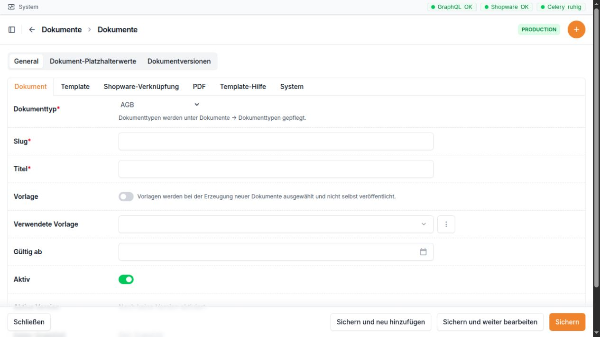

Dokumente
=========

Wofür ist dieser Bereich da?
~~~~~~~~~~~~~~~~~~~~~~~~~~~~

Im Bereich **Dokumente** pflegen Sie Inhalte wie Preislisten,
Bestellscheine, AGB, Widerrufsbelehrungen, Datenschutzerklärungen,
Impressum und sonstige Dokumente. Aus einem gespeicherten Dokument kann
die GC-Bridge eine PDF-Datei erzeugen. Diese PDF und optional auch der
Inhalt einer Shopware-Erlebniswelt können veröffentlicht werden.

Vor einer Veröffentlichung sollten Sie immer eine Vorschau prüfen. Bei
wichtigen Texten empfiehlt sich außerdem eine Dokumentversion. Dadurch
bleibt der freigegebene Stand nachvollziehbar.

Die Dokumentmaske ist in übersichtliche Reiter gegliedert. Der erste Reiter
enthält die Angaben, mit denen Sie das Dokument eindeutig erkennen.

Navigation
~~~~~~~~~~

In der linken Navigation enthält der Abschnitt **Dokumente** die
Einträge:

-  **Dokumente**: Inhalte, Vorlagen, PDFs und Shopware-Verknüpfungen
-  **Dokumenttypen**: auswählbare Arten und ihre gemeinsamen
   Einstellungen
-  **QR-Codes** und **PPWR-Etiketten**: eigene Fachbereiche; sie gehören
   nicht zu diesem Kapitel

Direkte Adressen:

+--------------------+------------------------------------------------+
| Bereich            | Adresse                                        |
+====================+================================================+
| Dokumente          | `                                              |
|                    | `http://10.0.0.165/admin/documents/document/`` |
+--------------------+------------------------------------------------+
| Neues Dokument     | ``htt                                          |
|                    | p://10.0.0.165/admin/documents/document/add/`` |
+--------------------+------------------------------------------------+
| Einzelnes Dokument | ``http://10.0                                  |
|                    | .0.165/admin/documents/document/<ID>/change/`` |
+--------------------+------------------------------------------------+
| Vorschau           | ``http://10.0.0.165/adm                        |
|                    | in/documents/document/<ID>/preview-template/`` |
+--------------------+------------------------------------------------+
| PDF herunterladen  | ``http://10.0.0.165                            |
|                    | /admin/documents/document/<ID>/download-pdf/`` |
+--------------------+------------------------------------------------+
| Word-Import        | ``http://10.0.0.16                             |
|                    | 5/admin/documents/document/<ID>/word-import/`` |
+--------------------+------------------------------------------------+
| Dokumenttypen      | ``htt                                          |
|                    | p://10.0.0.165/admin/documents/documenttype/`` |
+--------------------+------------------------------------------------+
| Word-Importe       | ``http://1                                     |
|                    | 0.0.0.165/admin/documents/documentimportjob/`` |
+--------------------+------------------------------------------------+
| Dokumentversionen  | ``http:/                                       |
|                    | /10.0.0.165/admin/documents/documentversion/`` |
+--------------------+------------------------------------------------+

Die Listen für Word-Importe und Dokumentversionen stehen nicht als
eigene Punkte im linken Menü. Sie werden normalerweise aus einem
Dokument heraus geöffnet.

Die Dokumentliste
~~~~~~~~~~~~~~~~~

+---------------------+-----------------------------------------------+
| Spalte              | Einfache Erklärung                            |
+=====================+===============================================+
| **Titel**           | Lesbarer Name des Dokuments. Ein Klick öffnet |
|                     | den Eintrag.                                  |
+---------------------+-----------------------------------------------+
| **Dokumenttyp**     | Art des Dokuments, zum Beispiel Preisliste    |
|                     | oder AGB.                                     |
+---------------------+-----------------------------------------------+
| **Vorlage**         | Zeigt, ob der Eintrag als Vorlage für neue    |
|                     | Dokumente dient.                              |
+---------------------+-----------------------------------------------+
| **Slug**            | Eindeutiger kurzer Schlüssel.                 |
+---------------------+-----------------------------------------------+
| **Template**        | Zeigt, ob der Inhalt aus einer hochgeladenen  |
|                     | HTML-Datei, aus dem sichtbaren Editor oder    |
|                     | aus keiner Vorlage kommt.                     |
+---------------------+-----------------------------------------------+
| **Aktiv**           | Legt fest, ob das Dokument verwendet werden   |
|                     | soll. Der Wert kann direkt in der Liste       |
|                     | geändert werden.                              |
+---------------------+-----------------------------------------------+
| **PDF erzeugt am**  | Zeitpunkt der letzten PDF-Erstellung.         |
+---------------------+-----------------------------------------------+
| **PDF**             | Link zum Herunterladen. Fehlt die Datei trotz |
|                     | gespeichertem Namen, wird dies angezeigt.     |
+---------------------+-----------------------------------------------+
| **Aktualisiert am** | Zeitpunkt der letzten Änderung.               |
+---------------------+-----------------------------------------------+

Die Suche berücksichtigt Titel, Slug, HTML, CSS, Vorlagendatei und
PDF-Dateiname. Filter gibt es für Dokumenttyp, Vorlage und Aktiv-Status.

Als Sammelaktion steht **PDF speichern** zur Verfügung. Sie erzeugt für
jedes markierte Dokument eine aktuelle PDF-Datei.

Dokument anlegen oder bearbeiten
~~~~~~~~~~~~~~~~~~~~~~~~~~~~~~~~

Die Detailseite ist in mehrere Reiter gegliedert.

Reiter „Dokument“
^^^^^^^^^^^^^^^^^

+----------------------------------+----------------------------------+
| Feld                             | Bedeutung und richtige           |
|                                  | Verwendung                       |
+==================================+==================================+
| **Dokumenttyp**                  | Pflichtauswahl aus den aktiven   |
|                                  | Dokumenttypen. Dokumenttypen     |
|                                  | werden unter **Dokumente →       |
|                                  | Dokumenttypen** gepflegt.        |
+----------------------------------+----------------------------------+
| **Slug**                         | Pflichtfeld und eindeutiger      |
|                                  | kurzer Schlüssel, zum Beispiel   |
|                                  | ``agb`` oder                     |
|                                  | ``preisliste-2026``. Er wird     |
|                                  | auch für den PDF-Dateinamen      |
|                                  | verwendet.                       |
+----------------------------------+----------------------------------+
| **Titel**                        | Pflichtfeld und sichtbarer Name  |
|                                  | des Dokuments.                   |
+----------------------------------+----------------------------------+
| **Vorlage**                      | Aktivieren, wenn dieser Eintrag  |
|                                  | als Ausgangspunkt für neue       |
|                                  | Dokumente dienen soll. Vorlagen  |
|                                  | selbst werden nicht              |
|                                  | veröffentlicht.                  |
+----------------------------------+----------------------------------+
| **Verwendete Vorlage**           | Zeigt bei einem erzeugten        |
|                                  | Dokument, aus welcher aktiven    |
|                                  | Vorlage es entstanden ist.       |
+----------------------------------+----------------------------------+
| **Gültig ab**                    | Datum, ab dem der Inhalt gelten  |
|                                  | soll. Bei Preislisten kann       |
|                                  | dieses Datum auf dem Deckblatt   |
|                                  | erscheinen.                      |
+----------------------------------+----------------------------------+
| **Aktiv**                        | Legt fest, ob das Dokument       |
|                                  | verwendet werden soll.           |
+----------------------------------+----------------------------------+
| **Kategorien mit                 | Nur bei Preislisten sichtbar.    |
| Doppelauflistung**               | Produkte aus diesen Kategorien   |
|                                  | und ihren Unterkategorien dürfen |
|                                  | zusätzlich zu ihrer normalen     |
|                                  | Kategorie nochmals erscheinen.   |
+----------------------------------+----------------------------------+
| **Aktive Version**               | Nur-Anzeige der derzeit          |
|                                  | freigegebenen Dokumentversion.   |
+----------------------------------+----------------------------------+
| **Daten-Snapshot**               | Nur-Anzeige eines eingefrorenen  |
|                                  | Datenstands. Bei einer erzeugten |
|                                  | Preisliste werden beispielsweise |
|                                  | Ursprung, Vorlage, Positionszahl |
|                                  | und Erzeugungszeit gezeigt.      |
+----------------------------------+----------------------------------+

Reiter „Template“
^^^^^^^^^^^^^^^^^

+-------------------------------+-------------------------------------+
| Feld                          | Bedeutung und richtige Verwendung   |
+===============================+=====================================+
| **Jinja2-Engine**             | Erweiterte Vorlagenfunktion für     |
|                               | automatisch eingesetzte Daten. Bei  |
|                               | bestehenden Vorlagen die            |
|                               | Einstellung nicht ohne Grund        |
|                               | ändern.                             |
+-------------------------------+-------------------------------------+
| **HTML-Template-Datei**       | Optionaler Upload einer ``.html``-  |
|                               | oder ``.htm``-Datei. Diese Datei    |
|                               | hat Vorrang vor dem sichtbaren      |
|                               | HTML-Feld.                          |
+-------------------------------+-------------------------------------+
| **Template**                  | Nur-Anzeige, ob eine Datei oder der |
|                               | sichtbare HTML-Editor als Quelle    |
|                               | verwendet wird.                     |
+-------------------------------+-------------------------------------+
| **DOCX-/RTF-Quelldatei**      | Optionales Original zum             |
|                               | Herunterladen und Bearbeiten. Für   |
|                               | den geführten KI-Import ist eine    |
|                               | DOCX-Datei nötig; eine RTF-Datei    |
|                               | dient nur als hinterlegte Quelle.   |
+-------------------------------+-------------------------------------+
| **KI-Prompt für Word-Import** | Optionaler aktiver Prompt für den   |
|                               | Word-Import. Ohne Auswahl wird der  |
|                               | eingerichtete Standard verwendet.   |
+-------------------------------+-------------------------------------+
| **HTML**                      | Sichtbarer Inhaltseditor. Er bietet |
|                               | einen visuellen Modus, einen        |
|                               | HTML-Code-Modus und eine            |
|                               | Vollbildansicht.                    |
+-------------------------------+-------------------------------------+
| **CSS**                       | Gestaltung des Dokuments. Das Feld  |
|                               | besitzt ebenfalls eine              |
|                               | Vollbildansicht. Änderungen wirken  |
|                               | als Vorschau im HTML-Editor.        |
+-------------------------------+-------------------------------------+

Wichtig: Wenn Sie eine HTML-Datei neu hochladen, übernimmt die Bridge
deren Inhalt in das HTML-Feld. Ändern Sie später ausdrücklich den
sichtbaren HTML-Inhalt, wird die alte hochgeladene Datei als führende
Quelle entfernt. So kann die sichtbare Änderung tatsächlich verwendet
werden.

Der Reiter eignet sich auch für einfache Texte. Die Bereiche
**HTML-Code**, **CSS** und **Template-Hilfe** sollten jedoch nur von
geschulten Personen geändert werden.

Platzhalterwerte unter dem Dokument
^^^^^^^^^^^^^^^^^^^^^^^^^^^^^^^^^^^

Platzhalter sind Stellen wie ``<Firmenname>`` oder ``<Anschrift>``, die
beim Word-Import durch freigegebene Werte ersetzt werden.

+---------------------+-----------------------------------------------+
| Feld                | Bedeutung                                     |
+=====================+===============================================+
| **Platzhalter**     | Exakte Schreibweise aus der Word-Datei        |
|                     | einschließlich ``<`` und ``>``. Derselbe      |
|                     | Platzhalter darf in einem Dokument nur einmal |
|                     | gepflegt werden.                              |
+---------------------+-----------------------------------------------+
| **Wert**            | Text, der an jeder Fundstelle dieses          |
|                     | Platzhalters eingesetzt wird.                 |
+---------------------+-----------------------------------------------+
| **Aktiv**           | Nur aktive Werte werden verwendet.            |
+---------------------+-----------------------------------------------+
| **Aktualisiert am** | Automatischer Zeitpunkt der letzten Änderung. |
+---------------------+-----------------------------------------------+

Reiter „Shopware-Verknüpfung“
^^^^^^^^^^^^^^^^^^^^^^^^^^^^^

+---------------------------+-----------------------------------------+
| Feld                      | Bedeutung und richtige Verwendung       |
+===========================+=========================================+
| **Shopware Erlebniswelt** | Optional. Wählen Sie eine vorhandene    |
|                           | Shop- oder Landingpage, deren genau ein |
|                           | Text-Element mit dem Dokumentinhalt     |
|                           | ersetzt werden soll. Ohne Auswahl wird  |
|                           | nur die PDF veröffentlicht.             |
+---------------------------+-----------------------------------------+
| **Shopware PDF-Datei**    | Pflicht für die Veröffentlichung. Diese |
|                           | bereits vorhandene Shopware-PDF wird    |
|                           | bei jeder Veröffentlichung              |
|                           | überschrieben.                          |
+---------------------------+-----------------------------------------+
| **Shopware Medienordner** | Optionaler Zielordner. Ohne Auswahl     |
|                           | bleibt der bisherige Ordner der         |
|                           | gewählten PDF erhalten.                 |
+---------------------------+-----------------------------------------+
| **Shopware IDs**          | Nur-Anzeige der gespeicherten           |
|                           | Zuordnungen und möglicher fehlender     |
|                           | Angaben.                                |
+---------------------------+-----------------------------------------+

Die Auswahllisten werden beim Öffnen des Formulars aus Shopware geladen.
Bei einer Verbindungsstörung zeigt das Feld einen Hinweis und
möglicherweise nur die bereits gespeicherte Kennung.

Bei einer ausgewählten Erlebniswelt gilt eine wichtige Schutzregel: Sie
muss **genau ein Text-Element** enthalten. Bei keinem oder mehreren
Text-Elementen bricht die Bridge die Veröffentlichung ab und verändert
den Seitenaufbau nicht.

Reiter „PDF“
^^^^^^^^^^^^

+------------------------+--------------------------------------------+
| Feld                   | Bedeutung und richtige Verwendung          |
+========================+============================================+
| **PDF erzeugt am**     | Zeitpunkt der letzten PDF-Erstellung. Wird |
|                        | automatisch gesetzt.                       |
+------------------------+--------------------------------------------+
| **PDF-Dateiname**      | Automatisch aus dem Slug erzeugter         |
|                        | Dateiname.                                 |
+------------------------+--------------------------------------------+
| **PDF**                | Link zum Herunterladen der zuletzt         |
|                        | erzeugten Datei.                           |
+------------------------+--------------------------------------------+
| **Cover-PDF**          | Optionale PDF-Datei, die vor den           |
|                        | eigentlichen Inhalt gesetzt wird.          |
+------------------------+--------------------------------------------+
| **Cover-PDF Vorschau** | Zeigt den Namen der hinterlegten           |
|                        | Cover-Datei.                               |
+------------------------+--------------------------------------------+
| **End-PDF**            | Optionale PDF-Datei, die an das Dokument   |
|                        | angehängt wird.                            |
+------------------------+--------------------------------------------+
| **End-PDF Vorschau**   | Zeigt den Namen der hinterlegten           |
|                        | End-Datei.                                 |
+------------------------+--------------------------------------------+

Bei Preislisten kann automatisch ein Standard-Cover verwendet werden,
wenn kein eigenes Cover hochgeladen ist. Die Bridge ergänzt bei
Preislisten außerdem Seitenzahlen. Das Gültigkeitsdatum kommt zuerst aus
**Gültig ab**, danach aus einem erkannten Monat und Jahr im Titel und
sonst aus dem aktuellen Monat.

Reiter „Template-Hilfe“
^^^^^^^^^^^^^^^^^^^^^^^

Dieser Reiter ist eine Nachschlagehilfe für geschulte Personen. Er
erklärt verfügbare Platzhalter, Schleifen, Bedingungen und
Produktfelder. Für normale Textänderungen ist er nicht erforderlich.

Reiter „System“
^^^^^^^^^^^^^^^

=================== ===============================================
Feld                Bedeutung
=================== ===============================================
**Angelegt am**     Automatischer Zeitpunkt der ersten Speicherung.
**Aktualisiert am** Automatischer Zeitpunkt der letzten Änderung.
=================== ===============================================

Aktionen eines Dokuments
~~~~~~~~~~~~~~~~~~~~~~~~

+----------------------+----------------------+----------------------+
| Aktion               | Wirkung              | Wichtiger Hinweis    |
+======================+======================+======================+
| **Neue Version       | Legt einen           | Die neue Version ist |
| anlegen**            | nummerierten Entwurf | zunächst nicht       |
|                      | aus dem aktuellen    | aktiv.               |
|                      | HTML, CSS,           |                      |
|                      | Gültigkeitsdatum und |                      |
|                      | Datenstand an.       |                      |
+----------------------+----------------------+----------------------+
| **Word-Datei mit KI  | Öffnet den geführten | Nur für AGB,         |
| aufbereiten**        | Import einer         | Datenschutzerklärung |
|                      | DOCX-Datei.          | und                  |
|                      |                      | Widerrufsbelehrung   |
|                      |                      | vorgesehen. Ergebnis |
|                      |                      | muss von einem       |
|                      |                      | Menschen geprüft und |
|                      |                      | freigegeben werden.  |
+----------------------+----------------------+----------------------+
| **PDF speichern**    | Erzeugt eine         | Erst Vorschau        |
|                      | aktuelle PDF auf dem | prüfen; eine         |
|                      | Server und           | PDF-Erstellung       |
|                      | hinterlegt Dateiname | veröffentlicht noch  |
|                      | und Zeitpunkt.       | nichts in Shopware.  |
+----------------------+----------------------+----------------------+
| **In Shopware        | Erzeugt jedes Mal    | Die Shopware-PDF     |
| veröffentlichen**    | eine neue PDF und    | muss vorher          |
|                      | überschreibt die     | ausgewählt und das   |
|                      | ausgewählte          | Dokument gespeichert |
|                      | Shopware-PDF.        | sein.                |
|                      | Optional wird das    |                      |
|                      | eine Text-Element    |                      |
|                      | der Erlebniswelt     |                      |
|                      | aktualisiert.        |                      |
+----------------------+----------------------+----------------------+
| **Vorschau**         | Öffnet den aktuellen | Bei einem            |
|                      | Inhalt als Vorschau  | Vorlagenfehler       |
|                      | im Browser.          | erscheint eine       |
|                      |                      | verständliche        |
|                      |                      | Fehlerseite; es wird |
|                      |                      | nichts               |
|                      |                      | veröffentlicht.      |
+----------------------+----------------------+----------------------+

Dokumenttypen
~~~~~~~~~~~~~

Dokumenttypen legen fest, welche Art bei einem Dokument auswählbar ist.
Voreingestellt sind Preisliste, Bestellschein, AGB, Widerrufsbelehrung,
Datenschutzerklärung, Impressum und Sonstiges.

+----------------------------------+----------------------------------+
| Feld                             | Bedeutung und richtige           |
|                                  | Verwendung                       |
+==================================+==================================+
| **Name**                         | Lesbarer Name in der Auswahl.    |
+----------------------------------+----------------------------------+
| **Kennung**                      | Eindeutiger kurzer Schlüssel.    |
|                                  | Nach der ersten Verwendung       |
|                                  | möglichst nicht mehr ändern,     |
|                                  | weil bestehende Dokumente diese  |
|                                  | Kennung speichern.               |
+----------------------------------+----------------------------------+
| **Aktiv**                        | Nur aktive Typen stehen bei      |
|                                  | neuen Änderungen zur Auswahl.    |
|                                  | Kann direkt in der Liste         |
|                                  | geändert werden.                 |
+----------------------------------+----------------------------------+
| **Einstellungen**                | Gemeinsame Zusatzangaben für     |
|                                  | diesen Typ. Dieses Feld wird als |
|                                  | strukturierte Baum- oder         |
|                                  | Codeansicht angezeigt und sollte |
|                                  | nur von geschulten Personen      |
|                                  | gepflegt werden.                 |
+----------------------------------+----------------------------------+
| **Angelegt am / Aktualisiert     | Automatische Zeitangaben.        |
| am**                             |                                  |
+----------------------------------+----------------------------------+

Word-Import
~~~~~~~~~~~

Der geführte Word-Import ist für **AGB**, **Datenschutzerklärungen** und
**Widerrufsbelehrungen** gedacht.

1. Hinterlegen Sie am Dokument eine DOCX-Datei und speichern Sie.
2. Wählen Sie **Word-Datei mit KI aufbereiten**.
3. Prüfen Sie die erkannten Platzhalter. Tragen Sie sichere Werte ein,
   wenn diese nicht aus dem bisherigen Dokument übernommen werden
   sollen.
4. Wählen Sie **KI-Prompt** und **KI-Provider**.
5. Starten Sie den Import. Der Auftrag läuft im Hintergrund.
6. Öffnen Sie das Ergebnis. Vergleichen Sie Word-Originaltext, ersetzte
   Werte, offene Platzhalter und erzeugtes HTML.
7. Korrigieren Sie erkennbare Darstellungsfehler im Ergebnis. Der
   juristische Inhalt darf nicht unbemerkt umgeschrieben werden.
8. Erst wenn keine offenen Platzhalter mehr vorhanden sind, wählen Sie
   **Geprüftes Ergebnis übernehmen**.

Sichtbare Felder eines Word-Imports
^^^^^^^^^^^^^^^^^^^^^^^^^^^^^^^^^^^

+-----------------------------+---------------------------------------+
| Feld                        | Bedeutung                             |
+=============================+=======================================+
| **Dokument**                | Dokument, zu dem der Import gehört.   |
+-----------------------------+---------------------------------------+
| **KI-Prompt**               | Verwendete Arbeitsanweisung.          |
+-----------------------------+---------------------------------------+
| **KI**                      | Verwendeter Anbieter.                 |
+-----------------------------+---------------------------------------+
| **Status**                  | **In Arbeit**, **Ergebnis             |
|                             | vorhanden**, **Übernommen** oder      |
|                             | **Fehlgeschlagen**.                   |
+-----------------------------+---------------------------------------+
| **Angefordert von**         | Mitarbeiter, der den Import gestartet |
|                             | hat.                                  |
+-----------------------------+---------------------------------------+
| **Übernommene Platzhalter** | Zeigt Wert und Herkunft.              |
|                             | „Benutzerangabe“ stammt aus der       |
|                             | manuellen Eingabe, „KI aus bisheriger |
|                             | Fassung“ aus einem belegbaren alten   |
|                             | Text.                                 |
+-----------------------------+---------------------------------------+
| **Offene Platzhalter**      | Zeigt noch nicht aufgelöste Stellen.  |
|                             | Solange welche vorhanden sind, ist    |
|                             | die Freigabe gesperrt.                |
+-----------------------------+---------------------------------------+
| **Word-Originaltext**       | Nur-Anzeige des gelesenen             |
|                             | Ausgangstextes.                       |
+-----------------------------+---------------------------------------+
| **Erzeugtes HTML**          | Prüffeld für das Importergebnis. Bis  |
|                             | zur Übernahme kann es berichtigt      |
|                             | werden.                               |
+-----------------------------+---------------------------------------+
| **Übernommen am**           | Zeitpunkt der Freigabe.               |
+-----------------------------+---------------------------------------+
| **Technische Details**      | Eingelesene Blöcke, verwendete        |
|                             | Anfragen, Rohantworten und Fehler.    |
|                             | Dieser eingeklappte Bereich ist für   |
|                             | Fehlersuche gedacht.                  |
+-----------------------------+---------------------------------------+

Ein übernommener Import kann nicht mehr geändert oder gelöscht werden.
Das geprüfte Ergebnis wird als aktive Dokumentversion übernommen.

Dokumentversionen
~~~~~~~~~~~~~~~~~

Eine Dokumentversion ist ein festgehaltener Stand. Sie enthält den
Inhalt, die Gestaltung, die Vorlageneinstellung, das Gültigkeitsdatum
und den damaligen Daten-Snapshot.

+----------------------------------+----------------------------------+
| Feld                             | Bedeutung                        |
+==================================+==================================+
| **Dokument**                     | Zugehöriges Dokument. Wird       |
|                                  | automatisch gesetzt.             |
+----------------------------------+----------------------------------+
| **Version**                      | Fortlaufende Nummer. Wird        |
|                                  | automatisch vergeben.            |
+----------------------------------+----------------------------------+
| **Bezeichnung**                  | Freier Name, zum Beispiel        |
|                                  | „Freigabe Rechtsabteilung“.      |
+----------------------------------+----------------------------------+
| **Gültig ab**                    | Gültigkeitsdatum dieses Standes. |
+----------------------------------+----------------------------------+
| **Aktiv**                        | Zeigt, ob diese Version gerade   |
|                                  | maßgeblich ist. Pro Dokument     |
|                                  | kann nur eine Version aktiv      |
|                                  | sein.                            |
+----------------------------------+----------------------------------+
| **Aktiviert am**                 | Zeitpunkt der Aktivierung.       |
+----------------------------------+----------------------------------+
| **Jinja2-Engine**                | Gespeicherte Vorlageneinstellung |
|                                  | dieser Version.                  |
+----------------------------------+----------------------------------+
| **HTML-Vorlage**                 | Festgehaltener Inhalt, der vor   |
|                                  | der Freigabe geprüft werden      |
|                                  | kann.                            |
+----------------------------------+----------------------------------+
| **CSS**                          | Festgehaltene Gestaltung.        |
+----------------------------------+----------------------------------+
| **Daten-Snapshot**               | Eingefrorene Daten dieses        |
|                                  | Standes.                         |
+----------------------------------+----------------------------------+
| **Angelegt am / Aktualisiert     | Automatische Zeitangaben.        |
| am**                             |                                  |
+----------------------------------+----------------------------------+

Mit **Aktivieren und zu Shopware veröffentlichen** wird die bisher
aktive Version abgelöst. Ihr Inhalt wird auf das Hauptdokument
übertragen; danach werden PDF und gegebenenfalls Erlebniswelt in
Shopware aktualisiert. Diese Aktion funktioniert nur, wenn mindestens
eine Shopware-PDF-Datei am Dokument ausgewählt ist.

Eine aktive Version kann nicht gelöscht werden.

Typischer Ablauf bei einer normalen Dokumentänderung
~~~~~~~~~~~~~~~~~~~~~~~~~~~~~~~~~~~~~~~~~~~~~~~~~~~~

1. Öffnen Sie **Dokumente → Dokumente** und suchen Sie nach Titel oder
   Slug.
2. Öffnen Sie das Dokument und prüfen Sie Dokumenttyp, Titel,
   Gültigkeitsdatum und Aktiv-Status.
3. Ändern Sie den Inhalt im visuellen HTML-Editor. Nutzen Sie den
   Code-Modus nur, wenn Sie HTML sicher beherrschen.
4. Speichern Sie das Dokument.
5. Öffnen Sie **Vorschau** und prüfen Sie Überschriften, Absätze,
   Seitenumbrüche und eingefügte Werte.
6. Legen Sie bei einem wichtigen Freigabestand mit **Neue Version
   anlegen** eine Version an.
7. Prüfen Sie in **Shopware-Verknüpfung** die gewählte PDF-Datei,
   optional die Erlebniswelt und den Medienordner.
8. Erzeugen Sie mit **PDF speichern** zunächst eine lokale PDF und laden
   Sie sie zur Kontrolle herunter.
9. Veröffentlichen Sie erst nach der Kontrolle mit **In Shopware
   veröffentlichen** oder aktivieren und veröffentlichen Sie die
   geprüfte Version.

Häufige Hinweise und Fehlerquellen
~~~~~~~~~~~~~~~~~~~~~~~~~~~~~~~~~~

-  **Dokumenttyp fehlt:** Der Typ ist möglicherweise inaktiv. Unter
   **Dokumenttypen** prüfen.
-  **Slug wird abgewiesen:** Jeder Slug darf nur einmal vorkommen. Einen
   eindeutigen kurzen Namen wählen.
-  **Änderung im HTML-Feld erscheint nicht:** Eine hochgeladene
   HTML-Datei kann noch Vorrang haben. Nach einer ausdrücklich
   gespeicherten Editoränderung wird diese Verknüpfung normalerweise
   entfernt.
-  **Vorschau zeigt einen Fehler:** Inhalt oder Vorlage enthält eine
   ungültige Anweisung. Nichts veröffentlichen; letzte Änderung prüfen
   oder eine geschulte Person hinzuziehen.
-  **PDF-Link fehlt:** Zuerst **PDF speichern** ausführen.
-  **PDF-Link meldet „Datei fehlt“:** Der gespeicherte Dateiname ist
   vorhanden, die Datei selbst aber nicht. PDF neu erzeugen.
-  **Shopware-Auswahlen können nicht geladen werden:**
   Shopware-Verbindung prüfen. Keine gespeicherte ID auf Verdacht
   überschreiben.
-  **Veröffentlichung ist nicht möglich:** Es wurde keine vorhandene
   **Shopware PDF-Datei** gewählt oder die Auswahl wurde noch nicht
   gespeichert.
-  **Nur PDF, keine Erlebniswelt:** Das ist zulässig. Ohne Erlebniswelt
   wird nur die ausgewählte PDF überschrieben.
-  **Erlebniswelt wird abgewiesen:** Sie enthält nicht genau ein
   Text-Element. Die Bridge schützt in diesem Fall den bestehenden
   Seitenaufbau und ändert nichts.
-  **Medienordner fehlt oder wurde gelöscht:** Einen noch vorhandenen
   Shopware-Ordner auswählen und speichern oder die Auswahl leer lassen,
   damit der aktuelle Ordner bleibt.
-  **Word-Import wird abgewiesen:** Er ist nur für AGB,
   Datenschutzerklärung und Widerrufsbelehrung vorgesehen.
-  **Word-Import startet nicht:** Zuerst eine DOCX-Datei speichern. Eine
   RTF-Datei reicht für diesen Ablauf nicht.
-  **Freigabe des Word-Imports ist gesperrt:** Mindestens ein
   Platzhalter ist noch offen.
-  **Juristischer Text hat sich verändert:** Nicht freigeben. Original
   und Ergebnis vergleichen und einen neuen, korrekten Import starten
   oder fachliche Prüfung anfordern.
-  **Aktive Version lässt sich nicht löschen:** Zuerst eine andere
   geprüfte Version aktivieren.
-  **Version lässt sich nicht veröffentlichen:** Am Hauptdokument fehlt
   die Shopware-PDF-Verknüpfung.
-  **Vorlage wird versehentlich veröffentlicht:** Ein als **Vorlage**
   markierter Eintrag ist als Ausgangspunkt gedacht und soll nicht
   selbst veröffentlicht werden.
-  **Preisliste zeigt ein falsches Datum:** **Gültig ab** prüfen. Fehlt
   es, versucht die Bridge Monat und Jahr aus dem Titel zu lesen.

Praxisbeispiel 1: Neue AGB aus einer Word-Datei prüfen und freigeben
~~~~~~~~~~~~~~~~~~~~~~~~~~~~~~~~~~~~~~~~~~~~~~~~~~~~~~~~~~~~~~~~~~~~

Die Rechtsabteilung liefert neue AGB als Datei ``AGB_2026.docx``. Die
Platzhalter ``<Firmenname>`` und ``<Anschrift>`` sollen mit
freigegebenen Angaben ersetzt werden.

1.  Öffnen Sie **Dokumente → Dokumente** und wählen Sie das bestehende
    AGB-Dokument.
2.  Prüfen Sie, ob der **Dokumenttyp** auf **AGB** steht.
3.  Laden Sie unter **DOCX-/RTF-Quelldatei** die Datei ``AGB_2026.docx``
    hoch und speichern Sie.
4.  Wählen Sie im Aktionsmenü **Word-Datei mit KI aufbereiten**.
5.  Tragen Sie bei ``<Firmenname>`` und ``<Anschrift>`` die von der
    Rechtsabteilung bestätigten Werte ein.
6.  Prüfen Sie den vorausgewählten **KI-Prompt** und wählen Sie den
    vorgesehenen **KI-Provider**. Starten Sie den Import.
7.  Warten Sie, bis der Status **Ergebnis vorhanden** zeigt.
8.  Vergleichen Sie **Word-Originaltext** und **Erzeugtes HTML**. Prüfen
    Sie besonders Überschriften, Nummerierung, Absätze und die beiden
    ersetzten Werte.
9.  Stellen Sie sicher, dass bei **Offene Platzhalter** „Keine offenen
    Platzhalter“ steht.
10. Wählen Sie **Geprüftes Ergebnis übernehmen**.
11. Öffnen Sie am Dokument die neue aktive Version und prüfen Sie noch
    einmal die **Vorschau**.
12. Erzeugen Sie eine PDF. Veröffentlichen Sie erst, wenn die
    Shopware-PDF-Verknüpfung stimmt und die fachliche Freigabe vorliegt.

Ergebnis: Die Word-Datei wurde strukturiert, die Werte wurden
nachvollziehbar eingesetzt und der geprüfte Inhalt liegt als aktive
Dokumentversion vor.

Praxisbeispiel 2: Preisliste prüfen und sicher in Shopware veröffentlichen
~~~~~~~~~~~~~~~~~~~~~~~~~~~~~~~~~~~~~~~~~~~~~~~~~~~~~~~~~~~~~~~~~~~~~~~~~~

Aus der Preiserhöhung „Preiserhöhung Oktober 2026“ wurde bereits ein
neues Preislisten-Dokument angelegt.

1.  Öffnen Sie das erzeugte Dokument über den Link **Erzeugte
    Preisliste** in der Preiserhöhung oder suchen Sie es unter
    **Dokumente**.
2.  Prüfen Sie **Dokumenttyp: Preisliste**, den **Titel**, **Gültig
    ab**, die verwendete Vorlage und die Anzeige **Daten-Snapshot**.
3.  Kontrollieren Sie bei Bedarf **Kategorien mit Doppelauflistung**.
    Verwenden Sie diese Auswahl nur, wenn Produkte bewusst in einem
    zweiten Katalogabschnitt erscheinen sollen.
4.  Öffnen Sie **Vorschau**. Prüfen Sie Kategorien, Produktnamen,
    Preise, Staffelpreise, Seitenumbrüche und das Datum auf dem
    Deckblatt.
5.  Wählen Sie **Neue Version anlegen** und geben Sie der Version eine
    verständliche Bezeichnung wie „Freigabe Oktober 2026“.
6.  Öffnen Sie **Shopware-Verknüpfung**. Wählen Sie die vorhandene
    Shopware-PDF-Datei aus. Wählen Sie die Erlebniswelt nur dann, wenn
    sie genau ein Text-Element enthält. Wählen Sie optional den
    Zielordner.
7.  Speichern Sie das Dokument, damit alle Shopware-Verknüpfungen
    feststehen.
8.  Wählen Sie **PDF speichern** und laden Sie die PDF herunter. Prüfen
    Sie Cover, Seitenzahlen, Preise und Schlussseite.
9.  Öffnen Sie die zuvor angelegte Dokumentversion und wählen Sie
    **Aktivieren und zu Shopware veröffentlichen**.
10. Lesen Sie die Erfolgsmeldung. Prüfen Sie anschließend in Shopware
    die ersetzte PDF und – falls ausgewählt – den Inhalt der
    Erlebniswelt.

Ergebnis: Der freigegebene Preislistenstand ist als aktive Version
nachvollziehbar, die aktuelle PDF wurde ersetzt und der bestehende
Aufbau der Erlebniswelt blieb geschützt.
