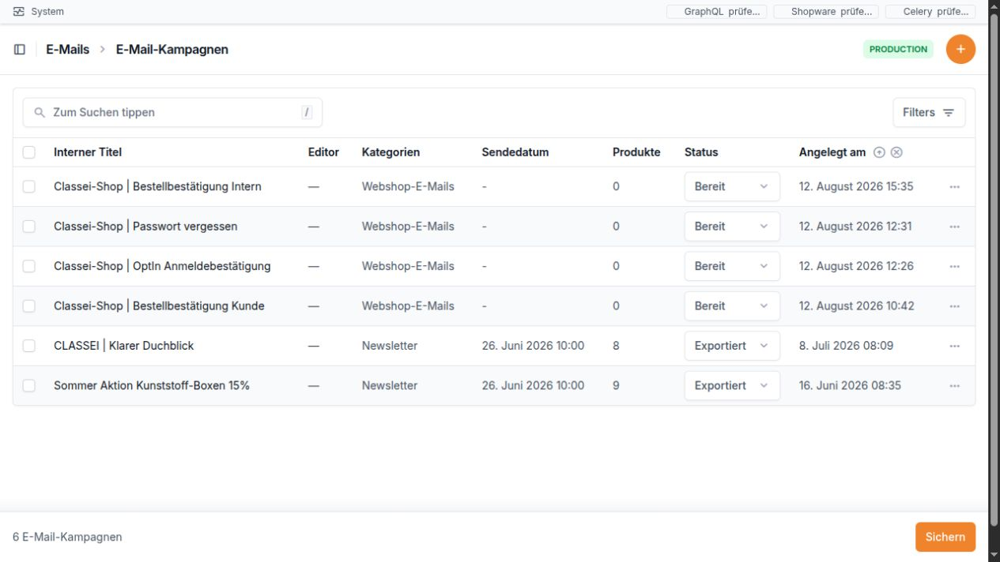

E-Mails
=======

Wofür ist dieser Bereich da?
----------------------------

Im Bereich **E-Mails** erstellen Sie Newsletter-Kampagnen, gestalten
deren Inhalt und ordnen sie den passenden Newsletter-Empfängern zu.
Außerdem sehen Sie, welche E-Mails bereits für die weitere Verarbeitung
vorbereitet wurden.

Der Bereich enthält fünf Menüpunkte:

-  **Kampagnen** – Newsletter anlegen, bearbeiten, gestalten und als
   HTML ausgeben.
-  **Warteschlange** – vorbereitete E-Mails je Empfänger prüfen.
-  **Komponenten** – wiederverwendbare Vorlagen-Bausteine verwalten.
   Dieser Punkt ist eher für geschulte Anwender gedacht.
-  **Kategorien** – Kampagnen mit einfachen Schlagworten ordnen.
-  **Newsletter-Empfänger** – Empfänger aus Shopware prüfen, mit Kunden
   verbinden und einer Kampagne zuordnen.

Die Kampagnenliste zeigt auf einen Blick, ob eine E-Mail noch ein Entwurf,
bereit oder bereits exportiert ist.

..

   **Wichtig:** Die hier geprüfte Funktion bereitet E-Mails vor und legt
   sie in die Warteschlange. Im untersuchten Bereich ist kein
   eigentlicher E-Mail-Versand zu sehen. Deshalb sollte das Handbuch
   nicht versprechen, dass eine E-Mail allein durch den Status „Bereit“
   oder durch den Eintrag in der Warteschlange bereits versendet wurde.

Navigation
----------

1. Öffnen Sie die Bridge unter ``http://10.0.0.165/admin/``.
2. Klappen Sie links den Bereich **E-Mails** auf.
3. Wählen Sie den gewünschten Menüpunkt.

Direkte Adressen:

+----------------------+----------------------------------------------+
| Seite                | Adresse                                      |
+======================+==============================================+
| Kampagnen            | ``htt                                        |
|                      | p://10.0.0.165/admin/emails/emailcampaign/`` |
+----------------------+----------------------------------------------+
| Neue Kampagne        | ``http://                                    |
|                      | 10.0.0.165/admin/emails/emailcampaign/add/`` |
+----------------------+----------------------------------------------+
| Kampagnendaten       | ``http://10.0.0.1                            |
|                      | 65/admin/emails/emailcampaign/<ID>/change/`` |
+----------------------+----------------------------------------------+
| Einfacher Editor     | ``http://10.0.0.1                            |
|                      | 65/admin/emails/emailcampaign/<ID>/editor/`` |
+----------------------+----------------------------------------------+
| Warteschlange        | ``http://10.0.0                              |
|                      | .165/admin/emails/emailcampaignqueueentry/`` |
+----------------------+----------------------------------------------+
| Komponenten          | ``htt                                        |
|                      | p://10.0.0.165/admin/emails/mjmlcomponent/`` |
+----------------------+----------------------------------------------+
| Kategorien           | ``http://10.0                                |
|                      | .0.165/admin/emails/emailcampaigncategory/`` |
+----------------------+----------------------------------------------+
| Newsletter-Empfänger | ``http://10.0.0                              |
|                      | .165/admin/newsletter/newsletterrecipient/`` |
+----------------------+----------------------------------------------+

``<ID>`` steht für die Nummer der jeweiligen Kampagne.

Kampagnen
---------

Die Kampagnenliste
~~~~~~~~~~~~~~~~~~

Die Liste zeigt folgende Spalten:

+--------------------+------------------------------------------------+
| Spalte             | Einfache Erklärung                             |
+====================+================================================+
| **Interner Titel** | Name der Kampagne in der Bridge. Er wird nicht |
|                    | im eigentlichen E-Mail-Inhalt angezeigt. Beim  |
|                    | Vorbereiten der E-Mail wird er zugleich als    |
|                    | Betreff übernommen.                            |
+--------------------+------------------------------------------------+
| **Editor**         | Bei Kampagnen mit einfachem Editor erscheint   |
|                    | **Öffnen**. Ein Strich bedeutet, dass die      |
|                    | Kampagne noch den älteren Komponenten-Aufbau   |
|                    | verwendet.                                     |
+--------------------+------------------------------------------------+
| **Kategorien**     | Zeigt alle zugeordneten Kategorien.            |
+--------------------+------------------------------------------------+
| **Sendedatum**     | Geplanter Zeitpunkt der Kampagne. Das Datum    |
|                    | allein versendet noch nichts.                  |
+--------------------+------------------------------------------------+
| **Produkte**       | Anzahl der in dieser Kampagne verwendeten      |
|                    | Produkte.                                      |
+--------------------+------------------------------------------------+
| **Status**         | Aktueller Arbeitsstand. Der Status kann direkt |
|                    | in der Liste geändert werden.                  |
+--------------------+------------------------------------------------+
| **Angelegt am**    | Zeitpunkt, zu dem die Kampagne erstellt wurde. |
+--------------------+------------------------------------------------+

Sie können nach dem **internen Titel** suchen. Als Filter stehen
**Kategorien**, **Status**, **Sendedatum** und **Angelegt am** zur
Verfügung.

Je nach Berechtigung stehen an einem Eintrag auch **Kopieren** und
**Löschen** zur Verfügung. Prüfen Sie bei einer Kopie besonders den
Status, das Sendedatum, die Kategorien, die Produkte und die Texte.
Diese Angaben können aus der Vorlage übernommen sein.

Status einer Kampagne
~~~~~~~~~~~~~~~~~~~~~

+----------------+----------------------------------------------------+
| Status         | Bedeutung                                          |
+================+====================================================+
| **Entwurf**    | Die Kampagne wird noch bearbeitet. Sie wird von    |
|                | der zeitgesteuerten Vorbereitung nicht             |
|                | berücksichtigt.                                    |
+----------------+----------------------------------------------------+
| **Bereit**     | Die Kampagne ist für die Vorbereitung freigegeben. |
|                | Ist zusätzlich ein Sendedatum gesetzt und der      |
|                | Hintergrundlauf eingerichtet, können die           |
|                | zugeordneten aktiven Empfänger vor dem Termin in   |
|                | die Warteschlange gelegt werden.                   |
+----------------+----------------------------------------------------+
| **Exportiert** | Kennzeichnung für eine bereits ausgegebene         |
|                | Kampagne. Der HTML-Export setzt diesen Status nach |
|                | aktuellem Stand nicht automatisch.                 |
+----------------+----------------------------------------------------+

Eine Kampagne anlegen oder bearbeiten
~~~~~~~~~~~~~~~~~~~~~~~~~~~~~~~~~~~~~

Im Formular **Kampagne** sehen Sie diese Felder:

+----------------------+----------------------------------------------+
| Feld                 | Einfache Erklärung                           |
+======================+==============================================+
| **Interner Titel**   | Pflichtfeld für den Namen in der Bridge.     |
|                      | Dieser Text wird beim Vorbereiten auch als   |
|                      | Betreff verwendet.                           |
+----------------------+----------------------------------------------+
| **Kategorien**       | Eine oder mehrere Kategorien zur besseren    |
|                      | Ordnung. Die Auswahl bestimmt nicht die      |
|                      | Empfänger.                                   |
+----------------------+----------------------------------------------+
| **Status**           | Entwurf, Bereit oder Exportiert. Arbeiten    |
|                      | Sie zuerst mit **Entwurf**.                  |
+----------------------+----------------------------------------------+
| **Sendedatum**       | Geplanter Zeitpunkt. Für die automatische    |
|                      | Vorbereitung muss die Kampagne zusätzlich    |
|                      | den Status **Bereit** haben.                 |
+----------------------+----------------------------------------------+
| **E-Mail gestalten** | Öffnet den einfachen Editor. Bei einer neuen |
|                      | Kampagne erscheint zunächst der Hinweis,     |
|                      | dass sich der Editor nach dem Speichern      |
|                      | öffnet.                                      |
+----------------------+----------------------------------------------+

Unter **Info** stehen Hinweise zu persönlichen Empfänger- und
Kundendaten, die in Vorlagen eingesetzt werden können. Dieser Teil ist
vor allem für Vorlagen-Verantwortliche gedacht. Unter **System** sehen
Sie **Angelegt am** und **Aktualisiert am**.

Nach dem ersten Speichern einer neuen Kampagne öffnet sich normalerweise
automatisch der einfache Editor.

Der einfache E-Mail-Editor
~~~~~~~~~~~~~~~~~~~~~~~~~~

Links bearbeiten Sie die Inhalte. Rechts sehen Sie die Vorschau der
E-Mail. Änderungen werden nach einer kurzen Pause automatisch
gespeichert. Die Anzeige oben wechselt dabei zwischen **Ungespeicherte
Änderung**, **Speichert …**, **Gespeichert**, **Vorschau wird erstellt
…** und **Vorschau aktuell**. Mit **Vorschau aktualisieren** können Sie
die Vorschau zusätzlich von Hand neu laden.

Oben stehen außerdem:

-  **← Kampagnen** – zurück zur Kampagnenliste.
-  **Kampagnendaten** – zurück zu Titel, Kategorien, Status und
   Sendedatum.
-  **Vorschau aktualisieren** – baut die rechte Vorschau neu auf.

Kopfbereich und Titel
^^^^^^^^^^^^^^^^^^^^^

+----------------------+----------------------------------------------+
| Feld                 | Einfache Erklärung                           |
+======================+==============================================+
| **Bild-URL**         | Internetadresse des Logos. Sie muss mit      |
|                      | ``http://`` oder ``https://`` beginnen.      |
+----------------------+----------------------------------------------+
| **Hauptüberschrift** | Große Überschrift am Anfang der E-Mail.      |
+----------------------+----------------------------------------------+
| **Unterzeile**       | Kürzerer Zusatz direkt unter der             |
|                      | Hauptüberschrift.                            |
+----------------------+----------------------------------------------+

Begrüßung und Einleitung
^^^^^^^^^^^^^^^^^^^^^^^^

+----------------------------------+----------------------------------+
| Feld                             | Einfache Erklärung               |
+==================================+==================================+
| **Anrede vor dem                 | Text vor dem Namen, zum Beispiel |
| Empfängernamen**                 | „Hallo“. Der Name wird bei der   |
|                                  | Vorbereitung für den einzelnen   |
|                                  | Empfänger ergänzt.               |
+----------------------------------+----------------------------------+
| **Einleitung**                   | Einleitender Text. Leerzeilen    |
|                                  | werden als getrennte Absätze     |
|                                  | dargestellt.                     |
+----------------------------------+----------------------------------+

In der Editor-Vorschau kann anstelle eines echten Empfängernamens ein
Platzhalter erscheinen. In der persönlichen E-Mail wird der Name des
gewählten Empfängers eingesetzt, soweit er vorhanden ist.

Produktauswahl
^^^^^^^^^^^^^^

+----------------------------------+----------------------------------+
| Feld oder Schaltfläche           | Einfache Erklärung               |
+==================================+==================================+
| **Überschrift**                  | Überschrift über der gesamten    |
|                                  | Produktauswahl.                  |
+----------------------------------+----------------------------------+
| **Produkt hinzufügen**           | Suche nach Artikelnummer oder    |
|                                  | Produktname. Geben Sie           |
|                                  | mindestens zwei Zeichen ein.     |
|                                  | Archivierte Produkte werden      |
|                                  | nicht angeboten.                 |
+----------------------------------+----------------------------------+
| **+ Zwischenüberschrift vor den  | Fügt einen eigenen Textblock vor |
| Produkten**                      | dem ersten Produkt ein.          |
+----------------------------------+----------------------------------+

Die Suche zeigt höchstens zwölf Treffer. Ein Klick auf einen Treffer
nimmt das Produkt in die Kampagne auf und lädt den Editor neu.

Felder je Produkt
^^^^^^^^^^^^^^^^^

+----------------------------------+----------------------------------+
| Feld oder Schaltfläche           | Einfache Erklärung               |
+==================================+==================================+
| **↑ / ↓**                        | Verschiebt das Produkt nach oben |
|                                  | oder unten.                      |
+----------------------------------+----------------------------------+
| **Entfernen**                    | Entfernt das Produkt nach einer  |
|                                  | Sicherheitsfrage aus dieser      |
|                                  | Kampagne. Das Produkt selbst     |
|                                  | bleibt im Produktkatalog         |
|                                  | erhalten.                        |
+----------------------------------+----------------------------------+
| **Abschnittsüberschrift ·        | Kleine Überschrift nur für       |
| optional**                       | diesen Produktabschnitt.         |
+----------------------------------+----------------------------------+
| **Titel in der E-Mail**          | Eigener Produktname für diese    |
|                                  | Kampagne. Bleibt das Feld leer,  |
|                                  | wird der Name aus dem            |
|                                  | Produktkatalog verwendet.        |
+----------------------------------+----------------------------------+
| **Beschreibung**                 | Eigener Beschreibungstext.       |
|                                  | Bleibt das Feld leer, wird die   |
|                                  | Kurzbeschreibung aus dem         |
|                                  | Produktkatalog verwendet.        |
+----------------------------------+----------------------------------+
| **Produktbilder · eine URL pro   | Eigene Bilder für diese          |
| Zeile**                          | Kampagne. Jede Bildadresse muss  |
|                                  | in einer neuen Zeile stehen und  |
|                                  | mit ``http://`` oder             |
|                                  | ``https://`` beginnen. Bleibt    |
|                                  | das Feld leer, werden die Bilder |
|                                  | aus dem Produktkatalog           |
|                                  | verwendet.                       |
+----------------------------------+----------------------------------+
| **Sonderpreis**                  | Auswahl zwischen                 |
|                                  | **Katalogpreis**, **Neuer Preis  |
|                                  | €** und **Rabatt %**.            |
+----------------------------------+----------------------------------+
| **Wert**                         | Betrag oder Prozentsatz passend  |
|                                  | zur Auswahl im Feld              |
|                                  | **Sonderpreis**.                 |
+----------------------------------+----------------------------------+
| **+ Zwischenüberschrift danach** | Fügt direkt nach diesem Produkt  |
|                                  | einen eigenen Zwischenblock ein. |
+----------------------------------+----------------------------------+

Preis und Rabatt gelten nur für diese Kampagne. Ein neuer Preis muss
größer als 0 und kleiner als der Listenpreis sein. Ein Rabatt muss
größer als 0 und kleiner als 100 Prozent sein. **Neuer Preis** und
**Rabatt** können nicht gleichzeitig verwendet werden.

Zwischenüberschrift
^^^^^^^^^^^^^^^^^^^

Ein Zwischenblock kann vor der Produktliste oder nach einem bestimmten
Produkt stehen.

========================== ========================================
Feld                       Einfache Erklärung
========================== ========================================
**Überschrift links**      Haupttext des Zwischenblocks.
**Text mittig · optional** Zusätzlicher Text in der Mitte.
**Text rechts · optional** Zusätzlicher Text auf der rechten Seite.
**Entfernen**              Löscht nur diesen Zwischenblock.
========================== ========================================

Pro Kampagne sind höchstens 30 Zwischenüberschriften möglich.

Abschluss „Bestellung“
^^^^^^^^^^^^^^^^^^^^^^

+------------------------+--------------------------------------------+
| Feld                   | Einfache Erklärung                         |
+========================+============================================+
| **Überschrift**        | Überschrift des Bestellbereichs.           |
+------------------------+--------------------------------------------+
| **Bestellhinweis**     | Kurze Erklärung, wie bestellt werden kann. |
+------------------------+--------------------------------------------+
| **Kontakttext rechts** | Kontaktmöglichkeit, zum Beispiel ein       |
|                        | Telefonhinweis.                            |
+------------------------+--------------------------------------------+

Die Produktliste im Bestellbereich entsteht automatisch aus den
ausgewählten Produkten.

Vorschau und Export
~~~~~~~~~~~~~~~~~~~

Öffnen Sie über **Kampagnendaten** wieder das normale Kampagnenformular.
Rechts befindet sich der Bereich **Export** mit der Schaltfläche **HTML
kopieren**. Sie öffnet ein großes Fenster mit:

-  **HTML zum Kopieren**,
-  **MJML zum Kopieren**,
-  **Textversion zum Kopieren**,
-  einer sichtbaren **Vorschau**,
-  den Schaltflächen **HTML kopieren**, **MJML kopieren**, **Text
   kopieren** und **Schließen**.

Für die Exportvorschau wird nach aktuellem Stand der zuletzt
aktualisierte aktive Newsletter-Empfänger verwendet. Dadurch können
echte persönliche Daten in der Vorschau erscheinen. Prüfen Sie
Screenshots und Weitergaben deshalb sorgfältig.

Der Export ändert den Kampagnenstatus nicht automatisch. Setzen Sie
**Exportiert** nur dann selbst, wenn dies zu Ihrem Arbeitsablauf gehört.

Kategorien
----------

Kategorien helfen beim Sortieren und Filtern. Sie wählen keine Empfänger
aus und verändern nicht den Inhalt.

+---------------------+-----------------------------------------------+
| Feld                | Einfache Erklärung                            |
+=====================+===============================================+
| **Name**            | Eindeutiger Name der Kategorie. Derselbe Name |
|                     | kann nicht zweimal angelegt werden.           |
+---------------------+-----------------------------------------------+
| **Angelegt am**     | Wird automatisch gesetzt.                     |
+---------------------+-----------------------------------------------+
| **Aktualisiert am** | Wird automatisch gesetzt.                     |
+---------------------+-----------------------------------------------+

Die Liste zeigt **Name**, **Angelegt am** und **Aktualisiert am**. Sie
können nach dem Namen suchen.

Newsletter-Empfänger
--------------------

Die Empfängerliste
~~~~~~~~~~~~~~~~~~

Die Liste zeigt:

+---------------------------------+-----------------------------------+
| Spalte                          | Einfache Erklärung                |
+=================================+===================================+
| **E-Mail**                      | E-Mail-Adresse des Empfängers.    |
+---------------------------------+-----------------------------------+
| **Anrede**                      | Lesbare Anrede aus Shopware.      |
+---------------------------------+-----------------------------------+
| **Name**                        | Titel, Vorname und Nachname       |
|                                 | zusammen.                         |
+---------------------------------+-----------------------------------+
| **Status**                      | Farbiger Hinweis, ob der          |
|                                 | Empfänger aktiv, abgemeldet oder  |
|                                 | noch nicht bestätigt ist.         |
+---------------------------------+-----------------------------------+
| **Kunde**                       | **Ja** mit Link zum verbundenen   |
|                                 | Kunden oder **Nein** ohne         |
|                                 | Zuordnung.                        |
+---------------------------------+-----------------------------------+
| **ERP-/Adressnummer**           | Nummer zur Verbindung mit dem     |
|                                 | Kunden.                           |
+---------------------------------+-----------------------------------+
| **Ausgewählte E-Mail-Kampagne** | Kampagne, die für diesen          |
|                                 | Empfänger vorbereitet wird.       |
+---------------------------------+-----------------------------------+
| **Ort**                         | Ort aus den Empfängerdaten.       |
+---------------------------------+-----------------------------------+
| **Sales-Channel ID**            | Herkunftskanal in Shopware.       |
+---------------------------------+-----------------------------------+
| **Zuletzt synchronisiert am**   | Zeitpunkt der letzten Übernahme   |
|                                 | aus Shopware.                     |
+---------------------------------+-----------------------------------+

Die Suche berücksichtigt unter anderem E-Mail-Adresse, Name, Ort,
Shopware-Nummern, ERP-/Adressnummer, verbundenen Kunden, Kampagnentitel
und Sales-Channel. Filter gibt es für **Status**, **Ist Kunde**,
**Sales-Channel ID**, **In Shopware vorhanden** und **Zuletzt
synchronisiert am**.

Oben stehen zwei wichtige Aktionen:

-  **Newsletter-Empfänger von Shopware synchronisieren** – übernimmt den
   aktuellen Stand aus Shopware und meldet anschließend, wie viele
   Einträge gesehen, neu angelegt, geändert, Kunden zugeordnet oder
   nicht zugeordnet wurden und wie viele Fehler auftraten.
-  **Kundenzuordnungen aus AdrNr neu aufbauen** – prüft die vorhandenen
   Empfänger erneut und verbindet sie anhand der ERP-/Adressnummer mit
   Kunden.

Felder eines Empfängers
~~~~~~~~~~~~~~~~~~~~~~~

Einige Angaben kommen aus Shopware und dienen nur zur Kontrolle. Manuell
wichtig ist vor allem **Ausgewählte E-Mail-Kampagne**.

+----------------------+----------------------+----------------------+
| Feld                 | Bedeutung            | Bearbeitung          |
+======================+======================+======================+
| **Shopware ID**      | Eindeutige Nummer    | Nur lesen            |
|                      | des                  |                      |
|                      | Newsletter-Eintrags  |                      |
|                      | in Shopware.         |                      |
+----------------------+----------------------+----------------------+
| **Shopware           | Nummer des           | Nur lesen            |
| Kunden-ID**          | zugehörigen          |                      |
|                      | Shopware-Kunden.     |                      |
+----------------------+----------------------+----------------------+
| ERP-/Adressnummer    | Nummer zur           | Nur lesen            |
|                      | Verbindung mit dem   |                      |
|                      | Bridge-Kunden.       |                      |
+----------------------+----------------------+----------------------+
| **Bridge-Kunde**     | Zugeordneter Kunde   | Nur lesen            |
|                      | in der Bridge.       |                      |
+----------------------+----------------------+----------------------+
| **Ausgewählte        | Kampagne, die für    | Auswählen            |
| E-Mail-Kampagne**    | diesen Empfänger     |                      |
|                      | vorbereitet werden   |                      |
|                      | soll.                |                      |
+----------------------+----------------------+----------------------+
| **Ist Kunde**        | Zeigt, ob eine       | Nur lesen            |
|                      | Kundenzuordnung      |                      |
|                      | besteht.             |                      |
+----------------------+----------------------+----------------------+
| **E-Mail**           | Zieladresse.         | Änderbar, kann aber  |
|                      |                      | beim nächsten        |
|                      |                      | Abgleich wieder aus  |
|                      |                      | Shopware kommen      |
+----------------------+----------------------+----------------------+
| **Titel**            | Titel der Person.    | Änderbar             |
+----------------------+----------------------+----------------------+
| **Anrede ID**        | Interne              | Änderbar             |
|                      | Shopware-Nummer der  |                      |
|                      | Anrede.              |                      |
+----------------------+----------------------+----------------------+
| **Anrede Schlüssel** | Kurzer               | Änderbar             |
|                      | Shopware-Schlüssel   |                      |
|                      | der Anrede.          |                      |
+----------------------+----------------------+----------------------+
| **Anrede**           | Lesbare Anrede.      | Änderbar             |
+----------------------+----------------------+----------------------+
| **Briefanrede**      | Anrede für einen     | Änderbar             |
|                      | persönlichen Text.   |                      |
+----------------------+----------------------+----------------------+
| **Vorname**          | Vorname des          | Änderbar             |
|                      | Empfängers.          |                      |
+----------------------+----------------------+----------------------+
| **Nachname**         | Nachname des         | Änderbar             |
|                      | Empfängers.          |                      |
+----------------------+----------------------+----------------------+
| **PLZ**              | Postleitzahl.        | Änderbar             |
+----------------------+----------------------+----------------------+
| **Ort**              | Ort.                 | Änderbar             |
+----------------------+----------------------+----------------------+
| **Straße**           | Straße.              | Änderbar             |
+----------------------+----------------------+----------------------+
| **Status**           | Shopware-Status des  | Änderbar             |
|                      | Empfängers.          |                      |
+----------------------+----------------------+----------------------+
| **Hash**             | Kennung aus          | Änderbar,            |
|                      | Shopware.            | normalerweise nicht  |
|                      |                      | anfassen             |
+----------------------+----------------------+----------------------+
| **Sales-Channel ID** | Sho                  | Änderbar,            |
|                      | pware-Verkaufskanal. | normalerweise nicht  |
|                      |                      | anfassen             |
+----------------------+----------------------+----------------------+
| **Sprach-ID**        | Sprache aus          | Änderbar,            |
|                      | Shopware.            | normalerweise nicht  |
|                      |                      | anfassen             |
+----------------------+----------------------+----------------------+
| **Bestätigt am**     | Zeitpunkt der        | Änderbar             |
|                      | Bestätigung.         |                      |
+----------------------+----------------------+----------------------+
| **Shopware angelegt  | Anlagezeitpunkt in   | Nur lesen            |
| am**                 | Shopware.            |                      |
+----------------------+----------------------+----------------------+
| **Shopware           | Letzte Änderung in   | Nur lesen            |
| aktualisiert am**    | Shopware.            |                      |
+----------------------+----------------------+----------------------+
| **Zuletzt            | Letzter Abgleich mit | Nur lesen            |
| synchronisiert am**  | der Bridge.          |                      |
+----------------------+----------------------+----------------------+
| **In Shopware        | Zeigt, ob der        | Änderbar,            |
| vorhanden**          | Eintrag beim letzten | normalerweise nicht  |
|                      | vollständigen        | anfassen             |
|                      | Abgleich noch        |                      |
|                      | gefunden wurde.      |                      |
+----------------------+----------------------+----------------------+
| **Custom Fields**    | Zusätzliche Daten    | Änderbar, nur für    |
|                      | aus Shopware.        | geschulte Anwender   |
+----------------------+----------------------+----------------------+
| **Shopware           | Vollständige         | Nur lesen            |
| Rohdaten**           | gelieferte Daten zur |                      |
|                      | Kontrolle.           |                      |
+----------------------+----------------------+----------------------+
| **Angelegt am /      | Systemzeiten der     | Nur lesen            |
| Aktualisiert am**    | Bridge.              |                      |
+----------------------+----------------------+----------------------+

Die möglichen Empfängerstatus sind:

-  **Nicht bestätigt** – Anmeldung wartet noch auf Bestätigung.
-  **Bestätigt** – Double-Opt-In wurde bestätigt; der Empfänger gilt als
   aktiv.
-  **Abgemeldet** – der Empfänger ist nicht aktiv.
-  **Direkt aktiv** – ohne offene Bestätigung aktiv.

Kampagne in die Warteschlange legen
~~~~~~~~~~~~~~~~~~~~~~~~~~~~~~~~~~~

Öffnen Sie einen Empfänger, wählen Sie **Ausgewählte E-Mail-Kampagne**,
speichern Sie und verwenden Sie **Ausgewählte Kampagne in Warteschlange
legen**. Alternativ können Sie mehrere Zeilen in der Liste markieren und
die gleichnamige Sammelaktion verwenden.

Die Vorbereitung ist nur möglich, wenn:

-  eine Kampagne ausgewählt ist,
-  eine E-Mail-Adresse vorhanden ist,
-  der Empfänger **Bestätigt** oder **Direkt aktiv** ist,
-  der Empfänger weiterhin in Shopware vorhanden ist.

Die Bridge erstellt dabei bereits die persönliche HTML- und Textfassung.
Wird dieselbe Kampagne für denselben Empfänger erneut vorbereitet, wird
der vorhandene Warteschlangen-Eintrag aktualisiert. Es entsteht nicht
jedes Mal ein neuer Eintrag.

Bei Erfolg erscheint eine Meldung, wie viele E-Mails fertig aufgebaut
und in die Warteschlange gelegt wurden. Bei einem Fehler nennt die
Meldung die betroffene E-Mail-Adresse und den Grund.

Warteschlange
-------------

Die Liste
~~~~~~~~~

======================== ===================================
Spalte                   Einfache Erklärung
======================== ===================================
**E-Mail**               Zieladresse.
**Kampagne**             Verwendete Kampagne.
**Newsletter-Empfänger** Zugehöriger Empfänger.
**Kunde**                Verbundener Kunde, falls vorhanden.
**Status**               Aktueller Stand des Eintrags.
**Eingereiht am**        Zeitpunkt der Vorbereitung.
**Gesendet am**          Versandzeitpunkt, sofern gesetzt.
======================== ===================================

Sie können nach E-Mail-Adresse, Betreff, Kampagnentitel, Empfängername,
ERP-/Adressnummer und Kundendaten suchen. Filter gibt es für **Status**,
**Kampagne**, **Eingereiht am** und **Gesendet am**.

Felder im Eintrag
~~~~~~~~~~~~~~~~~

+----------------------------------+----------------------------------+
| Feld                             | Einfache Erklärung               |
+==================================+==================================+
| **Kampagne**                     | Kampagne, aus der die E-Mail     |
|                                  | aufgebaut wurde. Nur lesbar.     |
+----------------------------------+----------------------------------+
| **Newsletter-Empfänger**         | Empfänger, für den die           |
|                                  | persönliche Fassung erstellt     |
|                                  | wurde. Nur lesbar.               |
+----------------------------------+----------------------------------+
| **Kunde**                        | Verbundener Kunde, falls         |
|                                  | vorhanden. Nur lesbar.           |
+----------------------------------+----------------------------------+
| **E-Mail**                       | Zieladresse zum Zeitpunkt der    |
|                                  | Vorbereitung. Nur lesbar.        |
+----------------------------------+----------------------------------+
| **Betreff**                      | Wird aus dem internen            |
|                                  | Kampagnentitel übernommen. Nur   |
|                                  | lesbar.                          |
+----------------------------------+----------------------------------+
| **Status**                       | Wartet, Wird gesendet, Gesendet, |
|                                  | Fehler oder Abgebrochen.         |
+----------------------------------+----------------------------------+
| **Eingereiht am**                | Zeitpunkt der letzten            |
|                                  | Vorbereitung. Nur lesbar.        |
+----------------------------------+----------------------------------+
| **Gesendet am**                  | Versandzeitpunkt, sofern         |
|                                  | bekannt.                         |
+----------------------------------+----------------------------------+
| **Fehlermeldung**                | Beschreibung eines aufgetretenen |
|                                  | Fehlers.                         |
+----------------------------------+----------------------------------+
| **Gerenderte HTML E-Mail**       | Sichtbare Vorschau genau dieser  |
|                                  | vorbereiteten Empfängerfassung.  |
|                                  | Nur lesbar.                      |
+----------------------------------+----------------------------------+
| **Angelegt am / Aktualisiert     | Systemzeiten der Bridge. Nur     |
| am**                             | lesbar.                          |
+----------------------------------+----------------------------------+

Ein Eintrag mit **Wartet** ist vorbereitet, aber damit noch nicht
nachweislich versendet. Verwenden Sie **Gesendet** nur zusammen mit
einem bestätigten Versandablauf.

.. _komponenten--nur-für-vorlagen-verantwortliche:

Komponenten – nur für Vorlagen-Verantwortliche
----------------------------------------------

Komponenten sind wiederverwendbare Bausteine für ältere oder besondere
Kampagnen. Neue Kampagnen verwenden normalerweise den einfachen Editor.

Die Liste zeigt **Name**, **Rendering-Modus**, **Platzierung**,
**Standard** und **Reihenfolge**. Nach Name kann gesucht werden. Die
Liste kann nach Modus, Platzierung und Standard gefiltert werden.
**Standard** und **Reihenfolge** lassen sich direkt in der Liste ändern.

+----------------------------------+----------------------------------+
| Feld                             | Einfache Erklärung               |
+==================================+==================================+
| **Name**                         | Name des Vorlagen-Bausteins.     |
+----------------------------------+----------------------------------+
| **Platzierung**                  | **Kopfbereich** oder             |
|                                  | **Inhaltsbereich**.              |
+----------------------------------+----------------------------------+
| **Standard**                     | Ist dies aktiv, kann der         |
|                                  | Baustein bei passenden älteren   |
|                                  | Kampagnen automatisch eingesetzt |
|                                  | werden.                          |
+----------------------------------+----------------------------------+
| **Reihenfolge**                  | Position des Bausteins.          |
+----------------------------------+----------------------------------+
| **Rendering-Modus**              | Legt fest, ob die Bridge die     |
|                                  | Platzhalter verarbeitet oder den |
|                                  | Baustein unverändert an Shopware |
|                                  | weitergibt. Nur nach Vorgabe     |
|                                  | ändern.                          |
+----------------------------------+----------------------------------+
| **MJML-Markup**                  | Vorlageninhalt des Bausteins.    |
|                                  | Nur für geschulte Anwender.      |
+----------------------------------+----------------------------------+
| **Standard-Variablen**           | Grundwerte für die Platzhalter   |
|                                  | des Bausteins. Muss als          |
|                                  | Schlüssel-Wert-Liste im          |
|                                  | angezeigten Editor gepflegt      |
|                                  | werden.                          |
+----------------------------------+----------------------------------+
| **Komponenten-Info**             | Zeigt, welche Unterbausteine     |
|                                  | sowie Produkt-, Empfänger- und   |
|                                  | Kundendaten verwendet werden     |
|                                  | können.                          |
+----------------------------------+----------------------------------+
| **Angelegt am / Aktualisiert     | Systemzeiten der Bridge. Nur     |
| am**                             | lesbar.                          |
+----------------------------------+----------------------------------+

Ein ungültiger Vorlagentext wird beim Speichern mit Zeilennummer
gemeldet. Ändern Sie Komponenten nur, wenn klar ist, welche Kampagnen
sie verwenden.

Ältere Kampagnen mit Komponenten
~~~~~~~~~~~~~~~~~~~~~~~~~~~~~~~~

Bei einer älteren Kampagne kann statt des einfachen Editors eine Liste
von Bausteinen im Kampagnenformular erscheinen. Dort gibt es je
Baustein:

+------------------------------+--------------------------------------+
| Feld                         | Einfache Erklärung                   |
+==============================+======================================+
| **Baum**                     | Zeigt Reihenfolge und Einrückung des |
|                              | Bausteins.                           |
+------------------------------+--------------------------------------+
| **Reihenfolge**              | Position innerhalb der Kampagne.     |
+------------------------------+--------------------------------------+
| **Titel**                    | Eigener Name für diesen Baustein.    |
+------------------------------+--------------------------------------+
| **Bibliotheks-Komponente**   | Gewählte Vorlage.                    |
+------------------------------+--------------------------------------+
| **Variablen**                | Abweichende Texte oder Werte für     |
|                              | diese Kampagne. Nicht gesetzte Werte |
|                              | kommen aus der Vorlage.              |
+------------------------------+--------------------------------------+
| **Übergeordnete Komponente** | Ordnet den Baustein unter einem      |
|                              | anderen Baustein ein.                |
+------------------------------+--------------------------------------+
| **Aktiviert**                | Bestimmt, ob der Baustein ausgegeben |
|                              | wird.                                |
+------------------------------+--------------------------------------+
| **Produkt**                  | Optional verbundenes Produkt.        |
+------------------------------+--------------------------------------+
| **Aktueller Preis**          | Nur lesbare Preisanzeige des         |
|                              | verbundenen Produkts.                |
+------------------------------+--------------------------------------+
| **Komponenten-Info**         | Zeigt Standardwerte und Hinweise zur |
|                              | Einordnung.                          |
+------------------------------+--------------------------------------+

Wenn in der Spalte **Editor** ein Strich steht, handelt es sich
wahrscheinlich um eine solche Komponenten-Kampagne.

Häufige Hinweise und Fehlerquellen
----------------------------------

-  **Die Vorschau ändert sich nicht:** Warten Sie kurz auf
   **Gespeichert** und **Vorschau aktuell** oder klicken Sie auf
   **Vorschau aktualisieren**.
-  **Ein Bild erscheint nicht:** Prüfen Sie, ob die Adresse vollständig
   ist und mit ``http://`` oder ``https://`` beginnt. Bei Produktbildern
   muss jede Adresse in einer eigenen Zeile stehen.
-  **Ein Produkt wird nicht gefunden:** Geben Sie mindestens zwei
   Zeichen ein. Suchen Sie nach Artikelnummer oder Name. Archivierte
   Produkte fehlen absichtlich.
-  **Ein Sonderpreis wird abgelehnt:** Der Wert muss größer als 0 und
   kleiner als der Listenpreis sein. Ein Rabatt muss unter 100 Prozent
   liegen.
-  **Eine Kampagne landet nicht automatisch in der Warteschlange:**
   Prüfen Sie Status **Bereit**, Sendedatum, Empfängerzuordnung und ob
   der Hintergrundlauf eingerichtet ist. Standardmäßig sucht dieser Lauf
   ungefähr einen Tag vor dem Sendedatum in einem Zeitfenster nach
   passenden Kampagnen.
-  **Ein Empfänger kann nicht vorbereitet werden:** Häufig fehlt die
   ausgewählte Kampagne, die E-Mail-Adresse, ein aktiver Status oder der
   Eintrag wurde in Shopware nicht mehr gefunden.
-  **Der Name fehlt in der E-Mail:** Prüfen Sie Vorname, Nachname und
   Anrede beim Empfänger sowie den letzten Shopware-Abgleich.
-  **Die falsche Kampagne wird vorbereitet:** Die Kategorie einer
   Kampagne wählt keine Empfänger aus. Entscheidend ist das Feld
   **Ausgewählte E-Mail-Kampagne** am Empfänger.
-  **Eine erneute Vorbereitung erzeugt keinen zweiten Eintrag:** Für
   dieselbe Kampagne und denselben Empfänger wird der bestehende Eintrag
   aktualisiert.
-  **Exportiert wurde nicht automatisch gesetzt:** Der HTML-Export
   ändert den Status nicht.
-  **Persönliche Daten in Vorschau oder Screenshot:** Export und
   Warteschlangen-Vorschau können Namen, Adresse oder Kundendaten
   enthalten. Vor Weitergabe bitte anonymisieren.

Praxisbeispiel 1: Eine Produktaktion erstellen und als HTML prüfen
------------------------------------------------------------------

Ziel: Eine neue Kampagne mit zwei Produkten, einer eigenen Einleitung
und einem Rabatt vorbereiten.

1.  Öffnen Sie **E-Mails → Kampagnen** und wählen Sie **Hinzufügen**.
2.  Tragen Sie bei **Interner Titel** „Herbstaktion Ordnungsmappen“ ein.
3.  Wählen Sie eine passende Kategorie und lassen Sie den Status
    zunächst auf **Entwurf**.
4.  Speichern Sie. Der einfache Editor öffnet sich.
5.  Tragen Sie eine **Hauptüberschrift**, eine **Unterzeile**, die
    **Anrede** und die **Einleitung** ein.
6.  Suchen Sie im Feld **Produkt hinzufügen** nach der ersten
    Artikelnummer und klicken Sie auf den Treffer. Wiederholen Sie den
    Schritt für das zweite Produkt.
7.  Verwenden Sie **↑** und **↓**, bis die Produkte in der gewünschten
    Reihenfolge stehen.
8.  Geben Sie beim ersten Produkt einen eigenen **Titel in der E-Mail**
    und eine kurze **Beschreibung** ein.
9.  Wählen Sie beim zweiten Produkt **Rabatt %** und tragen Sie ``15``
    ein. Prüfen Sie, ob in der Vorschau der erwartete Preis erscheint.
10. Fügen Sie nach dem ersten Produkt eine **Zwischenüberschrift** ein.
    Tragen Sie links einen kurzen Titel und rechts einen Telefonhinweis
    ein.
11. Warten Sie, bis oben **Gespeichert** und **Vorschau aktuell** steht.
12. Öffnen Sie **Kampagnendaten**. Kontrollieren Sie Titel, Kategorie,
    Status und gegebenenfalls das Sendedatum.
13. Klicken Sie rechts auf **HTML kopieren**. Prüfen Sie die Vorschau
    und kopieren Sie die benötigte Fassung.
14. Setzen Sie den Status erst dann auf **Bereit**, wenn Inhalt, Preise,
    Links und Empfängerzuordnung geprüft sind.

Erwartetes Ergebnis: Die Kampagne ist gespeichert, enthält zwei Produkte
in richtiger Reihenfolge, zeigt den Rabatt nur in dieser Kampagne und
kann als HTML, Vorlagentext oder reine Textfassung kopiert werden.

Praxisbeispiel 2: Empfänger zuordnen und die persönliche Fassung kontrollieren
------------------------------------------------------------------------------

Ziel: Eine fertige Kampagne für aktive Empfänger vorbereiten und Fehler
in der Warteschlange prüfen.

1.  Öffnen Sie **E-Mails → Newsletter-Empfänger**.
2.  Starten Sie **Newsletter-Empfänger von Shopware synchronisieren**
    und lesen Sie die Abschlussmeldung.
3.  Falls Empfänger trotz vorhandener ERP-/Adressnummer nicht als Kunde
    erkannt werden, verwenden Sie **Kundenzuordnungen aus AdrNr neu
    aufbauen**.
4.  Filtern Sie auf aktive Empfänger. Geeignet sind **Bestätigt** und
    **Direkt aktiv**.
5.  Öffnen Sie den ersten Empfänger. Prüfen Sie E-Mail-Adresse, Status,
    **In Shopware vorhanden** und die Kundenverknüpfung.
6.  Wählen Sie bei **Ausgewählte E-Mail-Kampagne** die fertige Kampagne
    und speichern Sie.
7.  Klicken Sie auf **Ausgewählte Kampagne in Warteschlange legen**.
8.  Wiederholen Sie die Zuordnung bei weiteren Empfängern oder markieren
    Sie mehrere vorbereitete Empfänger in der Liste und verwenden Sie
    die Sammelaktion.
9.  Achten Sie auf die Rückmeldung. Bei einem Fehler nennt die Bridge
    Empfänger und Ursache.
10. Öffnen Sie **E-Mails → Warteschlange** und filtern Sie auf die
    Kampagne.
11. Öffnen Sie einen Eintrag. Kontrollieren Sie E-Mail-Adresse, Betreff,
    Status und die **Gerenderte HTML E-Mail**. Prüfen Sie besonders
    Anrede, Name, Produkttexte, Preise und Bilddarstellung.
12. Ein Status **Wartet** bedeutet nur, dass die persönliche Fassung
    vorbereitet wurde. Klären Sie über den vorgesehenen Versandablauf,
    wann sie tatsächlich gesendet wird.

Erwartetes Ergebnis: Für jeden geeigneten Empfänger liegt genau ein
aktueller Warteschlangen-Eintrag mit persönlicher Vorschau vor. Nicht
aktive oder in Shopware fehlende Empfänger werden mit verständlicher
Meldung abgewiesen.
