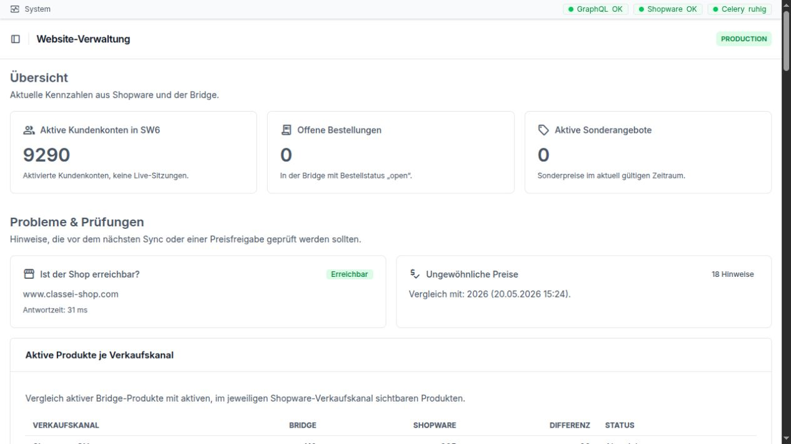

Anwenderhandbuch: tägliche Arbeit
=================================

Dieses Handbuch erklärt die wichtigsten Arbeitsbereiche der GC-Bridge in
einfacher Sprache. Es richtet sich an Mitarbeiterinnen und Mitarbeiter, die
mit Daten arbeiten, aber keine technischen Vorkenntnisse benötigen.

Jedes Kapitel enthält:

* eine kurze Erklärung des Bereichs,
* eine genaue Beschreibung der sichtbaren Felder,
* einen typischen Arbeitsablauf,
* Hinweise zu häufigen Fehlern,
* genau zwei Praxisbeispiele.

Die Startseite zeigt zuerst wichtige Kennzahlen und Prüfhinweise. Die sieben
Kapitel dieses Handbuchs öffnen Sie über die linke Navigation.

.. toctree::
   :maxdepth: 2
   :caption: Arbeitsbereiche

   issues
   emails
   bestellungen
   kunden
   produkte
   dokumente
   mappei
