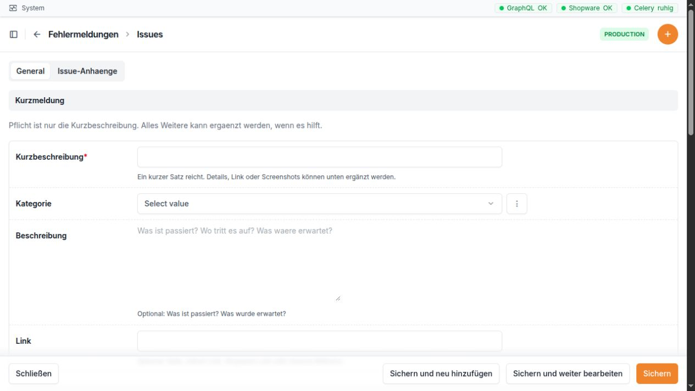

.. _gc-bridge-handbuch--issues:

Issues
======

Wofür ist dieser Bereich da?
----------------------------

Im Bereich **Issues** werden Fehler, offene Fragen und kleine
Arbeitsaufträge gesammelt. Ein Issue beschreibt kurz, was passiert ist,
wer sich darum kümmert und wie weit die Bearbeitung ist. Bilder,
PDF-Dateien und Fehlerdateien können direkt am Issue abgelegt werden.

Erledigte und geschlossene Einträge verschwinden nicht. Sie werden
automatisch im **Issue-Archiv** angezeigt und bleiben dort
nachvollziehbar.

Beim Anlegen reicht eine kurze, klare Überschrift. Kategorie, Beschreibung und
Link machen die Meldung leichter verständlich.

Navigation
----------

In der linken Navigation gibt es den Abschnitt **Issues** mit drei
Einträgen:

-  **Issues**: aktive Vorgänge bearbeiten und neue Vorgänge anlegen
-  **Issue-Archiv**: erledigte und geschlossene Vorgänge nachlesen oder
   wiederherstellen
-  **Kategorien**: die auswählbaren Themenbereiche verwalten

Direkte Adressen:

============= =================================================
Bereich       Adresse
============= =================================================
Aktive Issues ``http://10.0.0.165/admin/issues/issue/``
Neues Issue   ``http://10.0.0.165/admin/issues/issue/add/``
Issue-Archiv  ``http://10.0.0.165/admin/issues/archivedissue/``
Kategorien    ``http://10.0.0.165/admin/issues/issuecategory/``
============= =================================================

Die Links sind nur für angemeldete Mitarbeiter sichtbar. Issues dürfen
Mitarbeiter ansehen, anlegen und ändern. Das endgültige Löschen eines
Issues ist nur für Administratoren möglich. Kategorien dürfen ebenfalls
nur Administratoren anlegen, ändern oder löschen.

Die Arbeitsliste „Issues“
-------------------------

Die Arbeitsliste zeigt nur Vorgänge, die noch nicht erledigt oder
geschlossen sind. Standardmäßig stehen die neuesten Einträge oben.

Spalten der Liste
~~~~~~~~~~~~~~~~~

+----------------------+----------------------------------------------+
| Spalte               | Bedeutung                                    |
+======================+==============================================+
| **Kurzbeschreibung** | Der Titel des Issues. Ein Klick öffnet den   |
|                      | Vorgang.                                     |
+----------------------+----------------------------------------------+
| **Kategorie**        | Das Thema, zu dem der Vorgang gehört.        |
+----------------------+----------------------------------------------+
| **Status**           | Der aktuelle Bearbeitungsstand.              |
+----------------------+----------------------------------------------+
| **Priorität**        | Zeigt, wie dringend der Vorgang ist. Die     |
|                      | Priorität kann direkt in der Liste geändert  |
|                      | werden.                                      |
+----------------------+----------------------------------------------+
| **Gemeldet von**     | Der Mitarbeiter, der das Issue angelegt hat. |
+----------------------+----------------------------------------------+
| **Zugewiesen an**    | Der verantwortliche Mitarbeiter. Die         |
|                      | Zuweisung kann direkt in der Liste geändert  |
|                      | werden.                                      |
+----------------------+----------------------------------------------+
| **Link**             | Zeigt **Öffnen**, wenn im Issue eine Adresse |
|                      | hinterlegt wurde. Der Link öffnet sich in    |
|                      | einem neuen Fenster oder Tab. Ohne           |
|                      | hinterlegte Adresse steht hier ein Strich.   |
+----------------------+----------------------------------------------+
| **Anhänge**          | Anzahl der am Issue gespeicherten Dateien.   |
+----------------------+----------------------------------------------+
| **Angelegt am**      | Zeitpunkt, zu dem das Issue erstellt wurde.  |
+----------------------+----------------------------------------------+

Suchen und filtern
~~~~~~~~~~~~~~~~~~

Die Suche berücksichtigt die Kurzbeschreibung, die Beschreibung, den
Link, den Fehlertext sowie Namen und Benutzernamen der meldenden und
zugewiesenen Person.

Die Liste kann nach folgenden Angaben gefiltert werden:

-  Status
-  Priorität
-  Kategorie
-  zugewiesener Mitarbeiter
-  Anlagedatum

So lässt sich zum Beispiel schnell die persönliche Arbeitsliste
anzeigen: Im Filter **Zugewiesen an** den eigenen Namen wählen und bei
**Status** nur die gewünschten Bearbeitungsstände auswählen.

Ein Issue anlegen oder bearbeiten
---------------------------------

Zum Anlegen in der Arbeitsliste **Issue hinzufügen** wählen. Für ein
neues Issue ist nur die **Kurzbeschreibung** zwingend erforderlich. Je
genauer die hilfreichen Angaben sind, desto leichter kann der Vorgang
bearbeitet werden.

Abschnitt „Kurzmeldung“
~~~~~~~~~~~~~~~~~~~~~~~

+----------------------+----------------------------------------------+
| Feld                 | Eingabe und Bedeutung                        |
+======================+==============================================+
| **Kurzbeschreibung** | Pflichtfeld. Ein kurzer, eindeutiger Satz    |
|                      | mit höchstens 255 Zeichen. Er sollte         |
|                      | beschreiben, was nicht funktioniert oder was |
|                      | geklärt werden soll.                         |
+----------------------+----------------------------------------------+
| **Kategorie**        | Optional. Ordnet das Issue einem Thema zu.   |
|                      | Es werden nur aktive Kategorien angeboten.   |
+----------------------+----------------------------------------------+
| **Beschreibung**     | Optional. Hier gehört hinein, was passiert   |
|                      | ist, wo es passiert ist und was stattdessen  |
|                      | erwartet wurde. Das Feld bietet viel Platz   |
|                      | für eine verständliche Schilderung.          |
+----------------------+----------------------------------------------+
| **Link**             | Optional. Direkte Adresse zur betroffenen    |
|                      | Seite, zu einem Eintrag in der Bridge, zu    |
|                      | Shopware oder zu einer anderen passenden     |
|                      | Fundstelle. Es muss eine vollständige        |
|                      | Webadresse sein.                             |
+----------------------+----------------------------------------------+

Abschnitt „Bearbeitung“
~~~~~~~~~~~~~~~~~~~~~~~

+-------------------+-------------------------------------------------+
| Feld              | Eingabe und Bedeutung                           |
+===================+=================================================+
| **Status**        | Legt den Bearbeitungsstand fest. Die möglichen  |
|                   | Werte werden unten erklärt.                     |
+-------------------+-------------------------------------------------+
| **Priorität**     | Legt die Dringlichkeit fest. Beim Anlegen ist   |
|                   | **Normal** vorausgewählt.                       |
+-------------------+-------------------------------------------------+
| **Zugewiesen an** | Verantwortlicher Mitarbeiter. Es werden         |
|                   | Benutzer mit Mitarbeiterrechten angeboten. Ein  |
|                   | fest eingerichteter Standardbearbeiter ist      |
|                   | vorausgewählt; der angezeigte Name hängt von    |
|                   | der Benutzerverwaltung der Bridge ab. Das Feld  |
|                   | kann auch leer bleiben.                         |
+-------------------+-------------------------------------------------+
| **Gemeldet von**  | Wird beim Anlegen automatisch mit dem           |
|                   | angemeldeten Mitarbeiter gefüllt und kann nicht |
|                   | von Hand geändert werden.                       |
+-------------------+-------------------------------------------------+

Statuswerte
~~~~~~~~~~~

+--------------------+------------------------------------------------+
| Status             | Einfache Bedeutung                             |
+====================+================================================+
| **Offen**          | Das Issue ist neu oder wurde noch nicht        |
|                    | begonnen.                                      |
+--------------------+------------------------------------------------+
| **In Bearbeitung** | Jemand arbeitet gerade daran.                  |
+--------------------+------------------------------------------------+
| **Wartet**         | Die Bearbeitung kann im Moment nicht           |
|                    | weitergehen, etwa weil eine Antwort oder eine  |
|                    | andere Voraussetzung fehlt.                    |
+--------------------+------------------------------------------------+
| **Erledigt**       | Das Problem wurde gelöst. Eine                 |
|                    | Lösungsdokumentation ist Pflicht. Der Eintrag  |
|                    | wechselt ins Archiv.                           |
+--------------------+------------------------------------------------+
| **Geschlossen**    | Der Vorgang ist endgültig beendet. Eine        |
|                    | Lösungsdokumentation ist Pflicht. Der Eintrag  |
|                    | wechselt ins Archiv.                           |
+--------------------+------------------------------------------------+

Prioritäten
~~~~~~~~~~~

+--------------+------------------------------------------------------+
| Priorität    | Verwendung                                           |
+==============+======================================================+
| **Niedrig**  | Der Vorgang kann warten und behindert die tägliche   |
|              | Arbeit nicht.                                        |
+--------------+------------------------------------------------------+
| **Normal**   | Üblicher Vorgang ohne besondere Eile. Dies ist die   |
|              | Voreinstellung.                                      |
+--------------+------------------------------------------------------+
| **Hoch**     | Der Vorgang sollte zeitnah bearbeitet werden.        |
+--------------+------------------------------------------------------+
| **Dringend** | Der Vorgang beeinträchtigt die Arbeit stark und      |
|              | braucht sofortige Aufmerksamkeit.                    |
+--------------+------------------------------------------------------+

Abschnitt „Fehlerdetails“
~~~~~~~~~~~~~~~~~~~~~~~~~

+-----------------------+---------------------------------------------+
| Feld                  | Eingabe und Bedeutung                       |
+=======================+=============================================+
| **Fehlertext**        | Optional. Hier kann eine angezeigte         |
|                       | Fehlermeldung oder ein kopierter Auszug aus |
|                       | einem Protokoll eingefügt werden. Der Text  |
|                       | sollte möglichst unverändert übernommen     |
|                       | werden.                                     |
+-----------------------+---------------------------------------------+
| **Fehlertext-Datei**  | Optional. Hier kann eine Fehler- oder       |
|                       | Protokolldatei hochgeladen werden. Erlaubt  |
|                       | sind Dateien mit den Endungen ``.txt``,     |
|                       | ``.log``, ``.json``, ``.xml``, ``.html``    |
|                       | und ``.csv``.                               |
+-----------------------+---------------------------------------------+
| **Link** / **Öffnen** | Schreibgeschützte Anzeige des oben          |
|                       | eingetragenen Links. Ohne Link wird ein     |
|                       | Strich angezeigt.                           |
+-----------------------+---------------------------------------------+
| **Anhänge**           | Schreibgeschützte Anzahl der Dateien, die   |
|                       | unten im Bereich **Issue-Anhänge**          |
|                       | gespeichert sind. Bei einem noch nicht      |
|                       | gespeicherten Issue steht hier 0.           |
+-----------------------+---------------------------------------------+

Abschnitt „Abschlussdokumentation“
~~~~~~~~~~~~~~~~~~~~~~~~~~~~~~~~~~

+--------------------------+------------------------------------------+
| Feld                     | Eingabe und Bedeutung                    |
+==========================+==========================================+
| **Lösungsdokumentation** | Beschreibt kurz, was gemacht wurde und   |
|                          | warum. Sobald der Status **Erledigt**    |
|                          | oder **Geschlossen** gewählt wird, ist   |
|                          | dieses Feld Pflicht.                     |
+--------------------------+------------------------------------------+
| **Abgeschlossen am**     | Wird beim ersten Abschluss automatisch   |
|                          | gesetzt und kann nicht von Hand geändert |
|                          | werden.                                  |
+--------------------------+------------------------------------------+
| **Abgeschlossen von**    | Wird beim ersten Abschluss automatisch   |
|                          | mit dem angemeldeten Mitarbeiter gefüllt |
|                          | und kann nicht von Hand geändert werden. |
+--------------------------+------------------------------------------+

Wird **Erledigt** oder **Geschlossen** ohne Lösungsdokumentation
gespeichert, bleibt das Formular geöffnet und zeigt den Hinweis: „Bitte
dokumentiere kurz, was gelöst wurde und warum, bevor das Issue
archiviert wird.“

Abschnitt „System“
~~~~~~~~~~~~~~~~~~

Dieser eingeklappte Abschnitt dient nur zur Information:

=================== =================================
Feld                Bedeutung
=================== =================================
**Angelegt am**     Zeitpunkt der ersten Speicherung.
**Aktualisiert am** Zeitpunkt der letzten Änderung.
=================== =================================

Beide Angaben werden automatisch geführt.

Anhänge hinzufügen
------------------

Im unteren Teil des Issue-Formulars befindet sich der Bereich
**Issue-Anhänge**. Dort können mehrere Dateien nacheinander ergänzt
werden.

+-----------------+---------------------------------------------------+
| Feld            | Eingabe und Bedeutung                             |
+=================+===================================================+
| **Art**         | Auswahl zwischen **Screenshot**, **Fehlerdatei**  |
|                 | und **Sonstiges**. Beim neuen Anhang ist          |
|                 | **Screenshot** vorausgewählt.                     |
+-----------------+---------------------------------------------------+
| **Datei**       | Pflichtfeld für den jeweiligen Anhang. Erlaubt    |
|                 | sind ``.png``, ``.jpg``, ``.jpeg``, ``.webp``,    |
|                 | ``.gif``, ``.pdf``, ``.txt``, ``.log`` und        |
|                 | ``.json``.                                        |
+-----------------+---------------------------------------------------+
| **Hinweis**     | Optionaler kurzer Text, der erklärt, was auf dem  |
|                 | Bild oder in der Datei wichtig ist.               |
+-----------------+---------------------------------------------------+
| **Angelegt am** | Wird nach dem Speichern automatisch angezeigt.    |
+-----------------+---------------------------------------------------+

Ein nicht mehr benötigter Anhang kann im Issue zum Löschen markiert
werden. Die Änderung wird erst mit dem Speichern des gesamten Issues
übernommen.

Tipp: Bei einem Screenshot im Feld **Hinweis** kurz den sichtbaren
Fehler und die wichtige Stelle benennen. So muss der Bearbeiter nicht
raten, worauf er achten soll.

Ein Issue abschließen
---------------------

1. Das Issue öffnen.
2. Prüfen, ob Beschreibung, Fehlerdetails und Anhänge für spätere
   Rückfragen ausreichen.
3. Im Feld **Lösungsdokumentation** kurz festhalten, was geändert oder
   geklärt wurde und warum.
4. Den Status auf **Erledigt** oder **Geschlossen** setzen.
5. Speichern.

Beim Speichern werden Abschlusszeitpunkt und abschließender Mitarbeiter
automatisch eingetragen. Anschließend erscheint der Vorgang nicht mehr
in der normalen Arbeitsliste, sondern im **Issue-Archiv**.

Das Issue-Archiv
----------------

Das Archiv enthält ausschließlich Issues mit dem Status **Erledigt**
oder **Geschlossen**. Die Felder, Suche und Filter entsprechen
weitgehend der normalen Arbeitsliste. Im Archiv kann kein neues Issue
angelegt werden.

Soll ein Vorgang erneut bearbeitet werden, gibt es drei Möglichkeiten:

-  in der Archivliste die Aktion **Wiederherstellen** direkt in der
   Zeile verwenden,
-  ein archiviertes Issue öffnen und **Aus Archiv wiederherstellen**
   wählen,
-  mehrere Einträge markieren und die Sammelaktion **Aus Archiv
   wiederherstellen** ausführen.

Beim Wiederherstellen erhält das Issue den Status **In Bearbeitung** und
erscheint wieder in der normalen Arbeitsliste. Die bisherige
Lösungsdokumentation bleibt erhalten und kann bei Bedarf ergänzt werden.

Kategorien
----------

Kategorien machen die Arbeitsliste übersichtlicher. Nur Administratoren
können sie verwalten. Mitarbeiter können aktive Kategorien beim
Bearbeiten eines Issues auswählen.

Felder einer Kategorie
~~~~~~~~~~~~~~~~~~~~~~

+---------------------+-----------------------------------------------+
| Feld                | Eingabe und Bedeutung                         |
+=====================+===============================================+
| **Name**            | Pflichtfeld. Eindeutiger Name mit höchstens   |
|                     | 120 Zeichen. Derselbe Name kann nicht zweimal |
|                     | angelegt werden.                              |
+---------------------+-----------------------------------------------+
| **Beschreibung**    | Optional. Erklärt, welche Issues in diese     |
|                     | Kategorie gehören.                            |
+---------------------+-----------------------------------------------+
| **Farbe**           | Optional. Farbwert für die Kennzeichnung.     |
|                     | Ohne eigene Angabe wird ein gedecktes Grau    |
|                     | verwendet. In der Kategorienliste werden ein  |
|                     | Farbpunkt und der gespeicherte Wert           |
|                     | angezeigt.                                    |
+---------------------+-----------------------------------------------+
| **Aktiv**           | Nur aktive Kategorien stehen im               |
|                     | Issue-Formular zur Auswahl. Eine nicht mehr   |
|                     | benötigte Kategorie sollte deaktiviert        |
|                     | werden, wenn vorhandene Zuordnungen erhalten  |
|                     | bleiben sollen.                               |
+---------------------+-----------------------------------------------+
| **Angelegt am**     | Automatisch gesetzter Zeitpunkt der           |
|                     | Erstellung.                                   |
+---------------------+-----------------------------------------------+
| **Aktualisiert am** | Automatisch gesetzter Zeitpunkt der letzten   |
|                     | Änderung.                                     |
+---------------------+-----------------------------------------------+

Die Kategorienliste zeigt **Name**, eine Vorschau der **Farbe**,
**Aktiv** und **Aktualisiert am**. Der Schalter **Aktiv** kann direkt in
der Liste geändert werden. Außerdem kann nach aktiven und inaktiven
Kategorien gefiltert sowie in Name und Beschreibung gesucht werden.

Automatisch angelegte Issues
----------------------------

Bestimmte Hintergrundaufgaben der Bridge können Fehler selbst als Issue
festhalten. Solche Einträge tragen häufig einen Titel, der mit
**[Task]** beginnt. Sie sind normalerweise **Offen** und haben eine hohe
Priorität. Der gesammelte Fehler steht im Feld **Fehlertext**.

Gibt es bereits ein offenes Issue mit genau demselben Titel, wird nicht
jedes Mal ein weiterer Vorgang angelegt. Der neue Fehlertext wird dem
vorhandenen Issue hinzugefügt. Dadurch bleibt die Arbeitsliste
übersichtlich und die wiederholten Fehler stehen gemeinsam an einem Ort.
Automatisch angelegte Issues werden anschließend genauso zugewiesen,
bearbeitet und abgeschlossen wie manuell angelegte Issues.

Meldung über neue Issues nach der Anmeldung
-------------------------------------------

Nach einer Anmeldung kann oben rechts eine gelbe Meldung **Neues Issue**
erscheinen. Sie zeigt den Titel und führt mit einem Klick direkt zum
Issue. Bei einem bereits abgeschlossenen Issue führt der Link ins
Archiv.

Die Meldung betrifft neu angelegte Issues seit der letzten Prüfung und
ist nicht auf die eigene Zuweisung beschränkt. Sie schließt sich nach
etwa zehn Sekunden selbst oder kann über das Kreuz geschlossen werden.
Beim allerersten Einsatz werden vorhandene alte Issues nicht
nachträglich als neue Meldungen gezeigt.

Häufige Hinweise und Fehlerquellen
----------------------------------

-  **Das Issue ist nach dem Speichern verschwunden:** Bei **Erledigt**
   oder **Geschlossen** ist es ins Issue-Archiv gewechselt.
-  **Der Abschluss lässt sich nicht speichern:** Im Feld
   **Lösungsdokumentation** fehlt eine kurze Erklärung.
-  **Eine Kategorie fehlt in der Auswahl:** Die Kategorie ist
   möglicherweise auf **inaktiv** gestellt. Ein Administrator kann dies
   unter **Kategorien** prüfen.
-  **Eine Datei wird abgelehnt:** Die Dateiendung ist für das gewählte
   Dateifeld nicht erlaubt. Screenshots gehören am besten in
   **Issue-Anhänge**, nicht in **Fehlertext-Datei**.
-  **Der Link lässt sich nicht speichern:** Im Feld **Link** muss eine
   vollständige Webadresse stehen, in der Regel beginnend mit
   ``http://`` oder ``https://``.
-  **Die Liste zeigt zu viele Einträge:** Mit Status, Priorität,
   Kategorie oder Zuweisung filtern. Die Suche eignet sich für Wörter
   aus Titel, Beschreibung oder Fehlertext.
-  **Ein Issue soll doch weiterbearbeitet werden:** Im Issue-Archiv die
   Funktion **Wiederherstellen** verwenden.
-  **Eine Kategorie soll nicht mehr verwendet werden:** Sie besser
   deaktivieren statt löschen. So bleiben ältere Issues verständlich
   zugeordnet.
-  **Eine Warnmeldung verschwindet schnell:** Das ist beabsichtigt. Das
   Issue bleibt trotzdem in der Arbeitsliste oder im Archiv erhalten.

Praxisbeispiel 1: Fehler beim Bearbeiten einer Bestellung melden
----------------------------------------------------------------

Eine Mitarbeiterin kann eine Bestellung öffnen, aber beim Speichern
erscheint eine Fehlermeldung.

1.  In der linken Navigation **Issues → Issues** öffnen und **Issue
    hinzufügen** wählen.
2.  Als **Kurzbeschreibung** eintragen: „Bestellung 4711 lässt sich
    nicht speichern“.
3.  Eine passende **Kategorie** wählen, sofern vorhanden.
4.  In der **Beschreibung** festhalten: „Der Fehler erscheint nach einer
    Änderung der Lieferadresse beim Klick auf Speichern. Erwartet wurde,
    dass die neue Adresse übernommen wird.“
5.  Den vollständigen Link zur betroffenen Bestellung in **Link**
    einfügen.
6.  Die angezeigte Meldung unverändert in **Fehlertext** kopieren.
7.  **Priorität Hoch** wählen, weil die Bestellung weiterbearbeitet
    werden muss.
8.  Unter **Issue-Anhänge** die sichtbare Fehlermeldung als
    **Screenshot** hochladen. Als **Hinweis** „Fehlermeldung nach dem
    Speichern der Lieferadresse“ eintragen.
9.  Das Issue speichern. **Gemeldet von** wird automatisch gesetzt; der
    vorausgewählte Bearbeiter kann bei Bedarf geändert werden.
10. Während der Prüfung den Status auf **In Bearbeitung** stellen. Falls
    zunächst eine Rückmeldung benötigt wird, vorübergehend **Wartet**
    wählen.
11. Nach der Korrektur in **Lösungsdokumentation** eintragen: „Die
    unvollständige Lieferadresse wurde ergänzt. Danach konnte die
    Bestellung wieder gespeichert werden.“
12. Den Status auf **Erledigt** setzen und speichern. Das Issue liegt
    nun mit Abschlusszeit und Bearbeiter im Archiv.

Das Ergebnis ist ein nachvollziehbarer Vorgang: Die betroffene Stelle
ist direkt verlinkt, der genaue Fehler ist erhalten und die Lösung kann
später nachgelesen werden.

Praxisbeispiel 2: Einen zu früh geschlossenen Vorgang wieder aufnehmen
----------------------------------------------------------------------

Ein Issue wurde geschlossen, doch am nächsten Tag tritt dasselbe Problem
erneut auf.

1.  In der linken Navigation **Issues → Issue-Archiv** öffnen.
2.  Über die Suche ein markantes Wort aus der Kurzbeschreibung eingeben.
3.  Den gefundenen Vorgang öffnen und die bisherige Beschreibung,
    Anhänge und Lösungsdokumentation prüfen.
4.  **Aus Archiv wiederherstellen** wählen. Der Status ändert sich
    automatisch auf **In Bearbeitung**, und die normale Issue-Liste wird
    geöffnet.
5.  Das wiederhergestellte Issue öffnen.
6.  In der **Beschreibung** ergänzen, wann und unter welchen Umständen
    der Fehler erneut aufgetreten ist.
7.  Einen neuen Screenshot als weiteren **Issue-Anhang** hinzufügen und
    den Zeitpunkt im **Hinweis** nennen.
8.  Die **Priorität** bei Bedarf auf **Dringend** erhöhen und die
    zuständige Person unter **Zugewiesen an** prüfen.
9.  Nach der erneuten Lösung die **Lösungsdokumentation** um die neue
    Ursache und die dauerhafte Maßnahme ergänzen.
10. Den Status wieder auf **Erledigt** oder **Geschlossen** setzen und
    speichern.

Auf diese Weise bleibt die gesamte Vorgeschichte an einem Ort. Es
entsteht kein zweiter, schwer zuzuordnender Vorgang.
