Kunden
======

.. _kunden-merge-ablauf:

Kunden zusammenführen
~~~~~~~~~~~~~~~~~~~~~

**Unser Beispiel:** Nina Beispiel ist bereits Kundin unter der Nummer
**12196**. Sie meldet sich im Shop noch einmal an und erhält die Nummer
**950059**. Nun gibt es zwei Kundenkonten für dieselbe Person. Wir möchten
mit **12196** weiterarbeiten und die Bestellungen und die Adresse von
**950059** dorthin übernehmen.

Nina wohnt in der **Musterstraße 12**. Ihre Pakete möchte sie künftig an
den **Gartenweg 8** bekommen. Wir begleiten diesen einen Fall vom
Zusammenführen bis zur Prüfung der Adressen.

Die Bildschirmfotos zeigen die Bedienoberfläche mit fiktiven
Beispieldaten. Nina Beispiel, ihre Anschriften und Bestellungen sind
frei erfunden.

**1. Beide Kunden suchen**

Öffnen Sie **Kunden → Kunden zusammenführen**. Tragen Sie bei
**AdrNr / Kundennummer** die beiden Nummern **12196,950059** ein.
Lassen Sie die übrigen Suchfelder leer und klicken Sie auf **Suchen**.
So werden beide Kunden nebeneinander prüfbar.

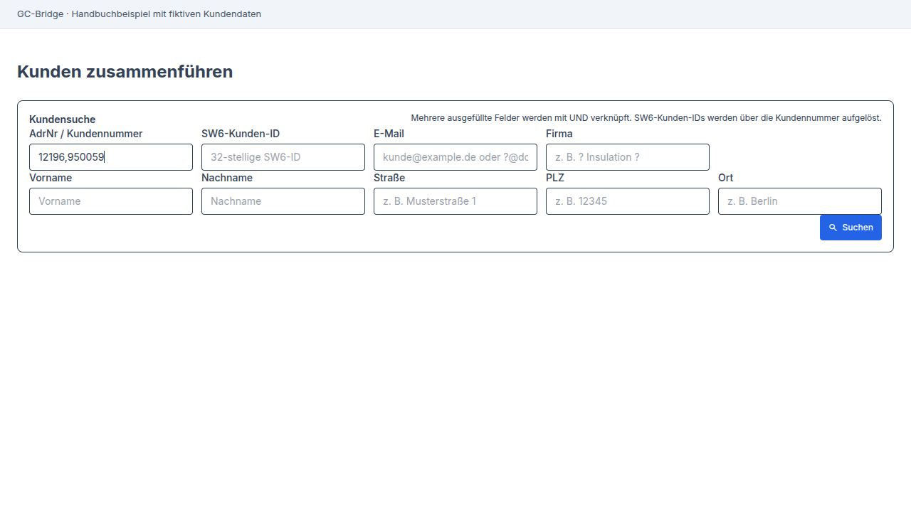

   Beide Nummern stehen im selben Suchfeld, durch ein Komma getrennt.

Prüfen Sie die Treffer: Gehören Name, E-Mail-Adressen und Anschriften
wirklich zu Nina? Zwei Menschen mit demselben Namen sollen nicht
zusammengeführt werden. Wird nur noch eines der beiden Konten gefunden,
prüfen Sie den verbliebenen Kunden und seine Adressen. Ein weiterer
Merge ist dann für dieses Beispiel nicht nötig.

**2. Festlegen, welcher Kunde bleibt**

Bei **Falscher Kunde – wird nach Prüfung gelöscht** wählen Sie
**950059**. Bei **Richtiger Kunde – bleibt erhalten** wählen Sie
**12196**. Nina soll künftig unter ihrer bisherigen Nummer geführt
werden. Klicken Sie anschließend auf **Vorschau laden**.

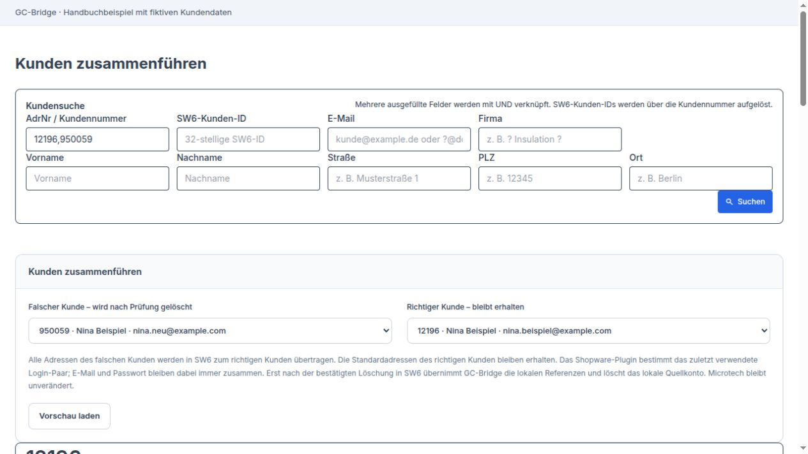

   Links steht das zusätzliche Konto 950059, rechts der Kunde 12196, der bleibt.

**3. Die Vorschau gemeinsam mit dem Beispiel lesen**

Die **Verbindliche Vorschau** zeigt links das bisherige Konto **950059**
und rechts das geplante Ergebnis bei **12196**. In unserem Beispiel
kommen **eine Adresse und zwei Bestellungen** hinzu. Ninas bisherige
Bestellung bei **12196** bleibt ebenfalls erhalten.

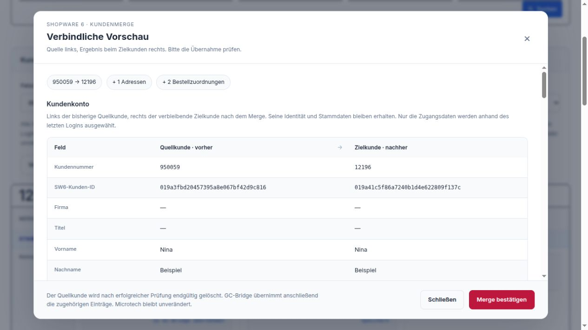

   Die Vorschau zeigt, was zum Kunden 12196 hinzukommt.

Nina hat zuletzt das neue Konto mit **nina.neu@example.com** benutzt.
Die Vorschau zeigt deshalb diese E-Mail-Adresse als künftigen Zugang.
Sie verwendet danach das dazugehörige Passwort. Ihre Kundennummer
bleibt trotzdem **12196**.

Unter **Adressen** prüfen Sie die Musterstraße 12. Sie steht in unserem
Beispiel schon beim alten Kunden und auch beim neuen Konto. Nach der
Zusammenführung bleiben zunächst beide Adressen erhalten. Die Vorschau
entfernt gleiche Adressen nicht von selbst. Ninas bisherige
Rechnungs- und Lieferadresse bei **12196** bleibt zunächst ausgewählt.

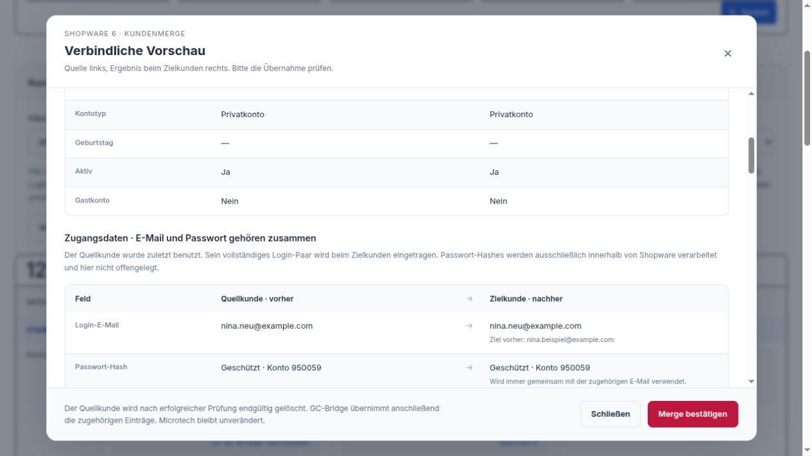

   Prüfen Sie Ninas künftigen Zugang und anschließend ihre Anschriften in der Vorschau.

**4. Bestätigen und das Ergebnis prüfen**

Passt alles zu Nina, klicken Sie auf **Merge bestätigen**. Das Konto
**950059** wird aufgelöst. Seine Adresse und seine beiden Bestellungen
gehören anschließend zu **12196**. Auch die GC-Bridge ordnet ihre
entsprechenden Einträge dem verbliebenen Kunden zu. Ninas Kunde in
Microtech wird durch diesen Schritt nicht geändert.

Warten Sie auf die Erfolgsmeldung. Erscheint stattdessen **Status
prüfen**, benutzen Sie diese Schaltfläche und warten Sie auf ein klares
Ergebnis. Starten Sie den Vorgang nicht noch einmal auf Verdacht.

Suchen Sie danach erneut nach **12196**. Prüfen Sie Ninas Adressen und
ihre Bestellungen. Rechnungen und Lieferanschriften bereits vorhandener
Bestellungen bleiben so erhalten, wie sie damals erstellt wurden.
Mit den drei Spalten prüfen wir nun, ob Nina ihre nächste Lieferung an
die richtige Anschrift erhält.

.. _kunden-merge-oberflaeche:

Funktionen der drei Spalten
~~~~~~~~~~~~~~~~~~~~~~~~~~~

Wir bleiben bei **Nina Beispiel, Kundennummer 12196**. Ihr zusätzliches
Shopkonto ist bereits zusammengeführt. Jetzt müssen wir noch dafür
sorgen, dass die drei Spalten ihre vorhandenen Einträge richtig
zusammen anzeigen.

Suchen Sie erneut nach **12196** und warten Sie, bis **SW6**, **GC-Bridge**
und **Microtech** geladen sind. Links stehen Ninas Angaben im Shop,
in der Mitte ihr Eintrag in der GC-Bridge und rechts ihre Angaben in
Microtech. Nina möchte ihre Rechnung an die **Musterstraße 12** und ihre
Pakete an den **Gartenweg 8** bekommen.

**1. Ninas Shopkonto mit dem Eintrag in der Mitte verbinden**

Die Kundennummer **12196** stimmt in unserem Beispiel schon überein.
Bei **SW6-ID** sehen Sie aber einen Unterschied: Links steht
**019a41c5f86a7240b1d4e622809f137c**, in der Mitte noch die alte Kennung
**019a3fbd20457395a8e067bf42d9c816**. Die Anzeige **„unterschiedlich“** macht darauf aufmerksam.
Dieselben Namen und Kundennummern allein reichen also noch nicht aus.

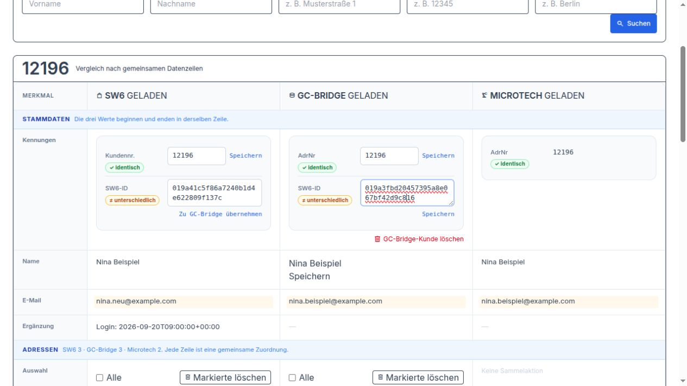

   Nina wird in allen drei Spalten gefunden. Die Shop-Zuordnung in der Mitte ist noch falsch.

Prüfen Sie zuerst, dass links wirklich Ninas verbliebenes Shopkonto
steht. Klicken Sie dann links neben dessen **SW6-ID** auf
**Zu GC-Bridge übernehmen**.
Der Knopf übernimmt die Kennung dieses Shopkontos in Ninas GC-Bridge-Eintrag.
Ihre Kundennummer und die Kennung im Shop bleiben dabei unverändert.

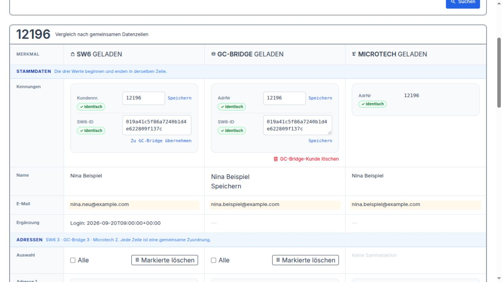

   Links und in der Mitte steht jetzt die Kennung des richtigen Shopkontos.

**2. Den Gartenweg 8 in den getrennten Zeilen wiederfinden**

Gehen Sie nun zu den Adressen. Ninas **Gartenweg 8** ist bereits in allen
drei Spalten vorhanden. Er steht aber in verschiedenen Zeilen: rechts
allein, in der Mitte allein und weiter unten links allein. Die leeren
Nachbarfelder sagen **Keine zugeordnete Adresse**. Das bedeutet in diesem
Beispiel, dass die vorhandenen Einträge noch nicht zusammengehören.
Die Adresse fehlt hier nicht.

Vergleichen Sie bei den drei Einträgen **Ninas Namen, Gartenweg 8,
12345 Musterstadt** und mögliche Zusätze. Wir haben geprüft, dass alle
drei dieselbe gewünschte Lieferanschrift zeigen.

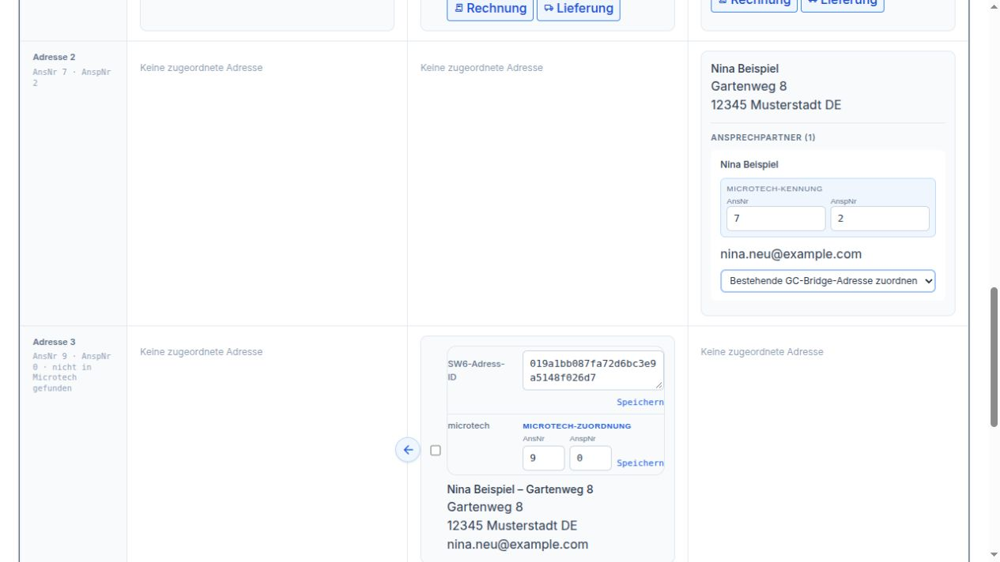

   Rechts steht 7 und 2, in der Mitte noch 9 und 0. Die vorhandenen Adressen sind noch getrennt.

**3. Die vorhandene Shopadresse mit Ninas GC-Bridge-Adresse verbinden**

Suchen Sie links Ninas **Gartenweg 8**. Dort steht unter
**SW6-Adress-ID** die Kennung **019a42e862c4718397fb3d605ea9b214**.
Kopieren Sie die **vollständige** angezeigte Kennung.

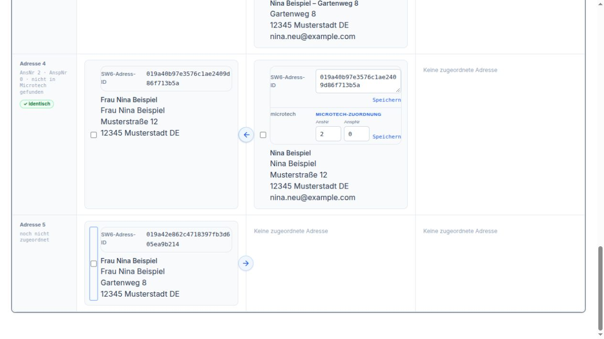

   Diese Shopadresse ist schon vorhanden. Wir übernehmen ihre Kennung in die passende GC-Bridge-Adresse.

Suchen Sie nun **Gartenweg 8 in der mittleren Spalte**. Im Beispiel heißt
dieser Eintrag **Nina Beispiel – Gartenweg 8**, damit er von der
Musterstraße unterscheidbar ist. Unter **SW6-Adress-ID** steht noch eine
andere Kennung: **019a1bb087fa72d6bc3e9a5148f026d7**. Ersetzen Sie diese durch die
gerade kopierte vollständige Kennung aus dem Shop. Klicken Sie auf
**Speichern direkt neben diesem Feld**.

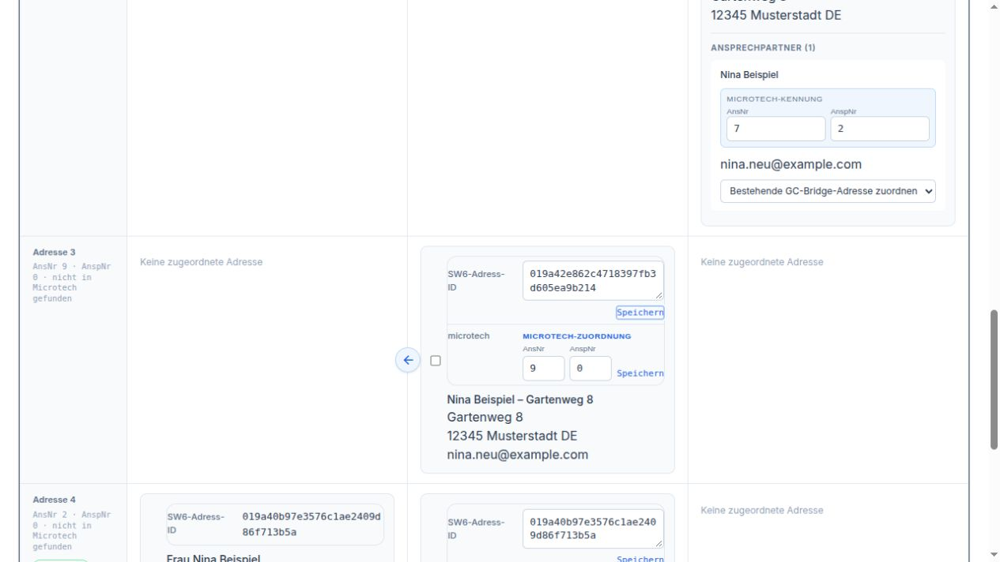

   Bei der vorhandenen GC-Bridge-Adresse wird die Shop-Zuordnung ersetzt und gespeichert.

Jetzt stehen Ninas Shopadresse und ihre GC-Bridge-Adresse **nebeneinander
in derselben Zeile**. Rechts ist die Zeile noch leer: Die Verbindung zu
Microtech fehlt weiterhin.

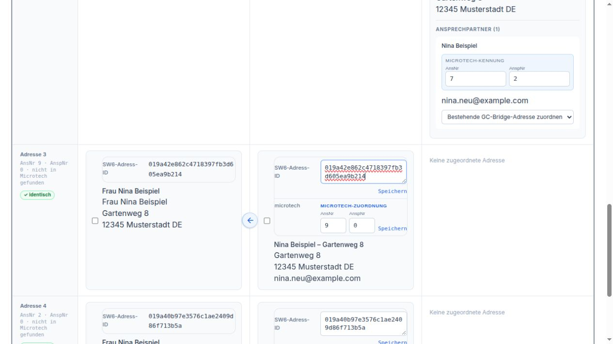

   Zwei Spalten gehören nun zusammen. Microtech ordnen wir im nächsten Schritt zu.

Die Pfeile an den Adressen brauchen wir hier nicht. Sie kopieren
Anschriften zwischen Shop und GC-Bridge. Ninas Gartenweg 8 ist bereits
auf beiden Seiten vorhanden; wir möchten diese Einträge verbinden.
Wäre Ninas Anschrift tatsächlich nur in der Mitte vorhanden, würde der
Pfeil nach links sie in den Shop übernehmen. Der Pfeil nach rechts
übernimmt entsprechend eine nur im Shop vorhandene Anschrift in die
GC-Bridge.

**4. Auch Ninas Microtech-Adresse in dieselbe Zeile holen**

Suchen Sie rechts den **Gartenweg 8** mit Ninas Ansprechpartner.
Im Beispiel stehen dort **AnsNr 7** und **AnspNr 2**. In der Mitte sind
bei derselben Anschrift noch **9** und **0** eingetragen. Auch hier
stimmt die Zuordnung also noch nicht.

Öffnen Sie rechts beim Gartenweg 8 die Auswahl **Bestehende GC-Bridge-Adresse
zuordnen**. Wählen Sie **Nina Beispiel – Gartenweg 8**. Das ist die
vorhandene Adresse, deren Anschrift Sie eben in der Mitte geprüft haben.
Die Auswahl wird unmittelbar gespeichert; ein weiterer Klick auf
**Speichern** ist für diese Auswahl nicht nötig.

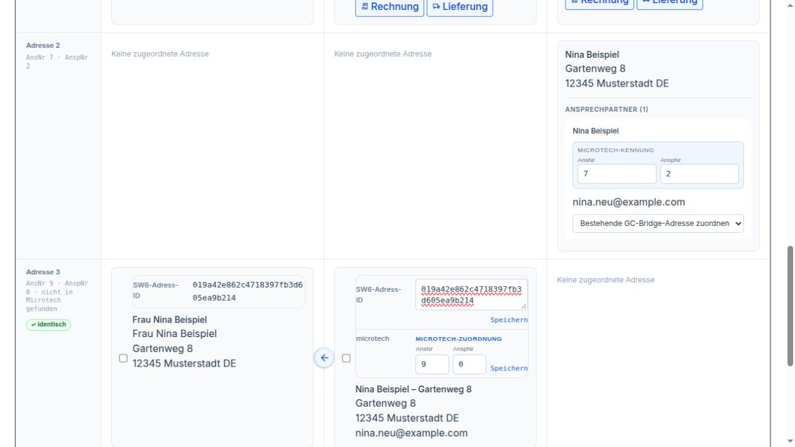

   Wählen Sie die passende vorhandene GC-Bridge-Adresse, nicht den Eintrag zur Musterstraße.

Nun stehen **Shop, GC-Bridge und Microtech nebeneinander in derselben
Adresszeile**. In der Mitte sehen Sie beim Gartenweg 8 jetzt **7** und
**2** statt **9** und **0**. Es wurde keine weitere Adresse angelegt.

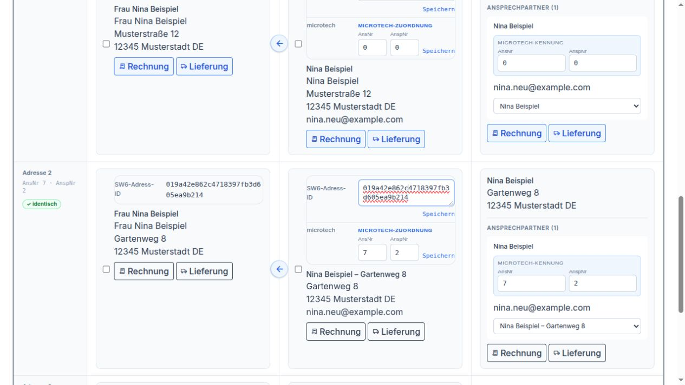

   Alle drei vorhandenen Einträge zum Gartenweg 8 sind jetzt miteinander verbunden.

Die lange Shop-Adress-ID und die beiden Microtech-Nummern müssen dabei
nicht gleich aussehen. Bei Nina stimmt die Shop-Adress-ID zwischen
links und Mitte überein; **7 und 2** stimmen zwischen Mitte und rechts
überein. So weiß die Oberfläche, welche drei Einträge zusammengehören.

Zeigt die Auswahl mehrere Einträge nur als **Nina Beispiel**, prüfen Sie
zuerst deren Anschriften in der Mitte. Wählen Sie nicht allein nach dem
Namen. Alternativ können Sie bei der geprüften GC-Bridge-Adresse die rechts
angezeigten Werte **7** und **2** in **AnsNr** und **AnspNr** eintragen und
auf **Speichern direkt neben diesen beiden Zahlen** klicken. Für Ninas
Beispiel genügt einer dieser beiden Wege.

**5. Für Ninas nächste Lieferung den Gartenweg 8 wählen**

An der nun verbundenen Adresszeile erscheinen **Rechnung** und
**Lieferung**. Klicken Sie beim **Gartenweg 8** auf **Lieferung**.
Die Auswahl setzt Ninas Lieferadresse in Shop, GC-Bridge und Microtech
zusammen. Für ihre Rechnung bleibt die **Musterstraße 12** ausgewählt.
Klicken Sie anschließend erneut auf **Suchen**, um den aktuellen Stand
in allen drei Spalten zu sehen.

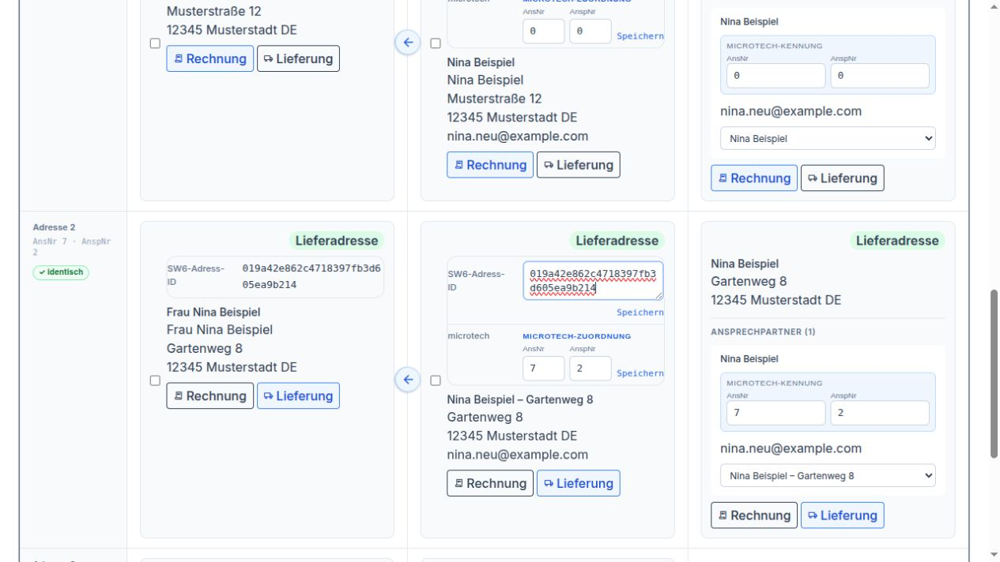

   Die drei grünen Kennzeichen bestätigen Ninas gewünschte Lieferadresse.

**6. Die zusätzliche Musterstraße 12 aufräumen**

Nach dem Kunden-Merge ist die Musterstraße 12 im Beispiel zweimal
vorhanden. Vergleichen Sie beide Einträge vollständig. Wir behalten die
Adresse mit **Rechnungsadresse**. Die zusätzliche Musterstraße hat weder
dieses Kennzeichen noch **Lieferadresse** und wird nicht gebraucht.

Markieren Sie nur diesen zusätzlichen Eintrag links. **Markierte
löschen in der linken Spalte** entfernt ihn aus dem Shop. Prüfen Sie die
Rückfrage und suchen Sie anschließend erneut.

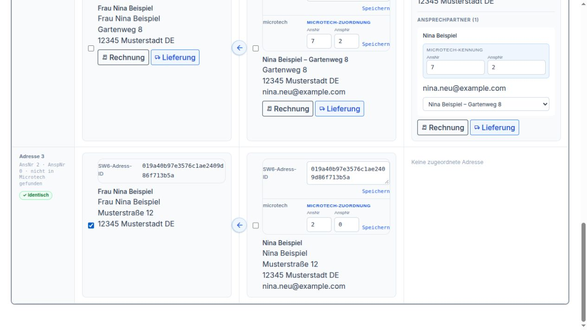

   Ninas Rechnungsadresse und der Gartenweg 8 bleiben erhalten.

Steht der zusätzliche Eintrag danach noch in der Mitte, markieren Sie
dort genau diese Adresse und verwenden dort **Markierte löschen**.
Jeder Knopf entfernt nur die Auswahl in seiner eigenen Spalte.
**GC-Bridge-Kunde löschen** würde dagegen Ninas ganzen Kunden in der GC-Bridge
entfernen. Für diese einzelne überflüssige Adresse bleibt er unbenutzt.

Zum Schluss suchen Sie noch einmal nach **12196**. Nina hat ein Shopkonto,
die Rechnung geht an die Musterstraße 12 und die Lieferung an den
Gartenweg 8. Die zugehörigen Adressen stehen jeweils gemeinsam in einer
Zeile, und ihre bisherigen Bestellungen bleiben erhalten.
