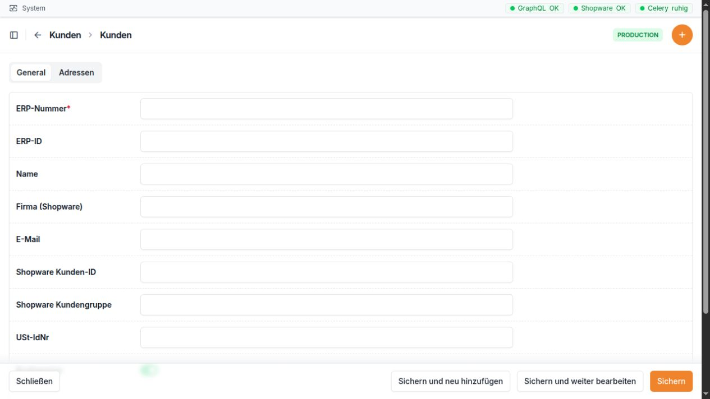

Kunden
======

Wofür ist dieser Bereich da?
~~~~~~~~~~~~~~~~~~~~~~~~~~~~

Im Bereich **Kunden** verwalten Sie die Kundendaten, die Zuordnung zu
Shopware und Microtech sowie Rechnungs- und Lieferanschriften. Die
GC-Bridge kann Kundendaten aus Microtech holen oder nach Microtech
übertragen.

Unter **Kunden zusammenführen** vergleichen Sie Daten aus Shopware,
GC-Bridge und Microtech. Diese Seite ist für unklare oder doppelte
Kundenzuordnungen gedacht.

Die Kundenmaske trennt die allgemeinen Kundendaten von den zugehörigen
Adressen. Pflichtfelder sind mit einem Stern markiert.

Navigation
~~~~~~~~~~

Öffnen Sie in der linken Navigation **Kunden**. Dort stehen:

-  **Kunden**: Kundenstammdaten und zugehörige Adressen
-  **Adressen**: alle Adressen als eigene Liste
-  **Kunden zusammenführen**: Suche und Vergleich über die drei
   beteiligten Systeme

Direkte Adressen:

-  Kunden: ``/admin/customer/customer/``
-  Einzelner Kunde: ``/admin/customer/customer/<ID>/change/``
-  Adressen: ``/admin/customer/address/``
-  Einzelne Adresse: ``/admin/customer/address/<ID>/change/``
-  Kunden zusammenführen: ``/admin/customer-merge/``

Die Kundenliste
~~~~~~~~~~~~~~~

+--------------+------------------------------------------------------+
| Spalte       | Einfache Erklärung                                   |
+==============+======================================================+
| ERP-Nummer   | Die AdrNr des Kunden. Sie ist eindeutig und die      |
|              | wichtigste Verbindung zu Microtech.                  |
+--------------+------------------------------------------------------+
| Name         | Kurzname des Kunden in der GC-Bridge.                |
+--------------+------------------------------------------------------+
| E-Mail       | Haupt-E-Mail-Adresse.                                |
+--------------+------------------------------------------------------+
| Bruttopreise | Zeigt, ob Preise für diesen Kunden brutto behandelt  |
|              | werden.                                              |
+--------------+------------------------------------------------------+
| Angelegt am  | Zeitpunkt, zu dem der Kunde in der GC-Bridge         |
|              | angelegt wurde.                                      |
+--------------+------------------------------------------------------+

Die Suche berücksichtigt ERP-Nummer, Name und E-Mail. Filtern können Sie
nach **Bruttopreise** und nach dem Anlagedatum.

Feldbeschreibung des Kunden
~~~~~~~~~~~~~~~~~~~~~~~~~~~

+-----------------------+---------------------------------------------+
| Feld                  | Bedeutung und richtige Verwendung           |
+=======================+=============================================+
| ERP-Nummer            | AdrNr des Kunden in Microtech. Sie muss     |
|                       | eindeutig sein. Eine falsche Nummer kann    |
|                       | Daten dem falschen Kunden zuordnen.         |
+-----------------------+---------------------------------------------+
| ERP-ID                | Interne Microtech-Kennung, falls vorhanden. |
|                       | Sie ist nicht dasselbe wie die AdrNr und    |
|                       | sollte normalerweise nicht von Hand         |
|                       | geändert werden.                            |
+-----------------------+---------------------------------------------+
| Name                  | Anzeigename in der GC-Bridge.               |
+-----------------------+---------------------------------------------+
| Firma (Shopware)      | Firmenname, wie er aus dem Shopware-Konto   |
|                       | kommt.                                      |
+-----------------------+---------------------------------------------+
| E-Mail                | Haupt-E-Mail-Adresse des Kunden.            |
+-----------------------+---------------------------------------------+
| Shopware Kunden-ID    | Eindeutige interne Kundenkennung in         |
|                       | Shopware. Sie verbindet das Shopware-Konto  |
|                       | mit diesem Datensatz.                       |
+-----------------------+---------------------------------------------+
| Shopware Kundengruppe | Name der Kundengruppe aus Shopware. Er kann |
|                       | Regeln und Steuerbehandlung beeinflussen.   |
+-----------------------+---------------------------------------------+
| USt-IdNr              | Umsatzsteuer-Identifikationsnummer.         |
|                       | Besonders bei Firmenkunden im Ausland       |
|                       | sorgfältig prüfen.                          |
+-----------------------+---------------------------------------------+
| Bruttopreise          | Aktiv bedeutet, dass Shopware diesen Kunden |
|                       | mit Bruttopreisen führt.                    |
+-----------------------+---------------------------------------------+
| Angelegt am           | Zeitpunkt der Anlage in der GC-Bridge. Wird |
|                       | automatisch gesetzt.                        |
+-----------------------+---------------------------------------------+
| Aktualisiert am       | Zeitpunkt der letzten Änderung. Wird        |
|                       | automatisch gesetzt.                        |
+-----------------------+---------------------------------------------+

Unter dem Kunden werden seine Adressen in einer Tabelle angezeigt. Dort
können vorhandene Adressen bearbeitet werden. Die Tabelle zeigt nur
einen Teil aller Adressfelder. Für alle Felder öffnen Sie **Kunden →
Adressen** und wählen die betreffende Adresse.

Aktionen für Kunden
~~~~~~~~~~~~~~~~~~~

+----------------------+----------------------+----------------------+
| Aktion               | Wirkung              | Wichtiger Hinweis    |
+======================+======================+======================+
| Von Microtech        | Holt den Kunden und  | Ohne ERP-Nummer ist  |
| synchronisieren      | seine Anschriften    | die Aktion nicht     |
|                      | anhand der           | möglich. Lokale      |
|                      | ERP-Nummer aus       | Werte können durch   |
|                      | Microtech in die     | die Microtech-Daten  |
|                      | GC-Bridge.           | ersetzt werden.      |
+----------------------+----------------------+----------------------+
| Nach Microtech       | Legt den Kunden in   | Vorher ERP-Nummer,   |
| übertragen           | Microtech an oder    | Anschriften und      |
|                      | aktualisiert ihn.    | Standardkennzeichen  |
|                      | Auch                 | prüfen.              |
|                      | Standard-Rechnungs-  |                      |
|                      | und Lieferanschrift  |                      |
|                      | werden               |                      |
|                      | berücksichtigt.      |                      |
+----------------------+----------------------+----------------------+

Beide Aktionen gibt es für einen einzelnen Kunden auf der Detailseite
und für markierte Kunden in der Liste. Nach dem Lauf zeigt die
Oberfläche eine Erfolgsmeldung oder die betroffenen Fehler.

Feldbeschreibung der Adresse
~~~~~~~~~~~~~~~~~~~~~~~~~~~~

+------------------------+--------------------------------------------+
| Feld                   | Bedeutung und richtige Verwendung          |
+========================+============================================+
| Kunde                  | Kunde, zu dem die Adresse gehört.          |
+------------------------+--------------------------------------------+
| ERP Kombi-ID           | Zusammengesetzte interne Kennung aus       |
|                        | Microtech-Werten. Sie wird bei passenden   |
|                        | Daten automatisch gebildet und sollte      |
|                        | nicht manuell gepflegt werden.             |
+------------------------+--------------------------------------------+
| Shopware Adress-ID     | Eindeutige Kennung dieser Adresse in       |
|                        | Shopware. Sie darf bei einem Kunden nicht  |
|                        | auf mehrere lokale Adressen zeigen.        |
+------------------------+--------------------------------------------+
| ERP-Nummer             | Numerische AdrNr, zu der die Anschrift     |
|                        | gehört.                                    |
+------------------------+--------------------------------------------+
| Anschrift-ID           | Interne Microtech-Kennung der Anschrift.   |
|                        | Nicht mit der sichtbaren Anschrift-Nummer  |
|                        | verwechseln.                               |
+------------------------+--------------------------------------------+
| Anschrift-Nummer       | Nummer der Anschrift innerhalb des         |
|                        | Microtech-Kunden. Sie wird für den         |
|                        | täglichen Abgleich verwendet. Auch ``0``   |
|                        | kann eine gültige Nummer sein.             |
+------------------------+--------------------------------------------+
| Ansprechpartner-ID     | Interne Microtech-Kennung des              |
|                        | Ansprechpartners.                          |
+------------------------+--------------------------------------------+
| Ansprechpartner-Nummer | Nummer des Ansprechpartners innerhalb der  |
|                        | Anschrift. Auch ``0`` kann gültig sein.    |
+------------------------+--------------------------------------------+
| Firma                  | Firmenangabe der Adresse.                  |
+------------------------+--------------------------------------------+
| Name 1                 | Erste Namenszeile, häufig Firma oder       |
|                        | Anrede.                                    |
+------------------------+--------------------------------------------+
| Name 2                 | Zweite Namenszeile, häufig Personenname    |
|                        | oder Ergänzung.                            |
+------------------------+--------------------------------------------+
| Name 3                 | Weitere Namenszeile.                       |
+------------------------+--------------------------------------------+
| Abteilung              | Abteilung des Empfängers oder              |
|                        | Ansprechpartners.                          |
+------------------------+--------------------------------------------+
| Straße                 | Straße und Hausnummer.                     |
+------------------------+--------------------------------------------+
| PLZ                    | Postleitzahl.                              |
+------------------------+--------------------------------------------+
| Ort                    | Ort.                                       |
+------------------------+--------------------------------------------+
| Ländercode             | Zweistelliger Ländercode, etwa ``DE``,     |
|                        | ``AT`` oder ``CH``.                        |
+------------------------+--------------------------------------------+
| E-Mail                 | E-Mail-Adresse für diese Anschrift oder    |
|                        | diesen Ansprechpartner.                    |
+------------------------+--------------------------------------------+
| Titel                  | Anrede oder Titel.                         |
+------------------------+--------------------------------------------+
| Vorname                | Vorname des Ansprechpartners.              |
+------------------------+--------------------------------------------+
| Nachname               | Nachname des Ansprechpartners.             |
+------------------------+--------------------------------------------+
| Telefon                | Telefonnummer.                             |
+------------------------+--------------------------------------------+
| Lieferanschrift        | Kennzeichnet die aktuelle                  |
|                        | Standard-Lieferanschrift dieses Kunden.    |
+------------------------+--------------------------------------------+
| Rechnungsanschrift     | Kennzeichnet die aktuelle                  |
|                        | Standard-Rechnungsanschrift dieses Kunden. |
+------------------------+--------------------------------------------+
| Angelegt am            | Zeitpunkt der Anlage. Wird automatisch     |
|                        | gesetzt.                                   |
+------------------------+--------------------------------------------+
| Aktualisiert am        | Zeitpunkt der letzten Änderung. Wird       |
|                        | automatisch gesetzt.                       |
+------------------------+--------------------------------------------+

Ein Kunde kann mehrere Adressen haben. Für den normalen Ablauf sollte
genau die richtige Adresse als Lieferanschrift und genau die richtige
als Rechnungsanschrift gekennzeichnet sein. Beides darf dieselbe Adresse
sein.

Die Adressliste
~~~~~~~~~~~~~~~

Die eigene Adressliste zeigt Kunde, Anschrift-ID, Name 1, Ort, die
Kennzeichen für Rechnung und Lieferung sowie das Anlagedatum. Die Suche
findet Adressen über AdrNr, Name 1, Name 2, Straße, PLZ und Ort. Filter
stehen für Rechnungsanschrift, Lieferanschrift, Ländercode und
Anlagedatum bereit.

Kunden zusammenführen und Systemzuordnungen prüfen
~~~~~~~~~~~~~~~~~~~~~~~~~~~~~~~~~~~~~~~~~~~~~~~~~~

Die Seite **Kunden zusammenführen** beginnt mit einer Suche. Mehrere
ausgefüllte Felder werden gemeinsam ausgewertet; der Treffer muss also
zu allen Angaben passen.

+----------------------+----------------------------------------------+
| Suchfeld             | Bedeutung                                    |
+======================+==============================================+
| AdrNr / Kundennummer | Eine oder mehrere Kundennummern. Mehrere     |
|                      | Nummern werden mit Komma getrennt.           |
+----------------------+----------------------------------------------+
| SW6-Kunden-ID        | Die 32-stellige interne                      |
|                      | Shopware-Kundenkennung.                      |
+----------------------+----------------------------------------------+
| E-Mail               | Genaue E-Mail oder Suche mit ``?`` als       |
|                      | Platzhalter.                                 |
+----------------------+----------------------------------------------+
| Firma                | Firmenname; ``?`` kann als Platzhalter       |
|                      | verwendet werden.                            |
+----------------------+----------------------------------------------+
| Vorname              | Vorname des Kunden oder Ansprechpartners.    |
+----------------------+----------------------------------------------+
| Nachname             | Nachname des Kunden oder Ansprechpartners.   |
+----------------------+----------------------------------------------+
| Straße               | Straße der Adresse.                          |
+----------------------+----------------------------------------------+
| PLZ                  | Postleitzahl.                                |
+----------------------+----------------------------------------------+
| Ort                  | Ort.                                         |
+----------------------+----------------------------------------------+

Die Ergebnisse werden nebeneinander für **SW6**, **GC-Bridge** und
**Microtech** angezeigt. Prüfen Sie besonders:

-  Kundennummer beziehungsweise AdrNr
-  Kundenname und Firma
-  E-Mail
-  Shopware-Kunden-ID
-  USt-IdNr
-  Adressen und Standardkennzeichen
-  Microtech-Anschrift- und Ansprechpartnernummern
-  in der GC-Bridge zugeordnete Bestellungen

Je nach Treffer stehen Schaltflächen zum Korrigieren einer lokalen
Nummer, zum Übernehmen einer Shopware-Kunden-ID, zum Zuordnen einer
Microtech-Adresse, zum Kopieren einer Adresse zwischen Shopware und
GC-Bridge und zum Setzen der Standardadresse bereit.

Beim eigentlichen Zusammenführen zweier Shopware-Konten wird zuerst eine
verbindliche Vorschau angezeigt. Danach wählen Sie Quellkunde und
Zielkunde bewusst aus. Nach bestätigtem Erfolg in Shopware werden die
lokalen Verweise auf den Zielkunden verschoben und das lokale Quellkonto
bereinigt. Microtech bleibt bei diesem Shopware-Zusammenführen
unverändert.

Typischer Ablauf
~~~~~~~~~~~~~~~~

1. Öffnen Sie **Kunden → Kunden**.
2. Suchen Sie nach der AdrNr oder E-Mail-Adresse.
3. Öffnen Sie den Kunden und prüfen Sie Stammdaten sowie alle Adressen.
4. Kontrollieren Sie, welche Adresse als Rechnung und welche als
   Lieferung markiert ist.
5. Entscheiden Sie die Richtung: **Von Microtech synchronisieren** oder
   **Nach Microtech übertragen**.
6. Lesen Sie die Rückmeldung oben auf der Seite.
7. Nutzen Sie **Kunden zusammenführen** nur dann, wenn Nummern,
   Shopware-ID oder Adressen nicht eindeutig sind oder zwei
   Shopware-Konten zusammengeführt werden müssen.

Häufige Hinweise und Fehlerquellen
~~~~~~~~~~~~~~~~~~~~~~~~~~~~~~~~~~

-  **ERP-Nummer fehlt**: Ein Laden aus Microtech ist nicht möglich.
-  **ERP-Nummer doppelt**: Die Nummer muss eindeutig sein. Nicht einfach
   einen zweiten Kunden mit derselben Nummer anlegen.
-  **Shopware-Kunden-ID falsch**: Bestellungen und Adressen können dem
   falschen Konto zugeordnet werden. Korrekturen über **Kunden
   zusammenführen** durchführen und vorher alle drei Spalten
   vergleichen.
-  **Mehrere Standardadressen**: Vor der Übertragung prüfen, welche
   Adresse wirklich Rechnung und Lieferung sein soll.
-  **Anschrift-Nummer 0**: Null ist in Microtech ein gültiger Wert und
   darf nicht als „fehlt“ behandelt werden.
-  **Anschrift-ID und Anschrift-Nummer verwechselt**: Für den sichtbaren
   Abgleich ist vor allem die Anschrift-Nummer wichtig; IDs sind interne
   Kennungen.
-  **Falsche Synchronisationsrichtung**: **Von Microtech** ersetzt
   lokale Werte durch Microtech-Daten. **Nach Microtech** schreibt die
   GC-Bridge-Daten in die andere Richtung.
-  **Leere Felder**: Vor einer Übertragung besonders Name, Straße, PLZ,
   Ort, Ländercode und die Standardkennzeichen prüfen.
-  **Kundenmerge**: Das bestätigte Zusammenführen löscht das
   Shopware-Quellkonto und bereinigt danach das lokale Quellkonto.
   Vorschau und Zielkunde sorgfältig prüfen.
-  **Berechtigungen**: Einträge oder Aktionen können fehlen, wenn dem
   angemeldeten Benutzer die passende Ansichts- oder
   Änderungsberechtigung fehlt.

Praxisbeispiel 1: Bestehenden Kunden aus Microtech aktualisieren
~~~~~~~~~~~~~~~~~~~~~~~~~~~~~~~~~~~~~~~~~~~~~~~~~~~~~~~~~~~~~~~~

Die Anschrift der Kundin mit AdrNr ``36415`` wurde in Microtech
geändert.

1. Öffnen Sie **Kunden → Kunden** und suchen Sie nach ``36415``.
2. Öffnen Sie den Kunden und notieren Sie die bisherige Liefer- und
   Rechnungsanschrift.
3. Wählen Sie **Von Microtech synchronisieren**.
4. Prüfen Sie die Erfolgsmeldung.
5. Kontrollieren Sie anschließend Name, E-Mail, Anschriften sowie die
   Kennzeichen **Lieferanschrift** und **Rechnungsanschrift**.
6. Öffnen Sie bei Unklarheiten **Kunden zusammenführen** und suchen Sie
   erneut nach ``36415``, um Shopware, GC-Bridge und Microtech
   nebeneinander zu vergleichen.

Ergebnis: Die GC-Bridge zeigt den aktuellen Stand aus Microtech und die
vorhandenen Kontakte sind der richtigen Anschrift zugeordnet.

Praxisbeispiel 2: Doppeltes Shopware-Konto sicher zusammenführen
~~~~~~~~~~~~~~~~~~~~~~~~~~~~~~~~~~~~~~~~~~~~~~~~~~~~~~~~~~~~~~~~

Ein Kunde hat zwei Shopware-Konten, aber nur eines soll weiter benutzt
werden.

1. Öffnen Sie **Kunden zusammenführen**.
2. Suchen Sie mit E-Mail, Firma oder den bekannten Kundennummern.
3. Vergleichen Sie die Treffer in **SW6**, **GC-Bridge** und
   **Microtech**. Prüfen Sie Namen, E-Mail, Shopware-ID, Adressen und
   zugeordnete Bestellungen.
4. Wählen Sie als Ziel das Konto, das erhalten bleiben soll. Wählen Sie
   als Quelle das falsche oder doppelte Konto.
5. Laden Sie die Vorschau. Prüfen Sie besonders, welche Adressen und
   Bestellungen zum Ziel wechseln.
6. Bestätigen Sie den Merge erst, wenn Quelle und Ziel zweifelsfrei
   richtig sind.
7. Prüfen Sie nach Abschluss erneut den Zielkunden in der Kundenliste.

Ergebnis: Das richtige Shopware-Konto bleibt erhalten, die lokalen
Verweise zeigen auf den Zielkunden, und Microtech wurde durch diesen
Merge nicht verändert.

