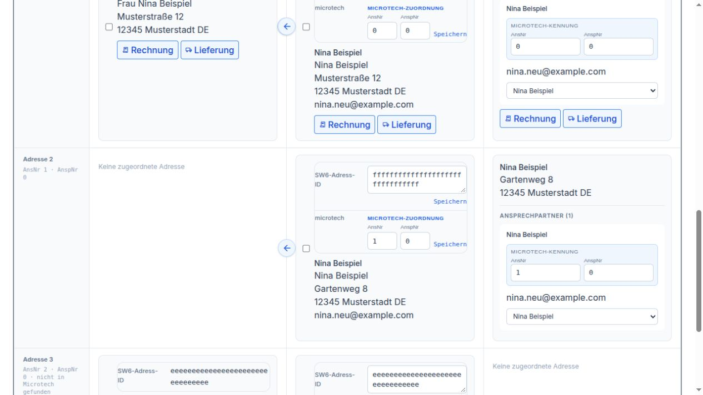

Kunden
======

.. _kunden-merge-ablauf:

Kunden zusammenführen
~~~~~~~~~~~~~~~~~~~~~

**Unser Beispiel:** Nina Beispiel ist bereits Kundin unter der Nummer
**12196**. Sie meldet sich im Shop noch einmal an und erhält die Nummer
**950059**. Nun gibt es zwei Kundenkonten für dieselbe Person. Wir möchten
mit **12196** weiterarbeiten und die Bestellungen und die Adresse von
**950059** dorthin übernehmen.

Nina wohnt in der **Musterstraße 12**. Ihre Pakete möchte sie künftig an
den **Gartenweg 8** bekommen. Wir begleiten diesen einen Fall vom
Zusammenführen bis zur Prüfung der Adressen.

Die Bildschirmfotos zeigen die Bedienoberfläche mit fiktiven
Beispieldaten. Nina Beispiel, ihre Anschriften und Bestellungen sind
frei erfunden.

**1. Beide Kunden suchen**

Öffnen Sie **Kunden → Kunden zusammenführen**. Tragen Sie bei
**AdrNr / Kundennummer** die beiden Nummern **12196,950059** ein.
Lassen Sie die übrigen Suchfelder leer und klicken Sie auf **Suchen**.
So werden beide Kunden nebeneinander prüfbar.

.. figure:: ../_static/handbuch/kunden/01_suche.jpg
   :alt: Suche nach Ninas beiden Kundennummern 12196 und 950059
   :width: 100%

   Beide Nummern stehen im selben Suchfeld, durch ein Komma getrennt.

Prüfen Sie die Treffer: Gehören Name, E-Mail-Adressen und Anschriften
wirklich zu Nina? Zwei Menschen mit demselben Namen sollen nicht
zusammengeführt werden. Wird nur noch eines der beiden Konten gefunden,
prüfen Sie den verbliebenen Kunden und seine Adressen. Ein weiterer
Merge ist dann für dieses Beispiel nicht nötig.

**2. Festlegen, welcher Kunde bleibt**

Bei **Falscher Kunde – wird nach Prüfung gelöscht** wählen Sie
**950059**. Bei **Richtiger Kunde – bleibt erhalten** wählen Sie
**12196**. Nina soll künftig unter ihrer bisherigen Nummer geführt
werden. Klicken Sie anschließend auf **Vorschau laden**.

.. figure:: ../_static/handbuch/kunden/02_auswahl.jpg
   :alt: Auswahl 950059 als zusätzliches Konto und 12196 als verbleibender Kunde
   :width: 100%

   Links steht das zusätzliche Konto 950059, rechts der Kunde 12196, der bleibt.

**3. Die Vorschau gemeinsam mit dem Beispiel lesen**

Die **Verbindliche Vorschau** zeigt links das bisherige Konto **950059**
und rechts das geplante Ergebnis bei **12196**. In unserem Beispiel
kommen **eine Adresse und zwei Bestellungen** hinzu. Ninas bisherige
Bestellung bei **12196** bleibt ebenfalls erhalten.

.. figure:: ../_static/handbuch/kunden/03_vorschau.jpg
   :alt: Verbindliche Vorschau für 950059 zu 12196 mit einer Adresse und zwei Bestellungen
   :width: 100%

   Die Vorschau zeigt, was zum Kunden 12196 hinzukommt.

Nina hat zuletzt das neue Konto mit **nina.neu@example.com** benutzt.
Die Vorschau zeigt deshalb diese E-Mail-Adresse als künftigen Zugang.
Sie verwendet danach das dazugehörige Passwort. Ihre Kundennummer
bleibt trotzdem **12196**.

Unter **Adressen** prüfen Sie die Musterstraße 12. Sie steht in unserem
Beispiel schon beim alten Kunden und auch beim neuen Konto. Nach der
Zusammenführung bleiben zunächst beide Adressen erhalten. Die Vorschau
entfernt gleiche Adressen nicht von selbst. Ninas bisherige
Rechnungs- und Lieferadresse bei **12196** bleibt zunächst ausgewählt.

.. figure:: ../_static/handbuch/kunden/04_zugang_adressen.jpg
   :alt: Vorschau des künftigen Zugangs nina.neu@example.com und der übernommenen Adressen
   :width: 100%

   Prüfen Sie Ninas künftigen Zugang und anschließend ihre Anschriften in der Vorschau.

**4. Bestätigen und das Ergebnis prüfen**

Passt alles zu Nina, klicken Sie auf **Merge bestätigen**. Das Konto
**950059** wird aufgelöst. Seine Adresse und seine beiden Bestellungen
gehören anschließend zu **12196**. Auch die Bridge ordnet ihre
entsprechenden Einträge dem verbliebenen Kunden zu. Ninas Kunde in
Microtech wird durch diesen Schritt nicht geändert.

Warten Sie auf die Erfolgsmeldung. Erscheint stattdessen **Status
prüfen**, benutzen Sie diese Schaltfläche und warten Sie auf ein klares
Ergebnis. Starten Sie den Vorgang nicht noch einmal auf Verdacht.

Suchen Sie danach erneut nach **12196**. Prüfen Sie Ninas Adressen und
ihre Bestellungen. Rechnungen und Lieferanschriften bereits vorhandener
Bestellungen bleiben so erhalten, wie sie damals erstellt wurden.
Mit den drei Spalten prüfen wir nun, ob Nina ihre nächste Lieferung an
die richtige Anschrift erhält.

.. _kunden-merge-oberflaeche:

Funktionen der drei Spalten
~~~~~~~~~~~~~~~~~~~~~~~~~~~

Wir bleiben bei **Nina Beispiel, Kundennummer 12196**. Nach dem
Zusammenführen suchen Sie diese Nummer erneut. Lesen Sie die Angaben
von links nach rechts: **SW6**, **GC-Bridge**, **Microtech**.
Warten Sie, bis die jeweilige Spalte fertig geladen ist.

.. figure:: ../_static/handbuch/kunden/05_drei_spalten.jpg
   :alt: Nina Beispiel unter 12196 in den drei Spalten SW6, GC-Bridge und Microtech
   :width: 100%

   Links Ninas Shopkonto, in der Mitte die Bridge und rechts ihr Kunde in Microtech.

**Links: SW6 – Ninas Angaben im Shop**

Hier sehen Sie, unter welcher Nummer Nina im Shop geführt wird, welche
E-Mail-Adresse sie dort verwendet und welche Anschriften der Shop kennt.
Im Beispiel stehen **12196** und **nina.neu@example.com**. Das passt zum
Ergebnis aus der Vorschau.

Neben der Kundennummer steht **Speichern**. Damit würde eine geänderte
Nummer im Shop gespeichert. Bei Nina ist **12196** bereits richtig und
bleibt stehen.

**Zu Django übernehmen** verbindet den angezeigten Shopkunden mit dem
Kunden in der mittleren Spalte. Bei Nina passen beide bereits zusammen.
Dafür müssen Sie nichts erneut übernehmen. In dieser Oberfläche meint
**Django** die **GC-Bridge**.

Der Pfeil **nach rechts** an einer Shopadresse kopiert diese Anschrift
in die Bridge. Wäre der Gartenweg 8 nur links vorhanden, würden Sie ihn
mit diesem Pfeil in die mittlere Spalte übernehmen.

**In der Mitte: GC-Bridge – Ninas Kunde zwischen Shop und Microtech**

Hier prüfen Sie Ninas Namen, ihre Kundennummer und ihre Anschriften in
der Bridge. Stünde beim Namen nur „N. Beispiel“, könnten Sie das Feld
auf **Nina Beispiel** ändern und mit **Speichern** direkt daneben sichern.
Mit dem Speichern neben der Kundennummer ändern Sie entsprechend nur
diese Nummer in der Bridge. In unserem Beispiel sind Name und Nummer
bereits richtig.

Bei den Adressen sehen wir einen Unterschied: Der **Gartenweg 8** ist
in der Bridge und in Microtech vorhanden, links im Shop fehlt er noch.
Nina hat bestätigt, dass ihre nächsten Pakete dorthin gehen sollen.
Klicken Sie beim **Gartenweg 8** auf den Pfeil **nach links**. Damit
kopieren Sie diese Anschrift aus der Bridge in den Shop.

   Der Pfeil nach links am Gartenweg 8 übernimmt genau diese Adresse in den Shop.

Klicken Sie anschließend erneut auf **Suchen**, um das Ergebnis zu sehen.
Prüfen Sie, dass der Gartenweg 8 jetzt auch in der linken Spalte steht.
Ein Pfeil kopiert eine Adresse; er führt keine Kunden zusammen.

**Rechts: Microtech – Ninas Angaben in der Warenwirtschaft**

Rechts vergleichen Sie Ninas bekannte Anschriften und Ansprechpartner.
Im Beispiel finden wir hier die **Musterstraße 12** und den
**Gartenweg 8**. Damit können wir prüfen, ob wir in den beiden anderen
Spalten die richtigen Anschriften ansehen.

Bei Ninas Ansprechpartner gibt es die Auswahl **Bestehende Bridge-Adresse
zuordnen**. Damit lässt sich ihr Ansprechpartner mit einer bereits
vorhandenen Adresse in der mittleren Spalte verbinden. Eine zusätzliche
Adresse wird dabei nicht angelegt. Im Beispiel gehört Nina bereits zur
passenden Adresse **Gartenweg 8** in der Mitte. Deshalb lassen Sie die
Auswahl dort stehen. Wenn mehrere Einträge denselben Namen zeigen,
prüfen Sie erst die zugehörigen Anschriften, statt allein nach „Nina
Beispiel“ auszuwählen.

In der Microtech-Spalte gibt es keine Sammelschaltfläche zum Löschen
von Adressen. Für Ninas Vergleich verwenden Sie diese Spalte vor allem,
um Anschrift und Ansprechpartner abzugleichen.

**Für Ninas nächste Lieferung den Gartenweg 8 wählen**

Sobald der Gartenweg 8 in allen drei Spalten passend zusammengehört,
erscheinen an dieser Anschrift die Schaltflächen **Rechnung** und
**Lieferung**. Klicken Sie beim Gartenweg 8 auf **Lieferung**. Diese
Auswahl gilt für **Shop, Bridge und Microtech gemeinsam**.

Die Rechnung soll weiter an die **Musterstraße 12** gehen. Dort lassen
Sie **Rechnung** ausgewählt. Bei Nina sind Rechnung und Lieferung nun
bewusst zwei verschiedene Anschriften. Sollten beide an dieselbe
Anschrift gehen, wären beide Kennzeichen an einer Adresse ebenfalls
richtig.

.. figure:: ../_static/handbuch/kunden/07_lieferadresse.jpg
   :alt: Gartenweg 8 ist in allen drei Spalten als Lieferadresse gekennzeichnet
   :width: 100%

   Gartenweg 8 ist jetzt die Lieferadresse; Musterstraße 12 bleibt die Rechnungsadresse.

Fehlen die Schaltflächen, kopieren oder löschen Sie nicht auf Verdacht
weitere Adressen. Prüfen Sie zuerst, ob in derselben Zeile wirklich
Ninas passende Anschrift in allen drei Spalten steht.

**Die zusätzliche Musterstraße 12 entfernen**

Nach dem Merge steht die Musterstraße 12 in unserem Beispiel zweimal
im Shop und zweimal in der Bridge. Vergleichen Sie beide Einträge
vollständig, einschließlich Namen und möglicher Zusätze. Wir behalten
die Anschrift, an der **Rechnungsadresse** steht. Die zusätzliche
Musterstraße 12 hat keine Standardkennzeichen mehr und wird nicht benötigt.

Markieren Sie **nur diese zusätzliche Adresse** in der linken Spalte.
Klicken Sie in dieser Spalte auf **Markierte löschen** und prüfen Sie
die Rückfrage. Der linke Knopf entfernt die ausgewählte Adresse im Shop.

.. figure:: ../_static/handbuch/kunden/08_doppelte_adresse.jpg
   :alt: Nur die zusätzliche Musterstraße 12 ohne Standardkennzeichen ist in der Shop-Spalte markiert
   :width: 100%

   Markiert ist nur die zusätzliche Musterstraße 12, nicht Ninas Rechnungs- oder Lieferadresse.

Suchen Sie danach erneut. Ist die zusätzliche Adresse noch in der
mittleren Spalte vorhanden, markieren Sie dort genau diesen Eintrag
und benutzen **Markierte löschen** in der mittleren Spalte. Dieser
Knopf entfernt die Auswahl in der Bridge. Das Löschen in einer Spalte
löscht nicht automatisch dieselbe Adresse in der anderen Spalte.

Eine noch ausgewählte Shop-Rechnungs- oder Lieferadresse lässt sich
auf diese Weise nicht entfernen. Bei Nina lassen wir deshalb zuerst
**Musterstraße 12 für Rechnung** und **Gartenweg 8 für Lieferung** richtig
stehen. Erst dann entfernen wir den überflüssigen Eintrag.

**Django-Kunde löschen** betrifft dagegen Ninas ganzen Kunden in der
Bridge samt seinen dortigen Adressen. Für die doppelte Musterstraße 12
verwenden wir diesen Knopf nicht: **12196** soll erhalten bleiben.

Zum Schluss suchen Sie noch einmal nach **12196**: Nina hat ein
Shopkonto, die Rechnung geht an die Musterstraße 12 und die nächste
Lieferung an den Gartenweg 8. Die Anschriften in den drei Spalten passen
zusammen, und ihre bisherigen Bestellungen sind weiter vorhanden.
