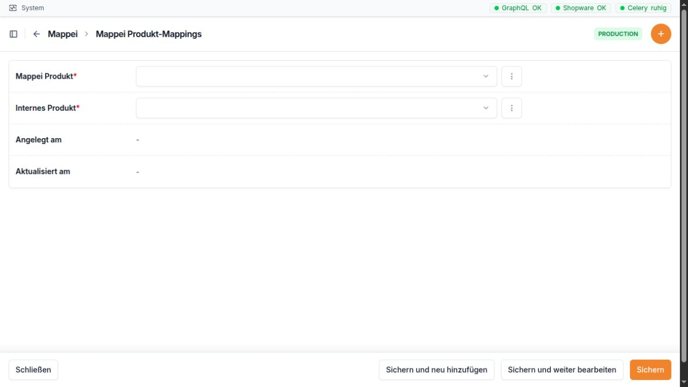

.. _gc-bridge-handbuch--mappei:

Mappei
======

Wofür ist dieser Bereich da?
----------------------------

Im Bereich **Mappei** sammelt die Bridge öffentlich sichtbare Produkt-
und Preisinformationen von Mappei. So können Sie die Preise von Mappei
mit den Preisen der eigenen Classei-Produkte vergleichen.

Der Bereich hat drei Seiten:

-  **Produkte** zeigt die gefundenen Mappei-Produkte und ihren letzten
   Preis.
-  **Preise** zeigt die gespeicherten Preisstände. Ein neuer Preisstand
   entsteht nur, wenn sich ein Preis oder eine Preisstaffel geändert
   hat.
-  **Mappei <-> Classei** verbindet ein Mappei-Produkt mit einem
   passenden Classei-Produkt.

Die Zuordnung ist wichtig. Erst durch sie kann ein Mappei-Preis beim
passenden Classei-Produkt in einer Preisänderung angezeigt werden.

   **Wichtig:** Mappei-Preise dienen als Vergleich. Sie ändern den
   eigenen Verkaufspreis nicht automatisch.

Bei einer Zuordnung wählen Sie links das Mappei-Produkt und rechts das
passende interne Classei-Produkt.

Navigation
----------

1. Öffnen Sie die Bridge unter ``http://10.0.0.165/admin/``.
2. Klappen Sie links den Bereich **Mappei** auf.
3. Wählen Sie **Produkte**, **Preise** oder **Mappei <-> Classei**.

Die folgenden Adressen ergeben sich direkt aus der Seitennavigation und
der Admin-Einrichtung:

+--------------------------+------------------------------------------+
| Seite                    | Adresse                                  |
+==========================+==========================================+
| Mappei-Produkte          | ``http://                                |
|                          | 10.0.0.165/admin/mappei/mappeiproduct/`` |
+--------------------------+------------------------------------------+
| Einzelnes Mappei-Produkt | ``http://10.0.0.165/a                    |
|                          | dmin/mappei/mappeiproduct/<ID>/change/`` |
+--------------------------+------------------------------------------+
| Mappei-Preise            | ``http://10.0.0                          |
|                          | .165/admin/mappei/mappeipricesnapshot/`` |
+--------------------------+------------------------------------------+
| Produkt-Zuordnungen      | ``http://10.0.0.                         |
|                          | 165/admin/mappei/mappeiproductmapping/`` |
+--------------------------+------------------------------------------+
| Neue Zuordnung           | ``http://10.0.0.165/                     |
|                          | admin/mappei/mappeiproductmapping/add/`` |
+--------------------------+------------------------------------------+
| Einzelne Zuordnung       | ``http://10.0.0.165/admin/ma             |
|                          | ppei/mappeiproductmapping/<ID>/change/`` |
+--------------------------+------------------------------------------+

``<ID>`` steht für die interne Nummer des Eintrags. Welche Seiten ein
Mitarbeiter sieht, hängt von seinen Rechten ab.

Mappei-Produkte
---------------

Die Produktliste
~~~~~~~~~~~~~~~~

Die Liste zeigt diese Spalten:

+-----------------------+---------------------------------------------+
| Spalte                | Einfache Erklärung                          |
+=======================+=============================================+
| **Bild**              | Kleines Produktbild von Mappei. Ein Strich  |
|                       | bedeutet: Es wurde kein Bild gefunden.      |
+-----------------------+---------------------------------------------+
| **Artikelnummer**     | Artikelnummer von Mappei. Sie kann auch     |
|                       | einen Schrägstrich, einen Punkt oder        |
|                       | Buchstaben enthalten.                       |
+-----------------------+---------------------------------------------+
| **Name**              | Bezeichnung des Produkts auf der            |
|                       | Mappei-Seite.                               |
+-----------------------+---------------------------------------------+
| **Hat Staffelpreise** | Zeigt an, ob für größere Mengen andere      |
|                       | Preise gefunden wurden.                     |
+-----------------------+---------------------------------------------+
| **Aktueller Preis**   | Der neueste gespeicherte Netto-Preis. Ein   |
|                       | Strich bedeutet: Es gibt noch keinen        |
|                       | Preisstand.                                 |
+-----------------------+---------------------------------------------+
| **Zuletzt gescrapt**  | Zeitpunkt, zu dem die Bridge das Produkt    |
|                       | zuletzt von der Mappei-Seite eingelesen     |
|                       | hat.                                        |
+-----------------------+---------------------------------------------+
| **Mapping**           | Zeigt an, ob mindestens eine Verbindung zu  |
|                       | einem Classei-Produkt besteht.              |
+-----------------------+---------------------------------------------+

Mit dem Filter **Hat Staffelpreise** können Sie Produkte mit und ohne
Preisstaffel trennen.

Die Suche findet ein Produkt über:

-  die Mappei-Artikelnummer,
-  den Mappei-Produktnamen,
-  die ERP-Nummer eines verbundenen Classei-Produkts.

Dadurch können Sie auch mit einer bekannten Classei-ERP-Nummer nach dem
passenden Mappei-Produkt suchen.

Die Produktseite und ihre Felder
~~~~~~~~~~~~~~~~~~~~~~~~~~~~~~~~

Ein Klick auf ein Produkt öffnet die Produktseite. Die Daten kommen
überwiegend von der Mappei-Webseite.

+----------------------+----------------------+----------------------+
| Feld                 | Einfache Erklärung   | Bearbeitung          |
+======================+======================+======================+
| **Artikelnummer**    | Eindeutige           | Nur Anzeige. Sie     |
|                      | M                    | wird beim Einlesen   |
|                      | appei-Artikelnummer. | übernommen.          |
+----------------------+----------------------+----------------------+
| **Name**             | Produktname von      | Kann sichtbar        |
|                      | Mappei.              | geändert werden.     |
|                      |                      | Beim nächsten        |
|                      |                      | Einlesen kann der    |
|                      |                      | Wert wieder durch    |
|                      |                      | die Angabe von       |
|                      |                      | Mappei ersetzt       |
|                      |                      | werden.              |
+----------------------+----------------------+----------------------+
| **URL**              | Direkter Link zur    | Nur Anzeige.         |
|                      | Produktseite bei     |                      |
|                      | Mappei. Der Link     |                      |
|                      | öffnet sich in einem |                      |
|                      | neuen Tab.           |                      |
+----------------------+----------------------+----------------------+
| **Bild**             | Das von Mappei       | Nur Anzeige.         |
|                      | gelieferte           |                      |
|                      | Produktbild.         |                      |
+----------------------+----------------------+----------------------+
| **VPE Menge**        | Anzahl der Einheiten | Kann geändert        |
|                      | in einer Verpackung. | werden. Eine falsche |
|                      | Bei ``100`` enthält  | Menge verfälscht den |
|                      | eine Verpackung zum  | Preisvergleich.      |
|                      | Beispiel 100 Stück.  |                      |
+----------------------+----------------------+----------------------+
| **VPE Einheit**      | Bezeichnung der      | Kann geändert        |
|                      | Einheit, zum         | werden.              |
|                      | Beispiel ``Stück``.  |                      |
+----------------------+----------------------+----------------------+
| **Hat                | Kennzeichen für ein  | Kann geändert        |
| Staffelpreise**      | Produkt mit          | werden. Beim         |
|                      | Mengenpreisen.       | nächsten Einlesen    |
|                      |                      | kann Mappei die      |
|                      |                      | Angabe wieder        |
|                      |                      | ersetzen.            |
+----------------------+----------------------+----------------------+
| **Zuletzt gescrapt** | Zeitpunkt der        | Nur Anzeige.         |
|                      | letzten              |                      |
|                      | erfolgreichen        |                      |
|                      | Übernahme dieses     |                      |
|                      | Produkts.            |                      |
+----------------------+----------------------+----------------------+

Unter den Produktfeldern steht die Tabelle mit den bisherigen
**Mappei-Preissnapshots**. Diese Tabelle ist nur zum Lesen. Sie zeigt
die neuesten Einträge zuerst. Neue Preiszeilen können dort nicht von
Hand angelegt oder gelöscht werden.

Zwei weitere Werte werden im Hintergrund übernommen, erscheinen aber
nicht als eigenes Eingabefeld auf dieser Produktseite:

+------------------+--------------------------------------------------+
| Wert             | Bedeutung                                        |
+==================+==================================================+
| **Beschreibung** | Beschreibungstext von der Mappei-Produktseite.   |
+------------------+--------------------------------------------------+
| **Bild-URL**     | Internetadresse, von der das angezeigte          |
|                  | Produktbild geladen wird.                        |
+------------------+--------------------------------------------------+

Die Verbindung zu Classei wird nicht auf dieser Seite gepflegt.
Verwenden Sie dafür **Mappei <-> Classei**.

   **Hinweis:** In der Oberfläche kann je nach Recht eine Schaltfläche
   zum Hinzufügen oder Kopieren sichtbar sein. Mappei-Produkte sollten
   im normalen Arbeitsablauf trotzdem durch das Einlesen entstehen. Die
   Artikelnummer ist auf der Produktseite nicht frei eintragbar.

Preise
------

Die Preisliste
~~~~~~~~~~~~~~

Die Seite **Preise** ist ein Preisverlauf. Sie ist nur zum Lesen. Die
neuesten Preisstände stehen oben.

+------------------------------+--------------------------------------+
| Spalte und Feld              | Einfache Erklärung                   |
+==============================+======================================+
| **Mappei Produkt**           | Das Produkt, zu dem der Preis        |
|                              | gehört. Angezeigt werden             |
|                              | Artikelnummer und Name.              |
+------------------------------+--------------------------------------+
| **Gescrapt am**              | Zeitpunkt, zu dem dieser Preisstand  |
|                              | eingelesen wurde.                    |
+------------------------------+--------------------------------------+
| **Preis (netto)**            | Normaler Netto-Preis der             |
|                              | Mappei-Verpackung.                   |
+------------------------------+--------------------------------------+
| **Staffelpreis min**         | Niedrigster gefundener Preis in der  |
|                              | Preisstaffel.                        |
+------------------------------+--------------------------------------+
| **Staffelpreis max**         | Höchster gefundener Preis in der     |
|                              | Preisstaffel.                        |
+------------------------------+--------------------------------------+
| **Staffelmenge min (Stück)** | Kleinste gefundene Menge der         |
|                              | Staffel, in Stück umgerechnet.       |
+------------------------------+--------------------------------------+
| **Staffelmenge max (Stück)** | Größte gefundene Menge der Staffel,  |
|                              | in Stück umgerechnet.                |
+------------------------------+--------------------------------------+
| **Teilweise erfolgreich**    | Warnt davor, dass die Bridge die     |
|                              | Staffelmengen nicht sicher in Stück  |
|                              | umrechnen konnte. Meist fehlte dafür |
|                              | die VPE-Menge. Die gefundenen Preise |
|                              | können trotzdem vorhanden sein.      |
+------------------------------+--------------------------------------+

Leere Staffel-Felder sind bei einem Produkt ohne Staffelpreis normal.

Sie können nach der **Mappei-Artikelnummer** suchen. Mit dem Filter
**Teilweise erfolgreich** finden Sie Preisstände, die geprüft werden
sollten.

Ein Preisstand kann nicht von Hand angelegt oder geändert werden. Er
wird automatisch erstellt. Bleiben alle Preisangaben gleich, entsteht
keine neue Zeile. So bleibt die Liste übersichtlich und zeigt echte
Preisänderungen.

So lesen Sie eine Preisstaffel
~~~~~~~~~~~~~~~~~~~~~~~~~~~~~~

Die Bridge speichert den normalen Verpackungspreis und die beiden
äußeren Werte der gefundenen Staffel:

-  **Staffelpreis min** ist der niedrigste gefundene Staffelpreis.
-  **Staffelpreis max** ist der höchste gefundene Staffelpreis.
-  **Staffelmenge min** und **Staffelmenge max** zeigen den kleinsten
   und größten gefundenen Mengenpunkt in Stück.

Die Liste zeigt damit einen schnellen Überblick. Sie zeigt nicht jede
einzelne Zwischenstufe einer langen Preisstaffel.

Mappei <-> Classei
------------------

Wozu dient die Zuordnung?
~~~~~~~~~~~~~~~~~~~~~~~~~

Auf dieser Seite legen Sie fest, welche Produkte zusammengehören. Eine
Zuordnung hat immer zwei Seiten:

-  ein Produkt von Mappei,
-  ein internes Produkt von Classei.

Eine Zuordnung ändert keine Produktdaten und keinen Verkaufspreis. Sie
erlaubt nur den Vergleich.

Ein Mappei-Produkt darf mit mehreren Classei-Produkten verbunden sein.
Auch ein Classei-Produkt darf mit mehreren Mappei-Produkten verbunden
sein. Genau dieselbe Verbindung kann aber nicht zweimal gespeichert
werden.

Die Zuordnungsliste
~~~~~~~~~~~~~~~~~~~

+----------------------+----------------------------------------------+
| Spalte               | Einfache Erklärung                           |
+======================+==============================================+
| **Mappei Bild**      | Kleines Bild des Mappei-Produkts.            |
+----------------------+----------------------------------------------+
| **Mappei Produkt**   | Artikelnummer und Name des ausgewählten      |
|                      | Mappei-Produkts.                             |
+----------------------+----------------------------------------------+
| **Produktbild**      | Erstes verfügbares Bild des                  |
|                      | Classei-Produkts.                            |
+----------------------+----------------------------------------------+
| **Internes Produkt** | ERP-Nummer und Name des Classei-Produkts.    |
+----------------------+----------------------------------------------+

Die Suche berücksichtigt Artikelnummern und Namen auf beiden Seiten:

-  Mappei-Artikelnummer,
-  Mappei-Produktname,
-  Classei-ERP-Nummer,
-  Classei-Produktname.

Eine Zuordnung anlegen
~~~~~~~~~~~~~~~~~~~~~~

1. Öffnen Sie **Mappei <-> Classei**.
2. Wählen Sie **Mappei Produkt-Mapping hinzufügen**.
3. Klicken Sie in das Feld **Mappei Produkt** und suchen Sie nach
   Artikelnummer oder Name.
4. Prüfen Sie das kleine Bild und wählen Sie das richtige
   Mappei-Produkt.
5. Klicken Sie in das Feld **Internes Produkt** und suchen Sie nach
   ERP-Nummer oder Name.
6. Prüfen Sie auch hier Bild, Nummer und Name.
7. Speichern Sie die Zuordnung.

Die beiden Auswahlfelder zeigen in der Trefferliste ein Produktbild,
sofern eines vorhanden ist.

+----------------------+----------------------------------------------+
| Feld                 | Einfache Erklärung                           |
+======================+==============================================+
| **Mappei Produkt**   | Das Produkt des Wettbewerbers. Suchen Sie    |
|                      | möglichst mit der genauen                    |
|                      | Mappei-Artikelnummer.                        |
+----------------------+----------------------------------------------+
| **Internes Produkt** | Das passende Classei-Produkt. Suchen Sie     |
|                      | möglichst mit der ERP-Nummer.                |
+----------------------+----------------------------------------------+
| **Angelegt am**      | Zeitpunkt, zu dem die Zuordnung angelegt     |
|                      | wurde. Nur Anzeige.                          |
+----------------------+----------------------------------------------+
| **Aktualisiert am**  | Zeitpunkt der letzten Änderung. Nur Anzeige. |
+----------------------+----------------------------------------------+

Beim Löschen einer Zuordnung wird nur die Verbindung entfernt. Die
beiden Produkte bleiben bestehen. Danach fehlt der Mappei-Vergleich für
diese Verbindung.

Wo erscheint der Vergleich?
---------------------------

Bei einer **Preisänderung** eines Classei-Produkts kann eine Spalte
**Mappei** erscheinen. Voraussetzung sind:

-  eine passende Zuordnung unter **Mappei <-> Classei**,
-  mindestens ein gespeicherter Preisstand für das Mappei-Produkt.

Die Bridge rechnet den Mappei-Preis auf die Preiseinheit des
Classei-Produkts um. Dabei werden die VPE-Menge von Mappei und die
Preiseinheit des Classei-Produkts berücksichtigt. In der aufgeklappten
Anzeige sehen Sie:

-  den Preis auf die eigene Preiseinheit umgerechnet,
-  die eigene Preisbasis zum Vergleich,
-  den originalen Mappei-Basispreis,
-  die Staffelmenge und den Staffelpreis, falls vorhanden,
-  die Mappei-Artikelnummer und das Datum des Preisstands,
-  einen Link zur Mappei-Produktseite.

Sind mehrere Mappei-Produkte mit demselben Classei-Produkt verbunden,
zeigt die Positionsliste den günstigsten passend umgerechneten aktuellen
Mappei-Preis. Im Preisdiagramm kann dagegen pro Jahr der höchste
gespeicherte Mappei-Preis erscheinen. Diese beiden Ansichten beantworten
also unterschiedliche Fragen.

Typischer Ablauf
----------------

1. Die Bridge liest die Mappei-Produkte und Preise ein.
2. Öffnen Sie **Produkte** und prüfen Sie Artikelnummer, Name, VPE und
   letzten Preis.
3. Prüfen Sie unter **Preise**, ob der aktuelle Preis vollständig ist.
4. Legen Sie unter **Mappei <-> Classei** die passende Verbindung an.
5. Öffnen Sie die zugehörige Preisänderung des Classei-Produkts.
6. Klappen Sie dort die Spalte **Mappei** auf und vergleichen Sie die
   Preiseinheiten.
7. Entscheiden Sie den eigenen Preis weiterhin bewusst. Der Mappei-Wert
   ist nur eine Hilfe.

Die Bridge ist so eingerichtet, dass Mappei-Preise auf dem laufenden
System täglich gegen 20 Uhr eingelesen werden können. Zusätzlich gibt es
für berechtigte Administratoren unter **System → Celery Tasks** den
Eintrag **Mappei Preise scrapen**. Ob der tägliche Lauf auf dem
jeweiligen Server wirklich aktiv ist, sollte die zuständige
Administration bestätigen.

Hinweise und häufige Fehler
---------------------------

-  **Kein aktueller Preis:** Prüfen Sie **Zuletzt gescrapt**. Ist das
   Feld leer oder alt, wurde das Produkt noch nicht oder seit längerer
   Zeit nicht erfolgreich gelesen.
-  **Kein Wert in der Mappei-Spalte:** Es fehlt wahrscheinlich die
   Zuordnung oder ein Preisstand.
-  **Falscher Vergleichspreis:** Prüfen Sie zuerst **VPE Menge**, **VPE
   Einheit** und die Preiseinheit des Classei-Produkts. Schon eine
   falsche Packungsmenge kann den Vergleich stark verändern.
-  **Warnung „Teilweise erfolgreich“:** Die Preisstaffel wurde gefunden,
   aber wegen einer fehlenden VPE-Menge nicht sicher in Stück
   umgerechnet. Prüfen Sie die Mappei-Seite und melden Sie den Fall an
   die zuständige Administration. Eine Änderung von Hand ist keine
   dauerhafte Lösung, weil das nächste Einlesen die VPE-Angabe wieder
   von Mappei übernimmt.
-  **Staffel-Felder sind leer:** Das ist bei einem Produkt ohne
   Preisstaffel normal.
-  **Doppelte Zuordnung wird abgelehnt:** Dieselbe Paarung aus Mappei-
   und Classei-Produkt gibt es bereits. Suchen Sie in der Liste nach
   beiden Artikelnummern.
-  **Falsches Produkt gewählt:** Löschen Sie nur die falsche Zuordnung
   und legen Sie die richtige neu an. Löschen Sie nicht das gesamte
   Mappei-Produkt.
-  **Name oder VPE ändert sich später wieder:** Diese Angaben werden
   beim nächsten Einlesen erneut von Mappei übernommen.
-  **Bild fehlt:** Die Zuordnung kann trotzdem gespeichert werden.
   Prüfen Sie Nummer und Name besonders sorgfältig.
-  **Preise nicht selbst überschreiben:** Die Preisliste ist absichtlich
   nur lesbar. Lassen Sie bei veralteten Daten den Einlesevorgang durch
   eine berechtigte Person prüfen.
-  **Netto und Verpackung beachten:** Der angezeigte Mappei-Basispreis
   ist ein Netto-Preis für die Mappei-Verpackung. Er ist nicht
   automatisch ein Stückpreis.

Praxisbeispiel 1: Ein Mappei-Produkt richtig mit Classei verbinden
------------------------------------------------------------------

Sie möchten das Mappei-Produkt ``M-204113`` mit dem eigenen
Classei-Produkt ``204113`` vergleichen.

1.  Öffnen Sie **Mappei → Produkte**.
2.  Suchen Sie nach ``M-204113``.
3.  Öffnen Sie den Treffer. Prüfen Sie Name, Bild und URL.
4.  Prüfen Sie die **VPE Menge**. Sie steht in diesem Fall auf ``100``.
    Damit gilt der Mappei-Preis für eine Verpackung mit 100 Stück.
5.  Schauen Sie unten in den Preisständen nach, ob ein aktueller
    Netto-Preis vorhanden ist.
6.  Öffnen Sie **Mappei → Mappei <-> Classei**.
7.  Wählen Sie **Mappei Produkt-Mapping hinzufügen**.
8.  Wählen Sie im ersten Feld ``M-204113``. Prüfen Sie das Bild.
9.  Wählen Sie im zweiten Feld das interne Produkt mit der ERP-Nummer
    ``204113``. Prüfen Sie auch dessen Bild und Namen.
10. Speichern Sie.
11. Suchen Sie die neue Zeile in der Zuordnungsliste. Beide Produkte
    müssen nebeneinander stehen.

Wenn das Classei-Produkt später in einer Preisänderung erscheint, zeigt
die Mappei-Spalte den Vergleich für 100 Stück. Das Speichern der
Zuordnung allein verändert den Classei-Preis nicht.

Praxisbeispiel 2: Eine unvollständige Preisstaffel richtig melden
-----------------------------------------------------------------

In der Preisliste steht bei einem Produkt **Teilweise erfolgreich: Ja**.
Außerdem fehlen die Staffel-Mengen.

1. Klicken Sie in der Preiszeile auf das Mappei-Produkt.
2. Prüfen Sie auf der Produktseite die **VPE Menge**.
3. Ist die VPE-Menge leer, kann die Bridge eine Mappei-Angabe wie „ab 2
   Packungen“ nicht sicher in Stück umrechnen.
4. Öffnen Sie über die **URL** die Mappei-Seite in einem neuen Tab.
5. Suchen Sie dort die Angabe zum Inhalt der Verpackung.
6. Notieren Sie Mappei-Artikelnummer, Verpackungsinhalt, Datum des
   Preisstands und die sichtbare Warnung.
7. Ändern Sie den Preisstand nicht. Er ist absichtlich nur lesbar.
8. Melden Sie die Angaben an die zuständige Administration. Die
   Übernahme von der Mappei-Seite muss geprüft werden.
9. Nach der Korrektur und einem neuen Einleselauf prüfen Sie den
   neuesten Preisstand. Die Staffelmengen sollten dann in Stück
   erscheinen. Beim neuen Eintrag sollte **Teilweise erfolgreich** auf
   **Nein** stehen.

Eine VPE-Änderung von Hand am Produkt wäre hier nur vorübergehend. Der
nächste Einleselauf übernimmt den Wert erneut von der Mappei-Seite. Der
ältere Preisstand bleibt zur Nachvollziehbarkeit erhalten und wird nicht
nachträglich verändert.
