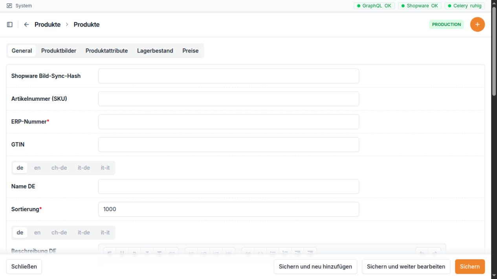

Produkte
========

Wofür ist dieser Bereich da?
~~~~~~~~~~~~~~~~~~~~~~~~~~~~

Im Bereich **Produkte** pflegen und prüfen Sie die Produktdaten, die
zwischen Microtech, der GC-Bridge und Shopware verwendet werden. Dazu
gehören unter anderem Namen und Beschreibungen, Kategorien, Bilder,
Videos, Attribute, Lagerbestand und Preise.

Die GC-Bridge ist dabei die Arbeits- und Kontrolloberfläche. Viele
Grunddaten kommen aus Microtech. Änderungen können eine neue Übertragung
nach Shopware oder Microtech auslösen. Arbeiten Sie deshalb bei Nummern,
Preisen und Zuordnungen besonders sorgfältig.

Oben wechseln Sie zwischen Stammdaten, Bildern, Attributen, Lagerbestand und
Preisen. Sprachabhängige Texte besitzen eigene Sprachreiter.

Navigation
~~~~~~~~~~

Öffnen Sie in der linken Navigation den Abschnitt **Produkte**. Er
enthält:

-  **Produkte**: aktive Arbeitsliste und Produktdetails
-  **Preise**: Preise je Produkt und Verkaufskanal
-  **Preiserhöhungen**: eine geplante Preisänderung vorbereiten, prüfen
   und übernehmen
-  **Kategorien**: Kategorien als Baum ordnen und Produkte zuordnen
-  **Produkt-Archiv**: nicht mehr benötigte Produkte aufbewahren oder
   wiederherstellen
-  **Variantenfamilien**: einzelne Produkte zu einem
   Shopware-Variantenartikel zusammenfassen
-  **Attributgruppen**: Oberbegriffe wie Farbe, Format oder Ausführung
-  **Attributwerte**: konkrete Werte wie Rot, DIN A4 oder mit Aufdruck

Direkte Adressen:

+--------------------------------+------------------------------------+
| Bereich                        | Adresse                            |
+================================+====================================+
| Produkte                       | ``http://10                        |
|                                | .0.0.165/admin/products/product/`` |
+--------------------------------+------------------------------------+
| Neues Produkt                  | ``http://10.0.0                    |
|                                | .165/admin/products/product/add/`` |
+--------------------------------+------------------------------------+
| Einzelnes Produkt              | ``http://10.0.0.165/adm            |
|                                | in/products/product/<ID>/change/`` |
+--------------------------------+------------------------------------+
| Preise                         | ``http://                          |
|                                | 10.0.0.165/admin/products/price/`` |
+--------------------------------+------------------------------------+
| Preiserhöhungen                | ``http://10.0.0.1                  |
|                                | 65/admin/products/priceincrease/`` |
+--------------------------------+------------------------------------+
| Positionen einer Preiserhöhung | ``http://10.0.0.165/admin/produc   |
|                                | ts/priceincrease/<ID>/positions/`` |
+--------------------------------+------------------------------------+
| Kategorien                     | ``http://10.0.0.165/               |
|                                | admin/products/category/manager/`` |
+--------------------------------+------------------------------------+
| Produkt-Archiv                 | ``http://10.0.0.165                |
|                                | /admin/products/archivedproduct/`` |
+--------------------------------+------------------------------------+
| Variantenfamilien              | ``http://10.0.0.165/admi           |
|                                | n/products/productvariantfamily/`` |
+--------------------------------+------------------------------------+
| Attributgruppen                | ``http://10.0.0.1                  |
|                                | 65/admin/products/propertygroup/`` |
+--------------------------------+------------------------------------+
| Attributwerte                  | ``http://10.0.0.1                  |
|                                | 65/admin/products/propertyvalue/`` |
+--------------------------------+------------------------------------+

``<ID>`` ist die interne Nummer des jeweiligen Eintrags. Sie ist nicht
mit der ERP-Nummer oder der Shopware-ID gleichzusetzen.

Weitere Verwaltungsseiten sind vorhanden, stehen aber nicht direkt in
der linken Navigation. Dazu gehören Bilder, Videos, Lagerbestände,
Steuern, Preisverläufe, einzelne Preiserhöhungs-Positionen und
Produkt-Synchronisationsläufe. Normalerweise öffnen Sie diese
Informationen über ein Produkt, einen Preis oder eine Preiserhöhung.

Die Produktliste
~~~~~~~~~~~~~~~~

Die Produktliste zeigt nur Produkte, die nicht archiviert sind. Aktive
Produkte stehen vor inaktiven Produkten; innerhalb dieser Gruppen wird
nach ERP-Nummer sortiert.

+-------------------------+-------------------------------------------+
| Spalte                  | Einfache Erklärung                        |
+=========================+===========================================+
| **Bild**                | Vorschau des ersten zugeordneten          |
|                         | Produktbildes. Ein Klick öffnet das       |
|                         | Produkt.                                  |
+-------------------------+-------------------------------------------+
| **ERP-Nummer**          | Zentrale Artikelnummer aus dem            |
|                         | Warenwirtschaftssystem. Ein Klick öffnet  |
|                         | das Produkt.                              |
+-------------------------+-------------------------------------------+
| **Name**                | Produktbezeichnung. Ein Klick öffnet das  |
|                         | Produkt.                                  |
+-------------------------+-------------------------------------------+
| **Verfügbarer Bestand** | Zeigt den virtuellen Bestand, wenn er     |
|                         | größer als 0 ist. Sonst wird der normale  |
|                         | Lagerbestand gezeigt.                     |
+-------------------------+-------------------------------------------+
| **Aktiv**               | Zeigt, ob das Produkt für die laufende    |
|                         | Verwendung freigegeben ist.               |
+-------------------------+-------------------------------------------+
| **Angelegt am**         | Zeitpunkt, zu dem das Produkt in der      |
|                         | GC-Bridge angelegt wurde.                 |
+-------------------------+-------------------------------------------+

Die Suche berücksichtigt **ERP-Nummer**, **Artikelnummer (SKU)** und
**Name**.

Die Liste kann gefiltert werden nach:

-  aktiv oder inaktiv,
-  Steuer,
-  Kategorie,
-  Anlagedatum.

Aktionen in der Produktliste und im Produkt
~~~~~~~~~~~~~~~~~~~~~~~~~~~~~~~~~~~~~~~~~~~

+----------------------+----------------------+----------------------+
| Aktion               | Wirkung              | Wichtiger Hinweis    |
+======================+======================+======================+
| **Produkt komplett   | Liest                | Der Vorgang läuft im |
| synchronisieren**    | beziehungsweise      | Hintergrund. Nicht   |
|                      | überträgt alle       | mehrfach kurz        |
|                      | vorgesehenen         | hintereinander       |
|                      | Produktdaten         | starten.             |
|                      | einschließlich       |                      |
|                      | Bilder im            |                      |
|                      | vollständigen Ablauf |                      |
|                      | Microtech →          |                      |
|                      | GC-Bridge →          |                      |
|                      | Shopware.            |                      |
+----------------------+----------------------+----------------------+
| **Produkt ohne       | Synchronisiert       | Geeignet, wenn       |
| Bilder               | Texte, Preise und    | Bilder unverändert   |
| synchronisieren**    | weitere              | bleiben sollen oder  |
|                      | Produktdaten, lässt  | die Bildübertragung  |
|                      | die Bilder aber aus. | gerade nicht         |
|                      |                      | benötigt wird.       |
+----------------------+----------------------+----------------------+
| **Sonderpreis für    | Setzt für die        | Verkaufskanal und    |
| Sales-Channel        | markierten Produkte  | Prozentwert sind     |
| setzen**             | einen prozentualen   | Pflicht. Ein         |
|                      | Sonderpreis in einem | Enddatum darf nicht  |
|                      | ausgewählten         | vor dem Startdatum   |
|                      | Verkaufskanal.       | liegen. Produkte     |
|                      |                      | ohne Preis in diesem |
|                      |                      | Kanal werden         |
|                      |                      | übersprungen.        |
+----------------------+----------------------+----------------------+
| **Sonderpreis für    | Entfernt             | Vorher den richtigen |
| Sales-Channel        | Sonderpreis,         | Verkaufskanal        |
| aufheben**           | Zeitraum und         | auswählen.           |
|                      | Prozentwert im       |                      |
|                      | ausgewählten         |                      |
|                      | Verkaufskanal.       |                      |
+----------------------+----------------------+----------------------+
| **In Archiv          | Verschiebt markierte | Kategorien, Preise,  |
| verschieben**        | Produkte ins         | Bilder, Attribute    |
|                      | Produkt-Archiv und   | und Bestände bleiben |
|                      | setzt sie            | erhalten.            |
|                      | gleichzeitig auf     |                      |
|                      | inaktiv.             |                      |
+----------------------+----------------------+----------------------+
| **AI** an            | Öffnet eine          | Ergebnis vor der     |
| Textfeldern          | Unterstützung zum    | Übernahme immer      |
|                      | Überarbeiten eines   | inhaltlich prüfen.   |
|                      | geeigneten           |                      |
|                      | Produkttextes.       |                      |
+----------------------+----------------------+----------------------+

Die beiden Synchronisationsaktionen und die Archivierung gibt es auch
direkt auf der Detailseite eines Produkts.

Produkt anlegen oder bearbeiten
~~~~~~~~~~~~~~~~~~~~~~~~~~~~~~~

Stammdaten
^^^^^^^^^^

+------------------------------+--------------------------------------+
| Feld                         | Bedeutung und richtige Verwendung    |
+==============================+======================================+
| **Shopware Bild-Sync-Hash**  | Interner Prüfwert für die            |
|                              | Bildübertragung. Normalerweise nicht |
|                              | von Hand ändern.                     |
+------------------------------+--------------------------------------+
| **Artikelnummer (SKU)**      | Artikelnummer für Shopware. Sie muss |
|                              | eindeutig sein, darf aber leer       |
|                              | bleiben, wenn der Datensatz noch     |
|                              | nicht vollständig ist.               |
+------------------------------+--------------------------------------+
| **ERP-Nummer**               | Pflichtfeld und eindeutige           |
|                              | Artikelnummer aus Microtech. Eine    |
|                              | falsche Änderung kann Zuordnungen    |
|                              | und Übertragungen stören.            |
+------------------------------+--------------------------------------+
| **GTIN**                     | Internationale Artikelnummer, zum    |
|                              | Beispiel EAN. Kann leer bleiben,     |
|                              | wenn keine GTIN vorhanden ist.       |
+------------------------------+--------------------------------------+
| **Name**                     | Lesbare Produktbezeichnung. Sie wird |
|                              | in mehreren Sprachfassungen          |
|                              | angeboten.                           |
+------------------------------+--------------------------------------+
| **Sortierung**               | Zahl für die Reihenfolge. Kleinere   |
|                              | Zahlen stehen üblicherweise weiter   |
|                              | oben. Der Standardwert ist 1000.     |
+------------------------------+--------------------------------------+
| **Beschreibung**             | Ausführlicher Produkttext. Das Feld  |
|                              | gibt es in mehreren Sprachfassungen. |
+------------------------------+--------------------------------------+
| **Kurzbeschreibung**         | Kurzer Produkttext für Übersichten.  |
|                              | Das Feld gibt es in mehreren         |
|                              | Sprachfassungen.                     |
+------------------------------+--------------------------------------+
| **Aktiv**                    | Legt fest, ob das Produkt im         |
|                              | laufenden Bestand verwendet werden   |
|                              | soll.                                |
+------------------------------+--------------------------------------+
| **Archiviert**               | Interne Archivkennzeichnung. Nutzen  |
|                              | Sie zum Archivieren besser die       |
|                              | vorgesehene Aktion **In Archiv       |
|                              | verschieben**.                       |
+------------------------------+--------------------------------------+
| **Faktor**                   | Mengenfaktor des Produkts, zum       |
|                              | Beispiel für eine                    |
|                              | Verpackungseinheit.                  |
+------------------------------+--------------------------------------+
| **Einheit**                  | Einheit wie Stück, Packung oder      |
|                              | Meter. Das Feld gibt es in mehreren  |
|                              | Sprachfassungen.                     |
+------------------------------+--------------------------------------+
| **Mindestabnahme**           | Kleinste Menge, die bestellt werden  |
|                              | kann.                                |
+------------------------------+--------------------------------------+
| **Kaufeinheit**              | Schrittweite, in der weitere Mengen  |
|                              | gekauft werden können.               |
+------------------------------+--------------------------------------+
| **Statistische Warennummer** | Warennummer für Zoll- und            |
|                              | Außenhandelszwecke.                  |
+------------------------------+--------------------------------------+
| **Bruttogewicht (kg)**       | Gewicht einschließlich Verpackung in |
|                              | Kilogramm.                           |
+------------------------------+--------------------------------------+
| **Nettogewicht (kg)**        | Gewicht ohne Verpackung in           |
|                              | Kilogramm.                           |
+------------------------------+--------------------------------------+
| **Steuer**                   | Passender Steuersatz des Produkts.   |
+------------------------------+--------------------------------------+
| **Kategorien**               | Eine oder mehrere Kategorien, in     |
|                              | denen das Produkt erscheinen soll.   |
|                              | Archivierte Produkte werden bei      |
|                              | neuen Zuordnungen nicht angeboten.   |
+------------------------------+--------------------------------------+
| **Angelegt am**              | Wird automatisch gesetzt.            |
+------------------------------+--------------------------------------+
| **Aktualisiert am**          | Wird bei Änderungen automatisch      |
|                              | gesetzt.                             |
+------------------------------+--------------------------------------+

Für **Name**, **Beschreibung**, **Kurzbeschreibung** und **Einheit**
stehen Sprachfassungen für Deutsch, Englisch, Schweizerdeutsch, Deutsch
für Italien und Italienisch bereit. Pflegen Sie nur Texte, deren Sprache
Sie sicher beurteilen können. Fehlende Sprachfassungen können je nach
Einrichtung auf Deutsch oder Englisch zurückfallen.

Produktbilder
^^^^^^^^^^^^^

Im unteren Bereich des Produktes werden Bilder in einer Tabelle
zugeordnet.

+-----------------+---------------------------------------------------+
| Feld            | Bedeutung                                         |
+=================+===================================================+
| **Vorschau**    | Zeigt das ausgewählte Bild klein an.              |
+-----------------+---------------------------------------------------+
| **Bild**        | Auswahl eines bereits bekannten Bildes.           |
+-----------------+---------------------------------------------------+
| **Reihenfolge** | Legt fest, welches Bild zuerst kommt. Das erste   |
|                 | Bild wird auch in der Produktliste gezeigt.       |
+-----------------+---------------------------------------------------+

Ein Bild selbst besitzt die Felder **Bildpfad** und **Alternativtext**.
Der Alternativtext beschreibt den Bildinhalt für barrierearme Ausgaben.
Bilder werden über einen Pfad oder eine vollständige Webadresse geladen;
sie werden in diesem Formular nicht als neue lokale Bilddatei
hochgeladen.

Produktvideos
^^^^^^^^^^^^^

+--------------+------------------------------------------------------+
| Feld         | Bedeutung                                            |
+==============+======================================================+
| **Video**    | Auswahl eines vorhandenen Vimeo-Videos.              |
+--------------+------------------------------------------------------+
| **Position** | Reihenfolge der Videos am Produkt. Kleinere Zahlen   |
|              | stehen zuerst.                                       |
+--------------+------------------------------------------------------+
| **Aktiv**    | Legt fest, ob diese Zuordnung verwendet wird.        |
+--------------+------------------------------------------------------+

Ein Video besitzt **Titel**, **Vimeo-ID oder URL**, den bei nicht
öffentlichen Vimeo-Links benötigten **Privacy-Hash**, ein optionales
**Vorschaubild** und **Aktiv**. Sie können eine reine Vimeo-Nummer oder
eine gültige Vimeo-HTTPS-Adresse eintragen. Beim Speichern wird daraus
die reine Nummer übernommen. Der Privacy-Hash wird aus einem passenden
nicht öffentlichen Link automatisch gelesen.

Produktattribute
^^^^^^^^^^^^^^^^

+------------------+--------------------------------------------------+
| Feld             | Bedeutung                                        |
+==================+==================================================+
| **Gruppe**       | Wird aus dem gewählten Attributwert angezeigt,   |
|                  | zum Beispiel „Farbe“.                            |
+------------------+--------------------------------------------------+
| **Attributwert** | Konkreter Wert, zum Beispiel „Rot“.              |
+------------------+--------------------------------------------------+

Dasselbe Produkt darf denselben Attributwert nicht doppelt erhalten.
Attribute werden auch für Variantenfamilien verwendet.

Lagerbestand
^^^^^^^^^^^^

+------------------------+--------------------------------------------+
| Feld                   | Bedeutung                                  |
+========================+============================================+
| **Bestand**            | Tatsächlicher Lagerbestand. Dezimalwerte   |
|                        | sind möglich.                              |
+------------------------+--------------------------------------------+
| **Virtueller Bestand** | Manuell vorgegebener Bestand. Ist dieser   |
|                        | Wert größer als 0, wird er anstelle des    |
|                        | normalen Bestands verwendet.               |
+------------------------+--------------------------------------------+
| **Lagerort**           | Freie Angabe zum Lagerplatz.               |
+------------------------+--------------------------------------------+

Wichtig: Der virtuelle Bestand **0** überschreibt den normalen Bestand
nicht. Für Shopware wird ein Bestand mit Nachkommastellen vorsichtig auf
die nächste ganze Zahl nach unten abgerundet.

Preise am Produkt
^^^^^^^^^^^^^^^^^

Jeder Preis gehört zu genau einem Produkt und einem Verkaufskanal. Pro
Verkaufskanal darf es nur einen Preiseintrag geben.

+-----------------------+---------------------------------------------+
| Feld                  | Bedeutung und richtige Verwendung           |
+=======================+=============================================+
| **Verkaufskanal**     | Shopware-Kanal, für den der Preis gilt. In  |
|                       | der Auswahl stehen aktive Kanäle; der       |
|                       | Standardkanal erscheint zuerst.             |
+-----------------------+---------------------------------------------+
| **Preis**             | Regulärer Preis.                            |
+-----------------------+---------------------------------------------+
| **Sonderpreis (%)**   | Prozentualer Nachlass. Bei einer Eingabe    |
|                       | berechnet die Bridge den Sonderpreis        |
|                       | automatisch und rundet auf 5 Cent auf.      |
+-----------------------+---------------------------------------------+
| **Sonderpreis ab**    | Beginn des Angebots. Ohne Angabe wird beim  |
|                       | Setzen eines Prozentsatzes der aktuelle     |
|                       | Zeitpunkt verwendet.                        |
+-----------------------+---------------------------------------------+
| **Sonderpreis bis**   | Ende des Angebots. Ohne Angabe setzt die    |
|                       | Bridge das Ende des folgenden Monats.       |
+-----------------------+---------------------------------------------+
| **Sonderpreis**       | Berechneter Preis. In der Produkttabelle    |
|                       | ist er nur zur Kontrolle sichtbar.          |
+-----------------------+---------------------------------------------+
| **Sonderpreis aktiv** | Zeigt, ob der aktuelle Zeitpunkt innerhalb  |
|                       | des Angebotszeitraums liegt.                |
+-----------------------+---------------------------------------------+
| **Staffelmenge**      | Menge, ab der ein Staffelpreis gilt.        |
+-----------------------+---------------------------------------------+
| **Staffelpreis**      | Preis für die angegebene Staffelmenge.      |
+-----------------------+---------------------------------------------+
| **Verlauf**           | Link zum Preis und zu seinen bisherigen     |
|                       | Änderungen.                                 |
+-----------------------+---------------------------------------------+

Bei jeder tatsächlichen Änderung eines Preisfeldes wird automatisch ein
Eintrag im Preisverlauf angelegt. Er enthält den Änderungstyp, die
geänderten Felder und die damaligen Preiswerte. Der Preisverlauf dient
nur zur Kontrolle und kann nicht von Hand angelegt oder geändert werden.

Preise als eigene Liste
~~~~~~~~~~~~~~~~~~~~~~~

Die Liste **Preise** zeigt Produkt, Verkaufskanal, Preis,
Sonderpreis-Prozent, Sonderpreis, den aktuellen Angebotsstatus,
Staffelpreis und Anlagedatum. Sie können nach Produktname, ERP-Nummer
oder Verkaufskanal suchen und nach Verkaufskanal, Preisbereich und
Anlagedatum filtern.

In dieser Liste stehen zwei Sammelaktionen zur Verfügung:

-  **Sonderpreis setzen (%)**: Prozentwert sowie optional Start und Ende
   eintragen; anschließend die markierten Preise ändern.
-  **Sonderpreis aufheben**: entfernt den Sonderpreis der markierten
   Preise.

Ein Enddatum vor dem Startdatum wird abgewiesen. Prüfen Sie vor einer
Sammelaktion stets, ob wirklich die richtigen Preise und Verkaufskanäle
markiert sind.

Kategorien verwalten
~~~~~~~~~~~~~~~~~~~~

Die Kategorienseite besteht aus zwei großen Bereichen:

-  links der **Kategoriebaum**,
-  rechts die **Produktzuordnung** der ausgewählten Kategorie.

Im Baum können Sie Kategorien suchen, auf- und zuklappen und – mit
passenden Rechten – per Ziehen verschieben. Eine Kategorie kann vor,
hinter oder in eine andere Kategorie verschoben werden. Die Bridge
verhindert, dass eine Kategorie in sich selbst oder in eine eigene
Unterkategorie verschoben wird.

Nach Auswahl einer Kategorie zeigt die rechte Seite die bereits
zugeordneten Produkte. Über das Suchfeld können Sie weitere Produkte ab
zwei eingegebenen Zeichen finden und hinzufügen. Bereits zugeordnete
Produkte können entfernt werden. Archivierte Produkte werden hier nicht
als neue Auswahl angeboten.

Felder einer Kategorie
^^^^^^^^^^^^^^^^^^^^^^

+----------------------------------+----------------------------------+
| Feld                             | Bedeutung und richtige           |
|                                  | Verwendung                       |
+==================================+==================================+
| **Name**                         | Kategoriename. Er steht in       |
|                                  | mehreren Sprachfassungen zur     |
|                                  | Verfügung. Bei gleichnamigen     |
|                                  | Unterkategorien wird in          |
|                                  | Auswahlen zusätzlich die oberste |
|                                  | Kategorie gezeigt.               |
+----------------------------------+----------------------------------+
| **Slug**                         | Eindeutiger kurzer Bestandteil   |
|                                  | für Adressen. Nur mit Bedacht    |
|                                  | ändern.                          |
+----------------------------------+----------------------------------+
| **Shopware 6 ID**                | Eindeutige Kennung aus Shopware  |
|                                  | 6. Normalerweise durch die       |
|                                  | Synchronisation gepflegt.        |
+----------------------------------+----------------------------------+
| **SKU / Shopware-ID**            | Weitere Shopware-Zuordnung,      |
|                                  | falls verwendet.                 |
+----------------------------------+----------------------------------+
| **Oberkategorie**                | Übergeordnete Kategorie. In der  |
|                                  | Baumansicht lässt sich diese     |
|                                  | Zuordnung einfacher erkennen und |
|                                  | ändern.                          |
+----------------------------------+----------------------------------+
| **Legacy ERP-Nummer**            | Alte ERP-Nummer. Nur zur         |
|                                  | Information.                     |
+----------------------------------+----------------------------------+
| **Legacy API-ID**                | Alte Schnittstellenkennung. Nur  |
|                                  | zur Information.                 |
+----------------------------------+----------------------------------+
| **Legacy Parent ERP-Nummer**     | Alte Nummer der Oberkategorie.   |
|                                  | Nur zur Information.             |
+----------------------------------+----------------------------------+
| **Bild**                         | Pfad oder Kennung des            |
|                                  | Kategoriebildes.                 |
+----------------------------------+----------------------------------+
| **Kurzbeschreibung (HTML)**      | Kurzer Kategorietext.            |
|                                  | Mehrsprachig.                    |
+----------------------------------+----------------------------------+
| **Beschreibung (HTML)**          | Ausführlicher Kategorietext.     |
|                                  | Mehrsprachig.                    |
+----------------------------------+----------------------------------+
| **SEO-Meta-Titel**               | Titel für Suchmaschinen.         |
|                                  | Mehrsprachig.                    |
+----------------------------------+----------------------------------+
| **SEO-Meta-Beschreibung**        | Kurzbeschreibung für             |
|                                  | Suchmaschinen. Mehrsprachig.     |
+----------------------------------+----------------------------------+
| **SEO-Keywords**                 | Suchbegriffe, sofern weiterhin   |
|                                  | verwendet. Mehrsprachig.         |
+----------------------------------+----------------------------------+
| **Aktiv**                        | Die Kategorie wird fachlich      |
|                                  | verwendet.                       |
+----------------------------------+----------------------------------+
| **Sichtbar**                     | Die Kategorie soll im Shop       |
|                                  | beziehungsweise in sichtbaren    |
|                                  | Ausgaben erscheinen. Aktiv und   |
|                                  | sichtbar sind getrennte Angaben. |
+----------------------------------+----------------------------------+
| **Legacy geändert am**           | Letzter Änderungszeitpunkt aus   |
|                                  | dem alten System.                |
+----------------------------------+----------------------------------+
| **Sortierung**                   | Reihenfolge unter derselben      |
|                                  | Oberkategorie. In der            |
|                                  | Baumansicht wird sie beim        |
|                                  | Verschieben passend neu gesetzt. |
+----------------------------------+----------------------------------+
| **Angelegt am / Aktualisiert     | Automatische Zeitangaben.        |
| am**                             |                                  |
+----------------------------------+----------------------------------+

Für Textfelder einer Kategorie gibt es dieselben fünf Sprachfassungen
wie bei Produkten. Bei geeigneten Textfeldern erscheint außerdem eine
**AI**-Schaltfläche zur Textüberarbeitung.

Produkt-Archiv
~~~~~~~~~~~~~~

Das Produkt-Archiv zeigt ausschließlich archivierte Produkte. Ein
Produkt wird beim Archivieren automatisch deaktiviert. Seine Kategorien,
Bilder, Videos, Attribute, Preise und Bestände bleiben erhalten.

Mit **Aus Archiv wiederherstellen** wird nur die Archivkennzeichnung
entfernt. Das Produkt bleibt zunächst inaktiv. Prüfen Sie es danach in
der normalen Produktliste und aktivieren Sie es bewusst, wenn es wieder
verwendet werden soll.

Im Archiv können keine neuen Produkte angelegt werden. Synchronisations-
und Sonderpreisaktionen sind dort absichtlich nicht verfügbar.

Attributgruppen und Attributwerte
~~~~~~~~~~~~~~~~~~~~~~~~~~~~~~~~~

Attributgruppe
^^^^^^^^^^^^^^

+----------------------------------+----------------------------------+
| Feld                             | Bedeutung                        |
+==================================+==================================+
| **Externe Referenz**             | Kennung aus einem anderen        |
|                                  | System. Normalerweise nicht frei |
|                                  | erfinden.                        |
+----------------------------------+----------------------------------+
| **Shopware Attributgruppen-ID**  | Kennung der Gruppe in Shopware.  |
+----------------------------------+----------------------------------+
| **Name**                         | Name der Gruppe, zum Beispiel    |
|                                  | „Farbe“. Mehrsprachig.           |
+----------------------------------+----------------------------------+
| **Angelegt am / Aktualisiert     | Automatische Zeitangaben.        |
| am**                             |                                  |
+----------------------------------+----------------------------------+

Attributwert
^^^^^^^^^^^^

+----------------------------------+----------------------------------+
| Feld                             | Bedeutung                        |
+==================================+==================================+
| **Externe Referenz**             | Kennung aus einem anderen        |
|                                  | System.                          |
+----------------------------------+----------------------------------+
| **Shopware Attributwert-ID**     | Kennung des Wertes in Shopware.  |
+----------------------------------+----------------------------------+
| **Attributgruppe**               | Gruppe, zu der der Wert gehört.  |
+----------------------------------+----------------------------------+
| **Wert**                         | Konkreter Wert, zum Beispiel     |
|                                  | „Blau“. Mehrsprachig. Innerhalb  |
|                                  | einer Gruppe darf derselbe Name  |
|                                  | nicht doppelt vorkommen.         |
+----------------------------------+----------------------------------+
| **Position**                     | Reihenfolge innerhalb der Gruppe |
|                                  | und in Shopware.                 |
+----------------------------------+----------------------------------+
| **Auswahlbild**                  | Optionales Bild für eine         |
|                                  | Variantenwahl mit Bildern.       |
+----------------------------------+----------------------------------+
| **Produkte**                     | Produkte, denen dieser Wert      |
|                                  | zugeordnet ist. Mehrere Produkte |
|                                  | können gemeinsam ausgewählt      |
|                                  | werden.                          |
+----------------------------------+----------------------------------+
| **Angelegt am / Aktualisiert     | Automatische Zeitangaben.        |
| am**                             |                                  |
+----------------------------------+----------------------------------+

Variantenfamilien
~~~~~~~~~~~~~~~~~

Eine Variantenfamilie bildet in Shopware ein übergeordnetes Produkt. Die
tatsächlich verkauften Varianten bleiben normale Produkte mit eigenen
ERP-Nummern.

+----------------------------------+----------------------------------+
| Feld                             | Bedeutung und richtige           |
|                                  | Verwendung                       |
+==================================+==================================+
| **Shopware Parent-Name**         | Gemeinsamer sichtbarer Name der  |
|                                  | Variantenfamilie. Mehrsprachig.  |
+----------------------------------+----------------------------------+
| **Technischer Schlüssel**        | Eindeutiger kurzer Schlüssel der |
|                                  | Familie.                         |
+----------------------------------+----------------------------------+
| **Shopware Parent-Beschreibung** | Gemeinsamer Beschreibungstext.   |
|                                  | Mehrsprachig.                    |
+----------------------------------+----------------------------------+
| **Shopware                       | Eindeutige technische            |
| Parent-Artikelnummer**           | Artikelnummer nur für Shopware.  |
|                                  | Sie besitzt kein Gegenstück in   |
|                                  | Microtech.                       |
+----------------------------------+----------------------------------+
| **Shopware Parent-ID**           | Kennung des bereits angelegten   |
|                                  | übergeordneten                   |
|                                  | Shopware-Produkts.               |
+----------------------------------+----------------------------------+
| **Aktiv**                        | Legt fest, ob die Familie        |
|                                  | verwendet werden soll.           |
+----------------------------------+----------------------------------+
| **Shopware Zielkategorie**       | Kategorie, in der nur das        |
|                                  | übergeordnete Variantenprodukt   |
|                                  | sichtbar sein soll.              |
+----------------------------------+----------------------------------+
| **Quellkategorien**              | Kategorien, aus denen aktive     |
|                                  | Einzelprodukte als mögliche      |
|                                  | Varianten gelesen werden.        |
+----------------------------------+----------------------------------+
| **Standardvariante**             | Produkt, das Shopware zunächst   |
|                                  | zeigt. Es muss aus einer         |
|                                  | ausgewählten Quellkategorie      |
|                                  | stammen.                         |
+----------------------------------+----------------------------------+
| **Gewünschter SEO-Pfad**         | Vorgabe für eine spätere         |
|                                  | Shopware-Adresse. Die            |
|                                  | tatsächliche Freigabe der        |
|                                  | SEO-Adresse erfolgt nicht allein |
|                                  | durch dieses Feld.               |
+----------------------------------+----------------------------------+

Unter der Familie werden die **Variantenattribute** gepflegt:

+----------------------------------+----------------------------------+
| Feld                             | Bedeutung                        |
+==================================+==================================+
| **Attributgruppe**               | Merkmal, nach dem gewählt wird,  |
|                                  | zum Beispiel Farbe oder Format.  |
|                                  | Jede Gruppe darf je Familie nur  |
|                                  | einmal vorkommen.                |
+----------------------------------+----------------------------------+
| **Position**                     | Reihenfolge der                  |
|                                  | Auswahlmöglichkeiten.            |
+----------------------------------+----------------------------------+
| **Darstellung in Shopware**      | Auswahl zwischen **Text**,       |
|                                  | **Farbe** und **Bild**.          |
+----------------------------------+----------------------------------+
| **Ersatzwert bei fehlendem       | Wert, der benutzt wird, wenn ein |
| Attribut**                       | Produkt dieses Merkmal nicht     |
|                                  | besitzt, zum Beispiel „Ohne      |
|                                  | Aufdruck“. Der Ersatzwert muss   |
|                                  | zur gewählten Attributgruppe     |
|                                  | gehören.                         |
+----------------------------------+----------------------------------+

Die Liste zeigt Name, Shopware-Parent-Artikelnummer, Zielkategorie, Zahl
der Quellkategorien, Aktiv-Status und Anlagedatum.

Preiserhöhungen
~~~~~~~~~~~~~~~

Eine Preiserhöhung ist ein kontrollierter Arbeitsvorgang. Beim Anlegen
werden die Preise des aktiven Standard-Verkaufskanals als Positionen
eingelesen. Danach prüfen oder ändern Sie die vorgeschlagenen
Zielpreise. Erst die Aktion **Preiserhöhung übernehmen** ändert die
Standardpreise.

Felder der Preiserhöhung
^^^^^^^^^^^^^^^^^^^^^^^^

+----------------------------------+----------------------------------+
| Feld                             | Bedeutung und richtige           |
|                                  | Verwendung                       |
+==================================+==================================+
| **Titel**                        | Eindeutige Bezeichnung, zum      |
|                                  | Beispiel „Preiserhöhung Oktober  |
|                                  | 2026“. Ein Monat und Jahr im     |
|                                  | Titel können für das Deckblatt   |
|                                  | der Preisliste verwendet werden. |
+----------------------------------+----------------------------------+
| **Status**                       | **Entwurf** oder **Übernommen**. |
|                                  | Wird durch den Ablauf gepflegt.  |
+----------------------------------+----------------------------------+
| **Standard-Verkaufskanal**       | Kanal, dessen Preise als         |
|                                  | Grundlage dienen. Wird           |
|                                  | automatisch aus dem aktiven      |
|                                  | Standardkanal gewählt und nur    |
|                                  | angezeigt.                       |
+----------------------------------+----------------------------------+
| **Generelle Erhöhung (%)**       | Prozentwert für den              |
|                                  | Preisvorschlag. Voreinstellung   |
|                                  | ist 2,50 %.                      |
+----------------------------------+----------------------------------+
| **Preislisten-Vorlage**          | Aktive Dokumentvorlage vom Typ   |
|                                  | **Preisliste**. Sie ist für das  |
|                                  | Jahresdokument erforderlich.     |
+----------------------------------+----------------------------------+
| **Erzeugte Preisliste**          | Link zum bereits aus dieser      |
|                                  | Preiserhöhung erzeugten          |
|                                  | Dokument.                        |
+----------------------------------+----------------------------------+
| **Positionen**                   | Anzahl der eingelesenen          |
|                                  | Preispositionen.                 |
+----------------------------------+----------------------------------+
| **Positionen synchronisiert am** | Zeitpunkt des letzten Neuladens  |
|                                  | der Produkte und Preise.         |
+----------------------------------+----------------------------------+
| **Übernommen am**                | Zeitpunkt, an dem die neuen      |
|                                  | Preise endgültig übernommen      |
|                                  | wurden.                          |
+----------------------------------+----------------------------------+
| **Hinweis zur                    | Warnt davor, dass direkte        |
| Wiederherstellung**              | Sonderpreise bei einer           |
|                                  | Wiederherstellung gelöscht       |
|                                  | werden; prozentuale Sonderpreise |
|                                  | werden neu berechnet.            |
+----------------------------------+----------------------------------+
| **Angelegt am / Aktualisiert     | Automatische Zeitangaben.        |
| am**                             |                                  |
+----------------------------------+----------------------------------+

Positionen bearbeiten
^^^^^^^^^^^^^^^^^^^^^

Die Positionstabelle zeigt unter anderem ERP-Nummer, Produktname,
bisherigen Preis, Staffelmenge, bisherigen Staffelpreis, Einheit,
Vorschlag, neuen Preis, neuen Staffelpreis, Preisverlauf und – sofern
vorhanden – einen Mappei-Vergleich.

+--------------------------------+------------------------------------+
| Feld                           | Bedeutung                          |
+================================+====================================+
| **Aktueller Preis**            | Beim Einlesen festgehaltener       |
|                                | Ausgangspreis.                     |
+--------------------------------+------------------------------------+
| **Aktuelle Staffelmenge**      | Bisherige Menge für den            |
|                                | Staffelpreis.                      |
+--------------------------------+------------------------------------+
| **Aktueller Staffelpreis**     | Bisheriger Preis ab der            |
|                                | Staffelmenge.                      |
+--------------------------------+------------------------------------+
| **Neuer Preis**                | Tatsächlicher Zielpreis. Bleibt    |
|                                | das Feld leer, gilt der grau       |
|                                | angezeigte Vorschlag aus dem       |
|                                | allgemeinen Prozentwert.           |
+--------------------------------+------------------------------------+
| **Neuer Staffelpreis**         | Tatsächlicher neuer Staffelpreis.  |
|                                | Auch hier kann der Vorschlag       |
|                                | verwendet werden.                  |
+--------------------------------+------------------------------------+
| **Letzter Status**             | Rückmeldung zur letzten            |
|                                | Bearbeitung der Zeile.             |
+--------------------------------+------------------------------------+
| **Letzte Änderung durch / am** | Zeigt, wer die Position zuletzt    |
|                                | geändert hat und wann.             |
+--------------------------------+------------------------------------+

Die Bridge rundet neue Preise auf den nächsten 5-Cent-Schritt auf. Ein
neuer Staffelpreis muss unter dem neuen normalen Preis liegen.
Auffällige Preissprünge oder unpassende Staffelwerte werden als Warnung
oder Fehler gezeigt. Gespeichert wird erst über die Schaltfläche
**Speichern**. Die Suche beginnt ab drei Zeichen und findet ERP-Nummern
und Produktnamen.

Aktionen einer Preiserhöhung
^^^^^^^^^^^^^^^^^^^^^^^^^^^^

+----------------------------------+----------------------------------+
| Aktion                           | Wirkung und Hinweis              |
+==================================+==================================+
| **PDF Bestellschein**            | Erstellt einen Bestellschein als |
|                                  | PDF. In der Listenaktion muss    |
|                                  | genau eine Preiserhöhung         |
|                                  | markiert sein.                   |
+----------------------------------+----------------------------------+
| **Produkte neu laden**           | Liest aktuelle Preise des        |
|                                  | Standard-Verkaufskanals neu ein, |
|                                  | entfernt entfallene Positionen   |
|                                  | und behält manuell gesetzte      |
|                                  | Zielpreise. Nach der Übernahme   |
|                                  | ist diese Aktion gesperrt.       |
+----------------------------------+----------------------------------+
| **Preiserhöhung übernehmen**     | Schreibt die geprüften           |
|                                  | Zielpreise als neue              |
|                                  | Standardpreise. Positionen mit   |
|                                  | sperrenden Prüfungsfehlern       |
|                                  | verhindern die Übernahme.        |
+----------------------------------+----------------------------------+
| **Preisliste für aktuelles Jahr  | Erzeugt aus der gewählten        |
| anlegen**                        | Vorlage ein neues Dokument und   |
|                                  | öffnet es im Dokumentbereich.    |
+----------------------------------+----------------------------------+
| **Microtech Preise               | Reiht die Preise der             |
| nachschreiben**                  | übernommenen Positionen zur      |
|                                  | Aktualisierung von VK0/VK1 in    |
|                                  | Microtech ein. Erst nach der     |
|                                  | Übernahme möglich.               |
+----------------------------------+----------------------------------+
| **Preise wiederherstellen und    | Stellt die vor der Preiserhöhung |
| synchronisieren**                | gespeicherten Preise wieder her  |
|                                  | und reiht die erneute            |
|                                  | Synchronisation ein. Direkte     |
|                                  | Sonderpreise gehen dabei         |
|                                  | verloren; prozentuale werden neu |
|                                  | berechnet.                       |
+----------------------------------+----------------------------------+

Typischer Ablauf bei einem einzelnen Produkt
~~~~~~~~~~~~~~~~~~~~~~~~~~~~~~~~~~~~~~~~~~~~

1. Öffnen Sie **Produkte → Produkte**.
2. Suchen Sie nach ERP-Nummer, SKU oder Name.
3. Öffnen Sie das Produkt und prüfen Sie zuerst ERP-Nummer, Aktiv-Status
   und Kategorien.
4. Ändern Sie nur die benötigten Felder. Prüfen Sie bei Texten die
   richtige Sprache.
5. Kontrollieren Sie Bilder, Videos, Attribute, Lagerbestand und Preise
   in den Tabellen darunter.
6. Speichern Sie das Produkt.
7. Nutzen Sie je nach Bedarf **Produkt komplett synchronisieren** oder
   **Produkt ohne Bilder synchronisieren**.
8. Warten Sie die Rückmeldung ab und prüfen Sie das Ergebnis in
   Shopware. Ein Hintergrundlauf kann etwas Zeit benötigen.

Häufige Hinweise und Fehlerquellen
~~~~~~~~~~~~~~~~~~~~~~~~~~~~~~~~~~

-  **Produkt ist nicht mehr in der Liste:** Es wurde möglicherweise
   archiviert. Im **Produkt-Archiv** nach ERP-Nummer oder Name suchen.
-  **Wiederhergestelltes Produkt bleibt unsichtbar:** Beim
   Wiederherstellen bleibt es inaktiv. Danach in der normalen
   Produktliste bewusst auf **Aktiv** setzen.
-  **Bildvorschau fehlt:** Prüfen Sie Bildzuordnung, Bildpfad und
   Reihenfolge. Das erste gültige Bild wird als Vorschau verwendet.
-  **Falsches Bild steht vorne:** In der Tabelle **Produktbilder** die
   Reihenfolge korrigieren.
-  **Video-Adresse wird abgewiesen:** Nur eine numerische Vimeo-ID oder
   eine gültige öffentliche beziehungsweise nicht öffentliche
   Vimeo-HTTPS-Adresse verwenden.
-  **Bestand stimmt in Shopware nicht:** Ein virtueller Bestand größer
   als 0 überschreibt den normalen Bestand. Außerdem werden
   Nachkommastellen für Shopware abgerundet.
-  **Sonderpreis ist nicht aktiv:** Start, Ende und berechneten
   Sonderpreis prüfen. Der aktuelle Zeitpunkt muss innerhalb des
   Zeitraums liegen.
-  **Sonderpreis-Aktion überspringt Produkte:** Für den gewählten
   Verkaufskanal fehlt bei diesen Produkten ein Preiseintrag.
-  **Kategorie ist in einer Auswahl nicht eindeutig:** Bei gleichnamigen
   Unterkategorien zeigt die Auswahl zusätzlich die oberste Kategorie,
   zum Beispiel „Deutschland \| Ordner“.
-  **Kategorie lässt sich nicht verschieben:** Eine Kategorie darf nicht
   in sich selbst oder in eine eigene Unterkategorie geschoben werden.
-  **Produkt erscheint nicht bei der Kategorie-Suche:** Mindestens zwei
   Zeichen eingeben; archivierte Produkte werden nicht angeboten.
-  **Standardvariante wird abgewiesen:** Sie muss ein aktives Produkt
   aus einer der gewählten Quellkategorien sein.
-  **Ersatzwert einer Variante wird abgewiesen:** Der Ersatzwert muss
   zur gewählten Attributgruppe gehören.
-  **Preiserhöhung lässt sich nicht übernehmen:** In den Positionen gibt
   es noch sperrende Preis- oder Staffelprüfungen.
-  **Neu geladene Preiserhöhungs-Positionen sehen anders aus:**
   Ausgangspreise wurden aktualisiert; bereits manuell gesetzte
   Zielpreise bleiben erhalten.
-  **Synchronisation mehrfach gestartet:** Hintergrundläufe können
   zeitversetzt erscheinen. Erst Rückmeldung und Synchronisationsstatus
   prüfen, bevor ein weiterer Lauf gestartet wird.
-  **Nummern und Kennungen:** ERP-Nummer, SKU, Shopware-IDs und externe
   Referenzen nicht ohne geklärten Grund ändern.

Praxisbeispiel 1: Produkttext und Bild korrigieren und nach Shopware übertragen
~~~~~~~~~~~~~~~~~~~~~~~~~~~~~~~~~~~~~~~~~~~~~~~~~~~~~~~~~~~~~~~~~~~~~~~~~~~~~~~

Beim Produkt mit der ERP-Nummer ``710045`` ist die deutsche
Kurzbeschreibung veraltet. Außerdem soll ein neues Bild an erster Stelle
stehen.

1.  Öffnen Sie **Produkte → Produkte**.
2.  Suchen Sie nach ``710045`` und öffnen Sie den Treffer.
3.  Prüfen Sie, ob **Aktiv** gesetzt ist und ob Name und Kategorien zum
    Artikel passen.
4.  Wechseln Sie beim Feld **Kurzbeschreibung** zur deutschen
    Sprachfassung und ändern Sie nur den veralteten Text.
5.  Gehen Sie zur Tabelle **Produktbilder**.
6.  Wählen Sie das gewünschte Bild aus. Tragen Sie dafür bei
    **Reihenfolge** den Wert ``1`` ein.
7.  Geben Sie den übrigen Bildern größere Reihenfolgenummern, damit
    keine unklare Reihenfolge entsteht.
8.  Speichern Sie das Produkt und prüfen Sie, ob das neue Bild jetzt in
    der Produktliste als Vorschau erscheint.
9.  Öffnen Sie das Produkt erneut und wählen Sie **Produkt komplett
    synchronisieren**, weil auch das Bild übertragen werden soll.
10. Warten Sie die Rückmeldung ab und kontrollieren Sie in Shopware den
    deutschen Kurztext und das erste Bild.

Ergebnis: Der Text wurde in der richtigen Sprachfassung geändert, das
gewünschte Bild steht vorne und der vollständige Produktstand wurde zur
Übertragung eingereiht.

Praxisbeispiel 2: Geprüfte Preiserhöhung mit Preisliste durchführen
~~~~~~~~~~~~~~~~~~~~~~~~~~~~~~~~~~~~~~~~~~~~~~~~~~~~~~~~~~~~~~~~~~~

Zum Oktober 2026 sollen die Standardpreise grundsätzlich um 2,5 %
steigen. Einige wichtige Produkte brauchen abweichende Zielpreise.

1.  Öffnen Sie **Produkte → Preiserhöhungen** und legen Sie einen neuen
    Eintrag an.
2.  Tragen Sie als **Titel** „Preiserhöhung Oktober 2026“ und bei
    **Generelle Erhöhung (%)** den Wert ``2,50`` ein.
3.  Wählen Sie eine aktive **Preislisten-Vorlage** und speichern Sie.
4.  Prüfen Sie die Meldung zur Zahl der eingelesenen Preispositionen.
5.  Öffnen Sie den Bereich **Positionen**. Suchen Sie wichtige Artikel
    über mindestens drei Zeichen der ERP-Nummer oder des Namens.
6.  Lassen Sie den grauen Vorschlag stehen, wenn die allgemeine Erhöhung
    passt. Tragen Sie nur bei den abweichenden Artikeln einen **Neuen
    Preis** oder **Neuen Staffelpreis** ein.
7.  Speichern Sie die geänderten Positionen. Beheben Sie rote Fehler;
    prüfen Sie gelbe Warnungen bewusst.
8.  Nutzen Sie **Produkte neu laden**, wenn sich seit dem Anlegen
    Ausgangspreise geändert haben. Prüfen Sie danach nochmals die
    Positionen.
9.  Wählen Sie **Preisliste für aktuelles Jahr anlegen**. Prüfen Sie das
    neue Dokument im Dokumentbereich und erzeugen Sie dort zunächst eine
    Vorschau.
10. Gehen Sie zurück zur Preiserhöhung und wählen Sie erst nach der
    fachlichen Freigabe **Preiserhöhung übernehmen**.
11. Wählen Sie anschließend **Microtech Preise nachschreiben** und
    kontrollieren Sie die Übertragung.

Ergebnis: Die Standardpreise wurden erst nach einer vollständigen
Positionsprüfung geändert. Die zugehörige Preisliste bleibt als eigenes
Dokument nachvollziehbar.
